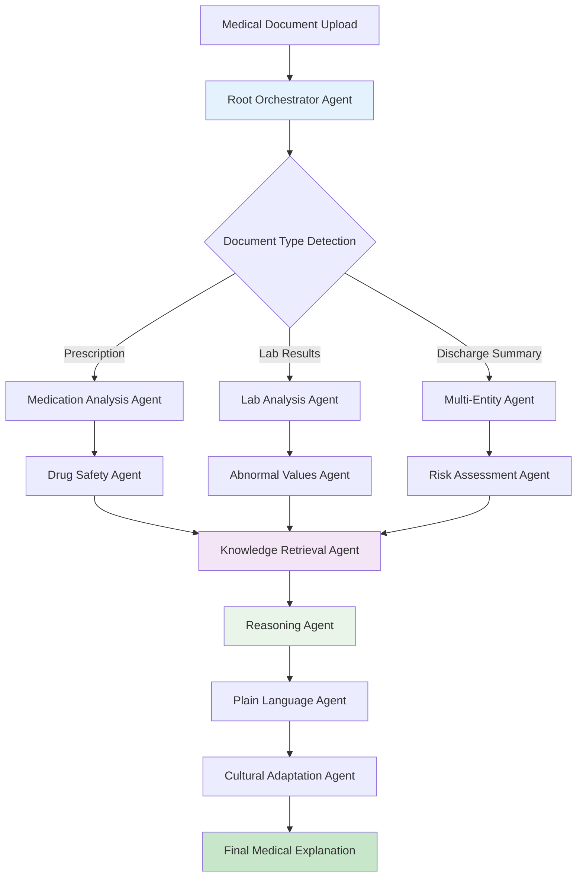

***

# MedScript AI

[](https://github.com/your-username/your-repo/actions)
[](https://opensource.org/licenses/MIT)
[](https://codecov.io/gh/your-username/your-repo)

An intelligent agentic healthcare application that transforms complex medical documents into clear, culturally-appropriate, actionable insights accessible globally in multiple languages.

---

## 1. Introduction

MedScript AI addresses the critical global healthcare crisis of medical document literacy. Billions of patients worldwide receive complex medical documents filled with jargon and technical terminology they cannot understand. This comprehension gap leads to preventable adverse drug events, medication non-adherence, and significant avoidable healthcare costs.

Built on Google's latest Gemini models and a scalable serverless architecture, MedScript AI functions as an autonomous intelligent agent. It ingests various medical document formats and produces clear, safe, and culturally-aware explanations, democratizing access to healthcare information regardless of geographic location, language, or education level.

## 2. Key Features

-   **🤖 Autonomous Document Analysis**: Automatically detects document types (e.g., prescriptions, lab results, discharge summaries) and determines the optimal analysis strategy without user input.
-   **🔍 Intelligent Entity Extraction**: Utilizes advanced NLP to identify and extract critical medical entities, including medications, lab values, diagnoses, procedures, and vital signs.
-   **🚨 Risk Detection & Safety Analysis**: Proactively identifies potential health risks, drug-drug interactions, polypharmacy concerns, and abnormal values, generating clear, severity-based alerts.
-   **🌍 Multi-Language & Cultural Support**: Supports over 100 languages and provides culturally-adapted explanations, dietary suggestions, and lifestyle recommendations.
-   **🧠 Advanced Medical Reasoning**: Applies multi-step reasoning to analyze retrieved medical knowledge in the context of the patient's document, generating personalized and actionable insights.
-   **☁️ Scalable & Cost-Effective**: Deployed on Google Cloud Run, the system automatically scales from zero to millions of users, ensuring global availability with a pay-per-use model.

## 3. System Architecture

MedScript AI employs a **serverless microservices architecture** built on Google Cloud Platform. The system follows an **event-driven, multi-agent pattern** orchestrated by Google's Agent Development Kit (ADK). This modular design allows specialized AI agents to collaborate on complex analysis tasks, ensuring accuracy, scalability, and maintainability.

The backend is built with **FastAPI** (Python), and the frontend is a **React/TypeScript** single-page application.

#### High-Level Multi-Agent Workflow



## 4. Technology Stack

### Backend
| Component | Technology |
| :--- | :--- |
| **Language** | Python 3.11+ |
| **Framework** | FastAPI, Pydantic |
| **AI/Agent Framework**| LangChain, Google Agent Development Kit (ADK) |
| **AI Models** | Google Gemini 1.5 Flash (via Vertex AI) |
| **NLP** | spaCy, medspacy |
| **Deployment** | Docker, Google Cloud Run |

### Frontend
| Component | Technology |
| :--- | :--- |
| **Language** | TypeScript |
| **Framework** | React 18+ |
| **UI Library** | Material-UI (MUI) |
| **State Management**| React Hooks & Context |
| **API Communication** | Axios |
| **Deployment** | Static hosting on Google Cloud Storage |

### Infrastructure & Database
| Component | Technology |
| :--- | :--- |
| **Cloud Provider** | Google Cloud Platform (GCP) |
| **IaC** | Terraform |
| **Database** | Google Cloud Firestore (Native Mode) |
| **Storage** | Google Cloud Storage |
| **CI/CD** | GitHub Actions, Google Cloud Build |
| **Monitoring** | Google Cloud Monitoring & Logging |

## 5. Getting Started (Local Development)

### Prerequisites
- Git, Docker, Node.js (v18+), Python (3.11+)
- Google Cloud SDK (`gcloud` CLI) installed and authenticated.
- A configured GCP project (see [DEPLOYMENT.md](DEPLOYMENT.md) for setup).

### Backend Setup

1.  **Navigate to the backend directory:**
    ```bash
    cd backend
    ```
2.  **Create and activate a virtual environment:**
    ```bash
    python3.11 -m venv venv
    source venv/bin/activate
    ```
3.  **Install dependencies:**
    ```bash
    pip install -r requirements.txt
    pip install -r requirements-dev.txt
    ```
4.  **Set environment variables:**
    Create a `.env` file in the `backend` directory with your GCP Project ID.
    ```env
    GOOGLE_CLOUD_PROJECT="your-gcp-project-id"
    DOCUMENT_UPLOAD_BUCKET="your-gcp-bucket-name"
    ```
5.  **Run the development server:**
    ```bash
    uvicorn app.main:app --host 0.0.0.0 --port 8000 --reload
    ```
    The backend API will be available at `http://localhost:8000`.

### Frontend Setup

1.  **Navigate to the frontend directory:**
    ```bash
    cd frontend
    ```2.  **Install dependencies:**
    ```bash
    npm install
    ```
3.  **Set environment variables:**
    Create a `.env.development.local` file in the `frontend` directory.
    ```env
    REACT_APP_API_BASE_URL=http://localhost:8000/api/v1
    ```
4.  **Run the development server:**
    ```bash
    npm start
    ```
    The frontend will open in your browser at `http://localhost:3000`.

## 6. Deployment

The application is designed for a fully automated deployment to Google Cloud Platform.

-   **Infrastructure**: The cloud infrastructure is defined using **Terraform** in the `/infrastructure` directory. This includes the Cloud Run service, Firestore database, and Cloud Storage buckets.
-   **CI/CD**: A **GitHub Actions** workflow defined in `.github/workflows/ci-cd.yml` automates the entire process. On every push to the `main` branch, the workflow will:
    1.  Run security checks and linting.
    2.  Execute the automated test suite.
    3.  Build the backend Docker image.
    4.  Push the image to Google Artifact Registry.
    5.  Deploy the new image to the Cloud Run service.

For manual deployment steps and detailed configuration, please refer to the [**DEPLOYMENT.md**](DEPLOYMENT.md) guide.

## 7. Testing

The project follows a comprehensive, risk-based testing strategy suitable for a critical healthcare application.

-   **Unit Tests**: Located in `backend/tests`, these tests validate individual components and functions. Run them with `pytest backend/tests/`.
-   **Integration Tests**: These validate the interactions between services (e.g., API endpoints and the Firestore service).
-   **End-to-End (E2E) Tests**: Simulate full user workflows from document upload to result display.
-   **Code Quality**: `black` and `isort` are used for code formatting and linting.

All tests are automatically executed in the CI/CD pipeline to ensure code quality and prevent regressions.

## 8. Contributing

Contributions are welcome! If you'd like to contribute, please follow these steps:

1.  **Fork the repository.**
2.  **Create a new feature branch:** `git checkout -b feature/your-feature-name`
3.  **Make your changes** and ensure all tests pass.
4.  **Submit a pull request** with a clear description of your changes.

Please ensure your code adheres to the project's coding standards and that all new features are accompanied by corresponding tests.

## 9. License

This project is licensed under the MIT License. See the [LICENSE](LICENSE.md) file for details.
