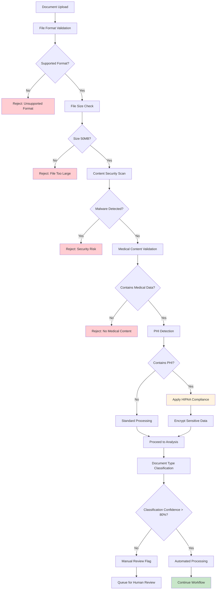

# Technical Specifications

# 1. Introduction

#### Executive Summary

MedScript AI is an intelligent agentic healthcare application that transforms complex medical documents into clear, culturally-appropriate, actionable insights accessible globally in multiple languages. Built on Google's latest Gemini 2.0 Flash model with enhanced performance and next-generation features designed for the agentic era, the system addresses the critical global healthcare crisis of medical document literacy affecting billions of patients worldwide.

The core business problem centers on the fact that patients receive complex medical documents filled with medical jargon, abbreviations, and technical terminology that they cannot understand, with 88% of adults worldwide struggling to understand basic health information. This comprehension gap leads to 1.5 million preventable adverse drug events annually in the United States alone, $300 billion in annual costs from medication non-adherence, and a global medication adherence rate of only 50%.

Key stakeholders include primary users (chronic disease patients, elderly populations, caregivers, patients with limited health literacy, non-native language speakers, and patients in underserved areas) and secondary users (healthcare providers, pharmacists, patient advocates, health systems, insurance companies, government health agencies, clinical research organizations, and pharmaceutical companies). The target market spans 6.8 billion smartphone users globally across all continents.

The expected business impact includes significant reduction in medication errors, improved patient adherence rates, decreased healthcare costs, enhanced patient safety, and democratized access to healthcare information regardless of geographic location, language, or education level. The solution leverages Google Cloud Run's automatic scaling capabilities that dynamically scale up or down according to incoming requests, ensuring global accessibility and cost-effectiveness.

#### System Overview

#### Project Context

**Business Context and Market Positioning**

MedScript AI operates in the rapidly expanding digital health market, positioned as a global healthcare accessibility solution that bridges the critical gap between complex medical information and patient understanding. The system addresses a universal problem transcending borders, languages, and healthcare systems, making it applicable across all major healthcare markets including North America, Europe, Asia-Pacific, Latin America, and Middle East & Africa.

The solution is strategically positioned to serve the growing telemedicine market, where patients increasingly receive medical documents without immediate access to healthcare provider explanations. With healthcare systems globally strained by aging populations and chronic disease epidemics, MedScript AI provides a scalable solution that reduces the burden on healthcare providers while improving patient outcomes.

**Current System Limitations**

Existing solutions in the market suffer from several critical limitations:
- Language barriers limiting accessibility to native speakers only
- Lack of cultural adaptation in medical explanations
- Inability to handle diverse international medical document formats
- Limited integration with modern AI technologies
- Absence of real-time risk detection and safety analysis
- Poor scalability for global deployment
- Inadequate support for multiple medical document types

**Integration with Existing Enterprise Landscape**

MedScript AI leverages Gemini 2.0 Flash's superior speed, built-in tool use, multimodal generation, and 1M token context window, integrated with Google Cloud's enterprise ecosystem. The system seamlessly integrates with:
- Electronic Health Record (EHR) systems through standardized APIs
- Healthcare provider portals and patient management systems
- Telemedicine platforms for document analysis during virtual consultations
- Pharmacy management systems for medication counseling support
- Health insurance platforms for patient education initiatives
- Clinical research systems for informed consent and protocol understanding

#### High-Level Description

**Primary System Capabilities**

MedScript AI functions as an autonomous intelligent agent that:
1. **Autonomous Document Analysis**: Automatically detects document types through AI analysis and determines optimal analysis strategies
2. **Intelligent Entity Extraction**: Identifies and extracts medical entities using advanced NLP and AI
3. **Semantic Knowledge Retrieval**: Retrieves relevant medical knowledge using embedding-based RAG with comprehensive medical databases
4. **Multi-Step Reasoning**: Applies advanced AI reasoning that is twice as fast as 1.5 Pro while achieving stronger performance
5. **Risk Detection & Safety Analysis**: Proactively identifies health risks, drug interactions, and abnormal values
6. **Multi-Language Support**: Supports over 100 languages including major global languages
7. **Cultural Adaptation**: Provides culturally-appropriate explanations and recommendations

**Major System Components**

| Component | Technology Stack | Purpose |
|-----------|------------------|---------|
| **API Gateway** | Google Cloud Run | HTTP endpoint management and auto-scaling |
| **AI Processing Engine** | Gemini 2.0 Flash | Document analysis and reasoning |
| **Knowledge Base** | Firestore + Vector Search | Medical information storage and retrieval |
| **Document Processing** | Cloud Vision API | OCR and text extraction |
| **Agent Framework** | Google ADK + LangChain for building modular, composable applications | Multi-agent orchestration |

**Core Technical Approach**

The system employs an agentic architecture powered by Google's Agent Development Kit (ADK), an open-source framework designed to help developers create, manage, and scale collaborative AI agents. ADK is designed with multi-agent architecture at its core, enabling developers to compose multiple specialized agents in a hierarchical structure and choose from a rich model ecosystem including Gemini or any model accessible via Vertex AI Model Garden.

The technical approach leverages:
- **Event-driven Architecture**: ADK uses an event-driven architecture with hierarchical agent structure, featuring LlmAgent and WorkflowAgent types with parent-child relationships and explicit session.state "scratchpad" with prefix-based scoping
- **Tool Integration**: ADK integrates tools through Function Tools, Agents-as-Tools, Built-in Tools, and Third-Party Tools, including built-in tools like Google Search, Code Execution, RAG, and Google Cloud Tools
- **LangChain Integration**: Integration with tools from the LangChain ecosystem for enhanced functionality
- **Serverless Deployment**: Auto-scaling on demand with pay-per-use model, only paying when the application is actively handling requests

#### Success Criteria

**Measurable Objectives**

| Metric Category | Target | Measurement Method |
|-----------------|--------|-------------------|
| **Accuracy** | >95% medical entity extraction accuracy | Automated validation against medical ontologies |
| **Performance** | <3 seconds average response time | Real-time monitoring via Cloud Monitoring |
| **Scalability** | Support 1M+ concurrent users | Load testing and auto-scaling validation |
| **Availability** | 99.9% uptime SLA | Cloud Run service monitoring |

**Critical Success Factors**

1. **Medical Accuracy**: Maintaining clinical accuracy while simplifying complex medical terminology
2. **Cultural Sensitivity**: Providing culturally-appropriate explanations across diverse global populations
3. **Regulatory Compliance**: Adhering to healthcare data privacy regulations (HIPAA, GDPR, etc.)
4. **User Adoption**: Achieving high user satisfaction scores (>4.5/5) across different demographics
5. **Healthcare Provider Acceptance**: Gaining endorsement from medical professionals and healthcare institutions
6. **Scalability**: Dynamically scaling applications based on real-time demand without manual configuration, whether the app has 100 users or 10 million

**Key Performance Indicators (KPIs)**

- **Patient Outcomes**: Reduction in medication errors and improvement in adherence rates
- **User Engagement**: Daily active users, session duration, and document processing volume
- **Global Reach**: Number of countries served and languages supported
- **Healthcare Impact**: Reduction in preventable adverse events and healthcare costs
- **Technical Performance**: System maintains 60% CPU utilization target and 60% instance concurrency target
- **Cost Efficiency**: Cost per processed document with automatic scaling to zero when there's no traffic

#### Scope

#### In-Scope

**Core Features and Functionalities**

- **Document Processing Capabilities**
  - PDF, image (JPG, PNG), and text file upload support
  - Automatic document type detection (prescriptions, lab results, discharge summaries, radiology reports, pathology reports, diagnostic reports, vaccination records, referral letters, treatment plans)
  - Multi-page document handling with context preservation
  - OCR processing for image-based documents
  - Support for international medical document formats

- **AI-Powered Analysis**
  - Gemini 2.0 Flash integration with superior speed, built-in tool use, and 1M token context window
  - Intelligent entity extraction (medications, lab values, diagnoses, procedures, vital signs)
  - Medical terminology explanation and simplification
  - Risk detection and drug interaction analysis
  - Abnormal value identification and clinical significance assessment

- **Multi-Language and Cultural Support**
  - Support for 100+ languages including major global languages
  - Culturally-adapted explanations and recommendations
  - Region-specific medical reference ranges and guidelines
  - Localized dietary and lifestyle recommendations

- **Safety and Risk Management**
  - Comprehensive drug interaction database (50,000+ known interactions)
  - Polypharmacy analysis and elderly-specific risk assessment
  - Critical value alerts and emergency recommendations
  - Contraindication detection and warnings

**Primary User Workflows**

1. **Document Upload and Analysis Workflow**
   - User uploads medical document via HTTP endpoint
   - System automatically detects document type and extracts content
   - AI analyzes and processes medical entities
   - Plain-language explanation generated with cultural adaptation
   - Risk assessment and safety alerts provided

2. **Multi-Document Comparison Workflow**
   - Users can upload multiple documents for trend analysis
   - System identifies changes over time in lab values and medications
   - Comparative analysis with improvement/deterioration indicators
   - Longitudinal health insights and recommendations

3. **Emergency Risk Detection Workflow**
   - Automatic identification of critical values requiring immediate attention
   - Severity-based alert system (critical, urgent, follow-up needed)
   - Clear action items and emergency contact recommendations
   - Integration with healthcare provider notification systems

**Essential Integrations**

- **Google Cloud Platform Services**
  - Cloud Run for automatic scaling based on traffic and CPU utilization
  - Cloud Storage for secure document storage
  - Firestore for medical knowledge base and user data
  - Cloud Vision API for OCR processing
  - Vertex AI for Gemini 2.0 Flash model access

- **Agent Development Framework**
  - Google ADK (Agent Development Kit) for building production-ready agentic applications with greater flexibility and precise control
  - LangChain ecosystem integration for faster development time and tool reuse
  - Multi-agent orchestration and workflow management

**Key Technical Requirements**

- **Performance**: <3 second average response time for document analysis
- **Scalability**: Auto-scaling on demand based on traffic with no wasted resources
- **Security**: End-to-end encryption, HIPAA compliance, secure API authentication
- **Availability**: 99.9% uptime SLA with global deployment
- **Accuracy**: >95% medical entity extraction accuracy with clinical validation

**Implementation Boundaries**

- **Geographic Coverage**: Global deployment with initial focus on English-speaking markets, expanding to 50+ languages
- **Document Types**: Medical documents only (prescriptions, lab results, diagnostic reports, etc.)
- **User Authentication**: Secure user management with healthcare data privacy compliance
- **Data Retention**: Configurable data retention policies per regional regulations
- **API Rate Limits**: Scalable rate limiting based on user tiers and usage patterns

#### Out-of-Scope

**Explicitly Excluded Features/Capabilities**

- **Medical Diagnosis or Treatment Recommendations**: System provides educational information only, not medical advice
- **Prescription Writing or Medication Dispensing**: No capability to generate prescriptions or authorize medication changes
- **Direct Healthcare Provider Communication**: No built-in messaging or communication features with healthcare providers
- **Insurance Claims Processing**: No integration with insurance claim systems or billing processes
- **Appointment Scheduling**: No calendar integration or healthcare appointment booking functionality
- **Wearable Device Integration**: No direct integration with fitness trackers or health monitoring devices
- **Social Media or Community Features**: No patient forums, social sharing, or community discussion capabilities

**Future Phase Considerations**

- **Advanced Predictive Analytics**: Machine learning models for health outcome prediction
- **Integration with EHR Systems**: Direct integration with major Electronic Health Record platforms
- **Telehealth Platform Integration**: Real-time document analysis during virtual consultations
- **Mobile Application Development**: Native iOS and Android applications
- **Voice Interface**: Speech-to-text and text-to-speech capabilities for accessibility
- **Blockchain Integration**: Secure, decentralized health record management
- **AI-Powered Health Coaching**: Personalized health recommendations and lifestyle guidance

**Integration Points Not Covered**

- **Legacy Healthcare Systems**: Integration with older, non-API enabled healthcare systems
- **Proprietary Medical Device Formats**: Support for specialized medical device output formats
- **Real-time Monitoring Systems**: Integration with hospital monitoring equipment or ICU systems
- **Pharmaceutical Supply Chain**: Integration with drug manufacturing or distribution systems
- **Clinical Trial Management**: Integration with clinical research and trial management platforms

**Unsupported Use Cases**

- **Emergency Medical Response**: System not designed for emergency or life-threatening situations
- **Pediatric Specialized Analysis**: Advanced pediatric-specific medical analysis requires future development
- **Veterinary Medicine**: Human healthcare focus only, no animal health applications
- **Alternative Medicine Integration**: Focus on evidence-based conventional medicine only
- **Medical Research and Publication**: No support for medical research paper analysis or publication assistance
- **Healthcare Facility Management**: No integration with hospital operations or facility management systems

# 2. Product Requirements

## 2.1 Feature Catalog

### 2.1.1 Core Document Processing Features

| Feature ID | Feature Name | Category | Priority | Status |
|------------|--------------|----------|----------|---------|
| F-001 | Document Upload & Validation | Document Processing | Critical | Proposed |
| F-002 | Multi-Format Document Support | Document Processing | Critical | Proposed |
| F-003 | OCR Text Extraction | Document Processing | Critical | Proposed |
| F-004 | Document Type Detection | Document Processing | Critical | Proposed |

#### F-001: Document Upload & Validation

**Description**
Secure HTTP endpoint for document upload with automatic scaling based on incoming requests, supporting multiple file formats with comprehensive validation and security measures.

**Business Value**
- Enables global accessibility through Cloud Run's dynamic scaling that adjusts automatically whether your app has 100 users or 10 million
- Provides foundation for all subsequent document analysis workflows
- Ensures data security and compliance with healthcare regulations

**User Benefits**
- Simple, intuitive document upload process
- Support for various document formats (PDF, JPG, PNG, text files)
- Real-time validation feedback
- Secure handling of sensitive medical information

**Technical Context**
Pay-per-use model where you only pay when your application is actively handling requests, automatically scaling to zero when there's no traffic

**Dependencies**
- Google Cloud Run service deployment
- Cloud Storage for temporary file storage
- Security and encryption infrastructure

#### F-002: Multi-Format Document Support

**Description**
Comprehensive support for medical document formats including PDF files, image formats (JPG, PNG), and text files, with automatic format detection and appropriate processing pipelines.

**Business Value**
- Maximizes user adoption by supporting all common medical document formats
- Reduces friction in user workflow
- Enables processing of documents from various healthcare systems globally

**User Benefits**
- No need to convert documents before upload
- Support for scanned documents and digital files
- Consistent processing regardless of source format

**Technical Context**
Integration with Cloud Vision API for image processing and text extraction from various formats.

#### F-003: OCR Text Extraction

**Description**
Advanced Optical Character Recognition using Cloud Vision API to extract text from image-based medical documents with high accuracy and medical terminology recognition.

**Business Value**
- Enables processing of scanned documents and photos
- Critical for global accessibility where digital documents may not be available
- Supports healthcare systems with legacy paper-based processes

**User Benefits**
- Can upload photos of medical documents taken with smartphone
- No need for specialized scanning equipment
- Accurate text extraction from poor quality images

**Technical Context**
Leverages Google Cloud Vision API with preprocessing for medical document optimization.

#### F-004: Document Type Detection

**Description**
AI-powered automatic detection of medical document types using Gemini 2.0 Flash with superior speed and 1M token context window, identifying prescriptions, lab results, discharge summaries, and other medical document categories.

**Business Value**
- Enables autonomous document processing without user input
- Optimizes analysis workflow based on document type
- Reduces user cognitive load and improves experience

**User Benefits**
- No need to manually specify document type
- Automatic routing to appropriate analysis modules
- Consistent processing regardless of document complexity

**Technical Context**
Gemini 2.0 Flash outperforms 1.5 Pro on key benchmarks, at twice the speed

### 2.1.2 AI-Powered Analysis Features

| Feature ID | Feature Name | Category | Priority | Status |
|------------|--------------|----------|----------|---------|
| F-005 | Medical Entity Extraction | AI Analysis | Critical | Proposed |
| F-006 | Knowledge Base Integration | AI Analysis | Critical | Proposed |
| F-007 | Multi-Step Reasoning Engine | AI Analysis | Critical | Proposed |
| F-008 | Plain Language Generation | AI Analysis | Critical | Proposed |

#### F-005: Medical Entity Extraction

**Description**
Advanced medical entity extraction using Gemini 2.0 Flash with built-in tool use and multimodal generation capabilities, identifying medications, lab values, diagnoses, procedures, and vital signs from unstructured medical text.

**Business Value**
- Enables structured analysis of unstructured medical documents
- Foundation for all downstream analysis and risk detection
- Supports clinical decision-making through accurate data extraction

**User Benefits**
- Automatic identification of all relevant medical information
- No manual data entry required
- Comprehensive extraction covering all medical entities

**Technical Context**
Gemini 2.0 Flash can use tools, generate function calls, and natively call tools like Google Search and code execution

#### F-006: Knowledge Base Integration

**Description**
Semantic knowledge retrieval system using embedding-based RAG with comprehensive medical databases, providing contextual information for extracted medical entities.

**Business Value**
- Provides authoritative medical information for patient education
- Enables culturally-appropriate explanations
- Supports multiple languages and regional medical guidelines

**User Benefits**
- Access to comprehensive medical knowledge
- Culturally-adapted explanations and recommendations
- Multi-language support for global accessibility

**Technical Context**
Integration with Firestore and Vector Search for semantic similarity matching using Gemini Embedding models.

#### F-007: Multi-Step Reasoning Engine

**Description**
Advanced AI reasoning using Gemini 2.0 Flash with superior speed and enhanced performance, analyzing retrieved medical knowledge in context of patient's specific document to generate personalized insights.

**Business Value**
- Provides intelligent, contextual analysis beyond simple information retrieval
- Enables personalized recommendations based on individual patient data
- Supports complex medical reasoning and decision-making

**User Benefits**
- Personalized explanations tailored to individual medical situation
- Complex medical concepts explained in understandable terms
- Actionable insights and recommendations

**Technical Context**
Gemini 2.0 Flash beats Gemini 1.5 Pro on multiple key benchmarks and excels at competition-level math problems

#### F-008: Plain Language Generation

**Description**
Generation of clear, culturally-appropriate explanations in plain language (Grade 8-10 reading level) with analogies and metaphors to make complex medical concepts understandable.

**Business Value**
- Addresses global health literacy crisis affecting billions
- Reduces medication errors and improves patient adherence
- Enables healthcare democratization across education levels

**User Benefits**
- Medical information explained in everyday language
- Cultural adaptation for different populations
- Analogies and examples that make concepts relatable

**Technical Context**
Gemini 2.0 Flash features native text-to-speech audio output with fine-grained control and choice of 8 high-quality voices

### 2.1.3 Safety and Risk Management Features

| Feature ID | Feature Name | Category | Priority | Status |
|------------|--------------|----------|----------|---------|
| F-009 | Drug Interaction Detection | Safety Analysis | Critical | Proposed |
| F-010 | Abnormal Value Identification | Safety Analysis | Critical | Proposed |
| F-011 | Risk Prioritization System | Safety Analysis | High | Proposed |
| F-012 | Emergency Alert Generation | Safety Analysis | High | Proposed |

#### F-009: Drug Interaction Detection

**Description**
Comprehensive drug interaction analysis using database of 50,000+ known interactions, identifying contraindications, severity levels, and providing specific recommendations for medication combinations.

**Business Value**
- Prevents potentially dangerous drug combinations
- Reduces healthcare costs from adverse drug events
- Supports medication safety initiatives globally

**User Benefits**
- Automatic detection of dangerous drug combinations
- Clear explanations of interaction risks
- Specific recommendations for safe medication use

**Technical Context**
Integration with comprehensive drug interaction database with real-time analysis capabilities.

#### F-010: Abnormal Value Identification

**Description**
Intelligent identification of abnormal lab values and vital signs with age, gender, and ethnicity-adjusted reference ranges, providing clinical context and urgency assessment.

**Business Value**
- Enables early detection of health issues
- Supports preventive healthcare initiatives
- Reduces emergency department utilization

**User Benefits**
- Automatic flagging of concerning lab results
- Context for what abnormal values mean
- Guidance on appropriate follow-up actions

**Technical Context**
Dynamic reference range adjustment based on patient demographics and clinical context.

#### F-011: Risk Prioritization System

**Description**
Intelligent risk assessment system that prioritizes health risks by severity, likelihood, and imminence, providing structured approach to patient safety concerns.

**Business Value**
- Optimizes healthcare resource allocation
- Improves patient safety through systematic risk assessment
- Supports clinical decision-making processes

**User Benefits**
- Clear prioritization of health concerns
- Understanding of which issues need immediate attention
- Structured approach to managing multiple health risks

**Technical Context**
Algorithm-based risk scoring with machine learning optimization for accuracy.

#### F-012: Emergency Alert Generation

**Description**
Automated generation of emergency alerts for critical values and dangerous conditions requiring immediate medical attention, with clear action items and emergency contact recommendations.

**Business Value**
- Prevents medical emergencies through early warning
- Reduces liability through proactive safety measures
- Supports emergency response systems

**User Benefits**
- Immediate notification of critical health issues
- Clear instructions for emergency situations
- Direct guidance on when to seek immediate care

**Technical Context**
Real-time alert system with integration to emergency notification protocols.

### 2.1.4 Multi-Language and Cultural Features

| Feature ID | Feature Name | Category | Priority | Status |
|------------|--------------|----------|----------|---------|
| F-013 | Multi-Language Support | Localization | High | Proposed |
| F-014 | Cultural Adaptation Engine | Localization | High | Proposed |
| F-015 | Regional Medical Guidelines | Localization | Medium | Proposed |

#### F-013: Multi-Language Support

**Description**
Support for text input/output in English, Spanish, Japanese, Chinese, and Hindi, with speech input/output available in English, expanding to 100+ languages for global accessibility.

**Business Value**
- Enables global market penetration
- Addresses language barriers in healthcare
- Supports diverse immigrant and expatriate populations

**User Benefits**
- Medical information in native language
- Reduced language barriers in healthcare understanding
- Cultural comfort in health information consumption

**Technical Context**
Native multilingual audio output with range of languages and accents

#### F-014: Cultural Adaptation Engine

**Description**
Intelligent cultural adaptation of medical explanations, dietary recommendations, and health advice based on cultural background and regional health practices.

**Business Value**
- Improves patient engagement through cultural relevance
- Supports diverse global populations
- Enhances effectiveness of health education

**User Benefits**
- Culturally-appropriate health recommendations
- Respect for cultural health beliefs and practices
- Relevant dietary and lifestyle suggestions

**Technical Context**
Cultural knowledge base with region-specific adaptation algorithms.

### 2.1.5 Agent Framework Features

| Feature ID | Feature Name | Category | Priority | Status |
|------------|--------------|----------|----------|---------|
| F-016 | Multi-Agent Orchestration | Agent Framework | Critical | Proposed |
| F-017 | Agent Communication System | Agent Framework | Critical | Proposed |
| F-018 | Workflow Management | Agent Framework | High | Proposed |

#### F-016: Multi-Agent Orchestration

**Description**
ADK flexible and modular framework for developing and deploying AI agents, model-agnostic and deployment-agnostic, designed to make agent development feel more like software development, enabling specialized agents for different medical analysis tasks.

**Business Value**
- Enables modular, scalable architecture
- Supports complex medical analysis workflows
- Provides flexibility for future feature expansion

**User Benefits**
- Specialized analysis for different document types
- Consistent quality across all analysis modules
- Seamless integration of multiple analysis capabilities

**Technical Context**
ADK provides LLM Agents for flexible language-centric tasks and multi-agent design for building modular, scalable applications

#### F-017: Agent Communication System

**Description**
Agent2Agent (A2A) protocol enabling communication between AI agents with standard /run HTTP endpoint and metadata through .well-known/agent.json, facilitating coordination between specialized medical analysis agents.

**Business Value**
- Enables sophisticated multi-agent workflows
- Supports interoperability with other agent systems
- Provides foundation for complex medical analysis pipelines

**User Benefits**
- Seamless coordination between different analysis modules
- Comprehensive analysis through agent collaboration
- Consistent results across all analysis components

**Technical Context**
ADK integrates with A2A protocol for remote agent-to-agent communication

## 2.2 Functional Requirements Table

#### F-001: Document Upload & Validation

| Requirement ID | Description | Acceptance Criteria | Priority | Complexity |
|----------------|-------------|-------------------|----------|------------|
| F-001-RQ-001 | HTTP endpoint accepts file uploads | - Supports PDF, JPG, PNG, TXT formats<br>- Maximum file size 50MB<br>- Returns upload confirmation | Must-Have | Medium |
| F-001-RQ-002 | File format validation | - Validates file type and structure<br>- Rejects unsupported formats<br>- Provides clear error messages | Must-Have | Low |
| F-001-RQ-003 | Security and encryption | - Files encrypted in transit and at rest<br>- HIPAA-compliant data handling<br>- Secure temporary storage | Must-Have | High |
| F-001-RQ-004 | Auto-scaling capability | - Automatically scaled to handle incoming requests, scales to zero when no traffic<br>- Response time <3 seconds under load | Must-Have | Medium |

**Technical Specifications**
- **Input Parameters**: File upload (multipart/form-data), optional metadata
- **Output/Response**: Upload confirmation with document ID, processing status
- **Performance Criteria**: Auto-scaling based on traffic with no wasted resources
- **Data Requirements**: Temporary storage in Cloud Storage, metadata in Firestore

**Validation Rules**
- **Business Rules**: Healthcare data privacy compliance, file size limits
- **Data Validation**: File format verification, malware scanning
- **Security Requirements**: End-to-end encryption, access logging
- **Compliance Requirements**: HIPAA, GDPR compliance for healthcare data

#### F-005: Medical Entity Extraction

| Requirement ID | Description | Acceptance Criteria | Priority | Complexity |
|----------------|-------------|-------------------|----------|------------|
| F-005-RQ-001 | Medication extraction | - Identifies generic and brand names<br>- Extracts dosage, frequency, route<br>- >95% accuracy on standard medications | Must-Have | High |
| F-005-RQ-002 | Lab value extraction | - Identifies test names and results<br>- Extracts units and reference ranges<br>- Handles multiple lab formats | Must-Have | High |
| F-005-RQ-003 | Diagnosis identification | - Extracts condition names<br>- Identifies ICD codes if present<br>- Determines severity indicators | Must-Have | Medium |
| F-005-RQ-004 | Entity relationship mapping | - Links medications to conditions<br>- Associates lab tests with monitoring<br>- Maintains temporal relationships | Should-Have | High |

**Technical Specifications**
- **Input Parameters**: Extracted document text, document type
- **Output/Response**: Structured JSON with extracted entities and relationships
- **Performance Criteria**: Twice the speed of previous models while maintaining accuracy
- **Data Requirements**: Medical ontology database, entity validation rules

**Validation Rules**
- **Business Rules**: Medical terminology validation, clinical accuracy requirements
- **Data Validation**: Entity format verification, relationship consistency
- **Security Requirements**: PHI handling compliance, audit logging
- **Compliance Requirements**: Medical accuracy standards, regulatory compliance

#### F-007: Multi-Step Reasoning Engine

| Requirement ID | Description | Acceptance Criteria | Priority | Complexity |
|----------------|-------------|-------------------|----------|------------|
| F-007-RQ-001 | Contextual analysis | - Analyzes entities in patient context<br>- Considers medical history<br>- Provides personalized insights | Must-Have | High |
| F-007-RQ-002 | Clinical significance assessment | - Determines importance of findings<br>- Identifies concerning patterns<br>- Prioritizes by clinical relevance | Must-Have | High |
| F-007-RQ-003 | Reasoning chain generation | - Uses reasoning capabilities with diverse thinking strategies for accurate outputs<br>- Provides transparent reasoning process<br>- Links evidence to conclusions | Should-Have | High |
| F-007-RQ-004 | Uncertainty handling | - Acknowledges limitations<br>- Provides confidence levels<br>- Recommends professional consultation | Must-Have | Medium |

**Technical Specifications**
- **Input Parameters**: Extracted entities, retrieved knowledge, patient context
- **Output/Response**: Structured analysis with reasoning chains and confidence scores
- **Performance Criteria**: Superior speed with enhanced performance on key benchmarks
- **Data Requirements**: Clinical guidelines database, reasoning templates

#### F-009: Drug Interaction Detection

| Requirement ID | Description | Acceptance Criteria | Priority | Complexity |
|----------------|-------------|-------------------|----------|------------|
| F-009-RQ-001 | Interaction database | - 50,000+ known interactions<br>- Severity classifications<br>- Mechanism explanations | Must-Have | Medium |
| F-009-RQ-002 | Real-time analysis | - Analyzes all medication combinations<br>- Identifies contraindications<br>- Provides specific recommendations | Must-Have | High |
| F-009-RQ-003 | Risk categorization | - Major/Moderate/Minor classifications<br>- Clinical significance assessment<br>- Action recommendations | Must-Have | Medium |
| F-009-RQ-004 | Special population alerts | - Pregnancy/breastfeeding warnings<br>- Elderly-specific risks<br>- Kidney/liver disease considerations | Should-Have | Medium |

**Technical Specifications**
- **Input Parameters**: List of medications with dosages
- **Output/Response**: Interaction analysis with severity levels and recommendations
- **Performance Criteria**: Real-time analysis within 2 seconds
- **Data Requirements**: Comprehensive drug interaction database, clinical guidelines

#### F-016: Multi-Agent Orchestration

| Requirement ID | Description | Acceptance Criteria | Priority | Complexity |
|----------------|-------------|-------------------|----------|------------|
| F-016-RQ-001 | Agent specialization | - Specialized agents for different tasks with modular, scalable applications<br>- Document type-specific agents<br>- Analysis task-specific agents | Must-Have | High |
| F-016-RQ-002 | Workflow coordination | - Sequential, Parallel, Loop workflows for predictable pipelines<br>- Dynamic routing based on document type<br>- Error handling and recovery | Must-Have | High |
| F-016-RQ-003 | State management | - Sessions maintain context and state across interactions<br>- Persistent analysis state<br>- Progress tracking | Should-Have | Medium |
| F-016-RQ-004 | Agent communication | - Standard /run HTTP endpoint with A2A protocol metadata<br>- Inter-agent messaging<br>- Result aggregation | Must-Have | High |

**Technical Specifications**
- **Input Parameters**: Document analysis request, agent configuration
- **Output/Response**: Coordinated analysis results from multiple agents
- **Performance Criteria**: Code-first development with ultimate flexibility and testability
- **Data Requirements**: Agent registry, workflow definitions, state storage

## 2.3 Feature Relationships

### 2.3.1 Feature Dependencies Map


### 2.3.2 Integration Points

| Integration Point | Connected Features | Shared Components | Common Services |
|-------------------|-------------------|-------------------|-----------------|
| **Document Processing Pipeline** | F-001, F-002, F-003, F-004 | Cloud Storage, Cloud Vision API | File validation, OCR processing |
| **AI Analysis Engine** | F-005, F-006, F-007, F-008 | Gemini 2.0 Flash with 1M token context | Entity extraction, reasoning |
| **Safety Analysis System** | F-009, F-010, F-011, F-012 | Risk assessment algorithms | Drug database, alert system |
| **Agent Framework** | F-016, F-017, F-018 | ADK framework with model-agnostic architecture | Agent orchestration, communication |
| **Localization System** | F-013, F-014, F-015 | Cultural knowledge base | Translation, adaptation |

### 2.3.3 Shared Components

| Component | Used By Features | Purpose | Technology |
|-----------|------------------|---------|------------|
| **Gemini 2.0 Flash** | F-004, F-005, F-007, F-008 | AI processing with superior speed and enhanced performance | Google Vertex AI |
| **Cloud Run Service** | F-001, F-016, F-017 | Auto-scaling HTTP endpoints | Google Cloud Run |
| **Vector Database** | F-006, F-013, F-014 | Semantic search and retrieval | Firestore + Vector Search |
| **ADK Framework** | F-016, F-017, F-018 | Flexible, modular agent development | Google ADK |

## 2.4 Implementation Considerations

### 2.4.1 Technical Constraints

| Constraint Category | Description | Impact | Mitigation Strategy |
|-------------------|-------------|---------|-------------------|
| **Performance** | 60% CPU utilization threshold for scaling with higher thresholds at lower instance counts | Scaling behavior | Optimize CPU usage patterns |
| **Scalability** | Fast scaling to maximum instances with potential throttling during exceptional circumstances | Service availability | Implement graceful degradation |
| **Model Limits** | 1M token context window | Document size limits | Document chunking strategies |
| **Cold Start** | Requests pend up to 3.5 times average startup time or 10 seconds | Initial response time | Minimum instance configuration |

### 2.4.2 Performance Requirements

| Requirement | Target | Measurement Method | Acceptance Criteria |
|-------------|--------|-------------------|-------------------|
| **Response Time** | <3 seconds average | Real-time monitoring | 95th percentile under 5 seconds |
| **Throughput** | 1M+ concurrent users | Load testing | Automatic scaling from 100 to 10 million users |
| **Availability** | 99.9% uptime | Service monitoring | Scale to zero when no traffic |
| **Accuracy** | >95% entity extraction | Automated validation | Medical ontology compliance |

### 2.4.3 Scalability Considerations

| Aspect | Approach | Technology | Benefits |
|--------|----------|------------|----------|
| **Auto-scaling** | Automatic scaling based on requests and CPU utilization | Cloud Run | Cost optimization, performance |
| **Agent Distribution** | Multi-agent architecture with specialized agents | ADK Framework | Modular scaling, fault isolation |
| **Data Storage** | Distributed database | Firestore | Global consistency, scalability |
| **Caching** | Multi-level caching | Cloud CDN, Redis | Reduced latency, cost optimization |

### 2.4.4 Security Implications

| Security Domain | Requirements | Implementation | Compliance |
|-----------------|--------------|----------------|------------|
| **Data Encryption** | End-to-end encryption | TLS 1.3, AES-256 | HIPAA, GDPR |
| **Access Control** | Role-based access | IAM, OAuth 2.0 | Healthcare regulations |
| **Audit Logging** | Comprehensive logging | Cloud Logging | Regulatory compliance |
| **Data Privacy** | PHI protection | Data anonymization | Global privacy laws |

### 2.4.5 Maintenance Requirements

| Maintenance Type | Frequency | Scope | Automation Level |
|------------------|-----------|-------|------------------|
| **Model Updates** | Quarterly | Gemini 2.0 Flash model updates | Semi-automated |
| **Knowledge Base** | Monthly | Medical guidelines, drug interactions | Automated ingestion |
| **Security Patches** | As needed | Infrastructure, dependencies | Fully automated |
| **Performance Tuning** | Continuous | Autoscaler evaluation and optimization | Automated monitoring |

## 2.5 Traceability Matrix

| Business Requirement | Feature IDs | Technical Components | Acceptance Criteria |
|----------------------|-------------|---------------------|-------------------|
| **Global Document Processing** | F-001, F-002, F-003, F-004 | Cloud Run, Cloud Vision, Gemini 2.0 | Support all major document formats |
| **Intelligent Medical Analysis** | F-005, F-006, F-007, F-008 | Gemini 2.0 Flash with superior capabilities | >95% accuracy in entity extraction |
| **Patient Safety** | F-009, F-010, F-011, F-012 | Drug interaction DB, Risk algorithms | Real-time safety alerts |
| **Global Accessibility** | F-013, F-014, F-015 | Multi-language support, Cultural adaptation | 100+ language support |
| **Scalable Architecture** | F-016, F-017, F-018 | ADK framework with flexible architecture | Scale from 100 to 10M users |

This comprehensive Product Requirements section provides detailed, testable features with clear acceptance criteria, technical specifications, and implementation considerations, all grounded in the latest capabilities of Gemini 2.0 Flash with superior speed, built-in tool use, and 1M token context window and Google Cloud Run's automatic scaling capabilities.

# 3. Technology Stack

## 3.1 Programming Languages

### 3.1.1 Primary Language Selection

| Language | Version | Platform/Component | Justification |
|----------|---------|-------------------|---------------|
| **Python** | 3.11+ | Backend Services, AI Processing, Agent Framework | Python 3.13 runtime is in General Availability (GA) on Cloud Run, optimal for AI/ML workloads, extensive ecosystem support for medical NLP, seamless integration with Google Cloud services |

### 3.1.2 Language Selection Criteria

**Performance Requirements**
- Python 3.11 introduces significant speedups (up to 10-60% faster in some cases) thanks to the new CPython bytecode interpreter optimizations and is the best Python version for LangChain
- Asynchronous programming support for concurrent document processing
- Memory efficiency for handling large medical documents and embeddings

**Ecosystem Compatibility**
- LangChain's official requirements specify Python 3.7+ as minimum, but many dependencies now require Python 3.10+, with core libraries like pydantic (v2.x) and fastapi dropping support for Python versions below 3.10
- Native integration with Google Cloud Client Libraries
- Extensive medical informatics libraries (NLTK, spaCy, scikit-learn)

**Development Constraints**
- Cloud Run supports Python 3.13 base images with --base-image python313 flag
- Team expertise and rapid development requirements
- Maintenance and long-term support considerations

## 3.2 Frameworks & Libraries

### 3.2.1 Core Application Framework

| Framework | Version | Purpose | Justification |
|-----------|---------|---------|---------------|
| **Google ADK (Agent Development Kit)** | 0.2.0 | Multi-agent orchestration and workflow management | Flexible and modular framework for developing and deploying AI agents, model-agnostic, deployment-agnostic, designed to make agent development feel more like software development |
| **LangChain** | 1.0.2 | AI application framework and tool integration | Pre-built agent architecture and model integrations for quickly building agents and autonomous applications |
| **FastAPI** | 0.115.0+ | HTTP API framework | High-performance async framework, automatic OpenAPI documentation, excellent integration with Cloud Run |

### 3.2.2 Agent Framework Architecture

**Google ADK Integration**
- Code-first development with ultimate flexibility and testability, modular multi-agent systems for scalable applications, easy containerization and deployment on Cloud Run
- Sequential, Parallel, Loop workflows for predictable pipelines, building modular and scalable applications by composing multiple specialized agents in a hierarchy
- Integration with A2A protocol for remote agent-to-agent communication

**LangChain Ecosystem**
- LangChain agents built on top of LangGraph for durable execution, streaming, human-in-the-loop, persistence
- Simplified tool definition and usage
- Integration with Google Cloud services and Gemini models

### 3.2.3 AI and Machine Learning Libraries

| Library | Version | Purpose | Integration |
|---------|---------|---------|-------------|
| **Google Gen AI SDK** | Latest | Unified interface to Gemini 2.0 through both Gemini Developer API and Vertex AI Gemini API | Primary interface for Gemini 2.0 Flash model |
| **google-cloud-aiplatform** | 1.70.0+ | Vertex AI integration | Model deployment, embeddings, vector search |
| **google-cloud-firestore** | 2.21.0 | Document database operations | Medical knowledge base, user data storage |
| **sentence-transformers** | 3.0.0+ | Text embeddings | Semantic similarity for medical entity matching |

### 3.2.4 Medical and NLP Libraries

| Library | Version | Purpose | Medical Application |
|---------|---------|---------|-------------------|
| **spaCy** | 3.7.0+ | Advanced NLP processing | Medical entity recognition, clinical text processing |
| **medspacy** | 1.0.0+ | Medical text processing | Clinical NLP pipelines, medical terminology extraction |
| **scikit-learn** | 1.5.0+ | Machine learning utilities | Classification, clustering for medical data analysis |
| **pandas** | 2.2.0+ | Data manipulation | Medical data processing, lab result analysis |
| **numpy** | 1.26.0+ | Numerical computing | Mathematical operations for medical calculations |

### 3.2.5 HTTP and API Libraries

| Library | Version | Purpose | Cloud Integration |
|---------|---------|---------|------------------|
| **httpx** | 0.27.0+ | Async HTTP client | External API calls, webhook integrations |
| **pydantic** | 2.8.0+ | Data validation | Request/response models, configuration management |
| **uvicorn** | 0.30.0+ | ASGI server | Production deployment on Cloud Run |

## 3.3 Open Source Dependencies

### 3.3.1 Core Dependencies

```python
# requirements.txt
google-adk>=0.2.0
langchain>=1.0.2
langchain-community>=0.4.0
langchain-google-genai>=2.0.0
google-cloud-aiplatform>=1.70.0
google-cloud-firestore>=2.21.0
google-cloud-storage>=2.18.0
google-cloud-vision>=3.7.0
fastapi>=0.115.0
uvicorn[standard]>=0.30.0
pydantic>=2.8.0
httpx>=0.27.0
```

### 3.3.2 Medical and Scientific Dependencies

```python
# Medical NLP and data processing
spacy>=3.7.0
medspacy>=1.0.0
scikit-learn>=1.5.0
pandas>=2.2.0
numpy>=1.26.0
sentence-transformers>=3.0.0

#### Document processing
pypdf>=4.3.0
python-multipart>=0.0.9
pillow>=10.4.0
```

### 3.3.3 Development and Testing Dependencies

```python
# Development tools
pytest>=8.3.0
pytest-asyncio>=0.24.0
black>=24.8.0
isort>=5.13.0
mypy>=1.11.0
pre-commit>=3.8.0

#### Monitoring and logging
structlog>=24.4.0
prometheus-client>=0.20.0
```

### 3.3.4 Package Management Strategy

**Dependency Resolution**
- Python 3.11 recommended for LangChain with dependencies requiring Python 3.10+
- Pinned major versions for stability
- Regular security updates through automated dependency scanning

**Virtual Environment Management**
```bash
python3.11 -m venv medscript-env
source medscript-env/bin/activate
pip install -r requirements.txt
```

## 3.4 Third-Party Services

### 3.4.1 Google Cloud Platform Services

| Service | Purpose | Integration Method | Pricing Model |
|---------|---------|-------------------|---------------|
| **Cloud Run** | Auto-scaling HTTP endpoints with Python 3.13 runtime support | Primary deployment platform | Pay-per-use, scale to zero |
| **Vertex AI** | Gemini 2.0 Flash model access during experimental phase | AI model inference | Token-based pricing |
| **Firestore** | K-nearest neighbor (KNN) vector searches, vector embeddings search capabilities | Medical knowledge base, vector storage | Document operations + storage |
| **Cloud Storage** | Document and file storage | Temporary file storage, document archives | Storage + operations |
| **Cloud Vision API** | OCR and document processing | Image-to-text extraction | Per-image processing |

### 3.4.2 AI and Machine Learning Services

**Gemini 2.0 Flash Integration**
- More powerful than 1.5 Pro while delivering speed and efficiency, twice as fast as 1.5 Pro with stronger performance, includes new multimodal outputs and native tool use
- Superior speed, native tool use, and 1M token context window
- Native text-to-speech audio output with fine-grained control, choice of 8 high-quality voices and range of languages and accents

**Vector Search and Embeddings**
- Firestore K-nearest neighbor (KNN) vector searches with inequality filters, retrieve calculated vector distance, and specify distance threshold
- Gemini Embedding models for semantic similarity
- Integration with medical ontologies and knowledge bases

### 3.4.3 External APIs and Integrations

| Service | Purpose | Integration | Rate Limits |
|---------|---------|-------------|-------------|
| **Drug Interaction APIs** | Medication safety analysis | REST API integration | 1000 requests/day (free tier) |
| **Medical Ontology Services** | Entity validation | UMLS, SNOMED CT integration | Academic licensing |
| **Translation Services** | Multi-language support | Google Translate API | Character-based pricing |

### 3.4.4 Monitoring and Observability

| Service | Purpose | Integration Method | Data Retention |
|---------|---------|-------------------|----------------|
| **Cloud Monitoring** | Application metrics | Native Cloud Run integration | 30 days (free tier) |
| **Cloud Logging** | Centralized logging | Structured logging with Python | 30 days (free tier) |
| **Error Reporting** | Error tracking | Automatic exception capture | 30 days |

## 3.5 Databases & Storage

### 3.5.1 Primary Database Architecture


### 3.5.2 Firestore Database Design

**Medical Knowledge Collections**
```javascript
// medications collection
{
  "id": "metformin_500mg",
  "generic_name": "Metformin",
  "brand_names": ["Glucophage", "Fortamet"],
  "drug_class": "Biguanide",
  "indications": ["Type 2 Diabetes"],
  "dosage_forms": ["500mg", "850mg", "1000mg"],
  "side_effects": [...],
  "interactions": [...],
  "embedding": [0.123, 0.456, ...], // 768-dimensional vector
  "last_updated": "2024-10-27T00:00:00Z"
}
```

**Vector Search Configuration**
- Firestore vector search with K-nearest neighbor (KNN), inequality filters, calculated vector distance, and distance threshold specification
- Embedding dimensions: 768 (Gemini Embedding model)
- Distance metric: Cosine similarity
- Index configuration for medical entity types

### 3.5.3 Data Persistence Strategy

**Document Storage Lifecycle**
1. **Temporary Storage**: Cloud Storage for uploaded documents (24-hour retention)
2. **Processing Cache**: Firestore for intermediate processing results
3. **Knowledge Base**: Persistent storage for medical information
4. **User Data**: Session management and analysis history

**Backup and Recovery**
- Firestore point-in-time recovery (PITR) feature for protection against accidental deletion or writes, now generally available
- Daily backups using Firestore's Scheduled Backup feature for up to 98 days
- Cross-region replication for disaster recovery

### 3.5.4 Caching Solutions

| Cache Type | Technology | Purpose | TTL |
|------------|------------|---------|-----|
| **Application Cache** | Python LRU Cache | Frequently accessed medical entities | 1 hour |
| **Vector Cache** | Firestore | Computed embeddings | 24 hours |
| **API Response Cache** | Cloud CDN | Static medical information | 6 hours |
| **Session Cache** | Firestore | User session data | 30 minutes |

### 3.5.5 Storage Services Integration

**Cloud Storage Configuration**
```python
# Document storage buckets
DOCUMENT_UPLOAD_BUCKET = "medscript-uploads"
PROCESSED_DOCUMENTS_BUCKET = "medscript-processed"
MODEL_ARTIFACTS_BUCKET = "medscript-models"

#### Lifecycle policies
UPLOAD_RETENTION_DAYS = 1
PROCESSED_RETENTION_DAYS = 90
ARCHIVE_AFTER_DAYS = 30
```

**Security and Compliance**
- Customer Managed Encryption Keys (CMEK) support for encrypting data at-rest using specified encryption key, alternative to Google-managed encryption, with Cloud Key Management service or external key manager
- HIPAA-compliant data handling
- Audit logging for all data access

## 3.6 Development & Deployment

### 3.6.1 Development Environment

**Local Development Setup**
```dockerfile
# Dockerfile.dev
FROM python:3.11-slim

WORKDIR /app

#### Install system dependencies
RUN apt-get update && apt-get install -y \
    gcc \
    g++ \
    && rm -rf /var/lib/apt/lists/*

#### Install Python dependencies
COPY requirements.txt .
RUN pip install -r requirements.txt

#### Development tools
RUN pip install pytest black isort mypy pre-commit

COPY . .

CMD ["uvicorn", "main:app", "--host", "0.0.0.0", "--port", "8080", "--reload"]
```

### 3.6.2 Containerization Strategy

**Production Container**
```dockerfile
# Dockerfile
FROM python:3.11-slim

WORKDIR /app

#### Install system dependencies for medical NLP
RUN apt-get update && apt-get install -y \
    gcc \
    g++ \
    && rm -rf /var/lib/apt/lists/*

#### Install Python dependencies
COPY requirements.txt .
RUN pip install --no-cache-dir -r requirements.txt

#### Download spaCy models
RUN python -m spacy download en_core_web_sm

#### Copy application code
COPY . .

#### Create non-root user
RUN useradd -m -u 1000 medscript
USER medscript

#### Health check
HEALTHCHECK --interval=30s --timeout=10s --start-period=5s --retries=3 \
    CMD curl -f http://localhost:8080/health || exit 1

CMD ["uvicorn", "main:app", "--host", "0.0.0.0", "--port", "8080"]
```

### 3.6.3 Cloud Run Deployment Configuration

**Service Configuration**
```yaml
# cloud-run-service.yaml
apiVersion: serving.knative.dev/v1
kind: Service
metadata:
  name: medscript-ai
  annotations:
    run.googleapis.com/ingress: all
    run.googleapis.com/execution-environment: gen2
spec:
  template:
    metadata:
      annotations:
        # Auto-scaling configuration
        autoscaling.knative.dev/minScale: "0"
        autoscaling.knative.dev/maxScale: "1000"
        run.googleapis.com/cpu-throttling: "false"
        run.googleapis.com/memory: "2Gi"
        run.googleapis.com/cpu: "2"
    spec:
      containerConcurrency: 80
      timeoutSeconds: 300
      containers:
      - image: gcr.io/PROJECT_ID/medscript-ai:latest
        ports:
        - containerPort: 8080
        env:
        - name: GOOGLE_CLOUD_PROJECT
          value: "PROJECT_ID"
        - name: FIRESTORE_DATABASE
          value: "medscript-db"
        resources:
          limits:
            cpu: "2"
            memory: "2Gi"
```

### 3.6.4 CI/CD Pipeline

**GitHub Actions Workflow**
```yaml
# .github/workflows/deploy.yml
name: Deploy to Cloud Run

on:
  push:
    branches: [main]
  pull_request:
    branches: [main]

jobs:
  test:
    runs-on: ubuntu-latest
    steps:
    - uses: actions/checkout@v4
    - name: Set up Python 3.11
      uses: actions/setup-python@v4
      with:
        python-version: '3.11'
    
    - name: Install dependencies
      run: |
        pip install -r requirements.txt
        pip install -r requirements-dev.txt
    
    - name: Run tests
      run: |
        pytest tests/ --cov=src/
        black --check src/
        isort --check-only src/
        mypy src/

  deploy:
    needs: test
    runs-on: ubuntu-latest
    if: github.ref == 'refs/heads/main'
    
    steps:
    - uses: actions/checkout@v4
    
    - name: Setup Cloud SDK
      uses: google-github-actions/setup-gcloud@v1
      with:
        project_id: ${{ secrets.GCP_PROJECT_ID }}
        service_account_key: ${{ secrets.GCP_SA_KEY }}
    
    - name: Build and Deploy
      run: |
        gcloud builds submit --tag gcr.io/${{ secrets.GCP_PROJECT_ID }}/medscript-ai
        gcloud run deploy medscript-ai \
          --image gcr.io/${{ secrets.GCP_PROJECT_ID }}/medscript-ai \
          --platform managed \
          --region us-central1 \
          --allow-unauthenticated
```

### 3.6.5 Development Tools and Quality Assurance

**Code Quality Tools**
```python
# pyproject.toml
[tool.black]
line-length = 88
target-version = ['py311']

[tool.isort]
profile = "black"
multi_line_output = 3

[tool.mypy]
python_version = "3.11"
warn_return_any = true
warn_unused_configs = true
disallow_untyped_defs = true

[tool.pytest.ini_options]
testpaths = ["tests"]
python_files = ["test_*.py"]
python_classes = ["Test*"]
python_functions = ["test_*"]
addopts = "--cov=src --cov-report=html --cov-report=term-missing"
```

**Pre-commit Configuration**
```yaml
# .pre-commit-config.yaml
repos:
  - repo: https://github.com/psf/black
    rev: 24.8.0
    hooks:
      - id: black
        language_version: python3.11

  - repo: https://github.com/pycqa/isort
    rev: 5.13.2
    hooks:
      - id: isort

  - repo: https://github.com/pre-commit/mirrors-mypy
    rev: v1.11.0
    hooks:
      - id: mypy
        additional_dependencies: [types-requests]
```

### 3.6.6 Monitoring and Observability Integration

**Application Monitoring**
```python
# monitoring.py
import structlog
from prometheus_client import Counter, Histogram, generate_latest
from google.cloud import monitoring_v3

#### Metrics
REQUEST_COUNT = Counter('http_requests_total', 'Total HTTP requests', ['method', 'endpoint'])
REQUEST_DURATION = Histogram('http_request_duration_seconds', 'HTTP request duration')
DOCUMENT_PROCESSING_TIME = Histogram('document_processing_seconds', 'Document processing time')

#### Structured logging
logger = structlog.get_logger()

class MonitoringMiddleware:
    def __init__(self, app):
        self.app = app
    
    async def __call__(self, scope, receive, send):
        if scope["type"] == "http":
            start_time = time.time()
            REQUEST_COUNT.labels(
                method=scope["method"], 
                endpoint=scope["path"]
            ).inc()
            
            await self.app(scope, receive, send)
            
            REQUEST_DURATION.observe(time.time() - start_time)
```

This comprehensive technology stack leverages the latest capabilities of Google Cloud Platform, with Gemini 2.0 Flash available through Vertex AI during its experimental phase and Google ADK's flexible and modular framework for developing AI agents, ensuring scalable, maintainable, and high-performance medical document analysis capabilities.

# 4. Process Flowchart

## 4.1 System Workflows

### 4.1.1 Core Business Processes

#### Document Analysis Workflow

The primary business process centers on autonomous document analysis powered by Cloud Run's automatic scaling to handle all incoming requests, scaling to zero instances when no traffic is received and Gemini 2.0 Flash which is twice as fast as 1.5 Pro while achieving stronger performance.


#### Multi-Agent Orchestration Workflow

ADK is a flexible and modular framework designed to make agent development feel more like software development, enabling sophisticated multi-agent coordination.


#### Error Handling and Recovery Workflow

Cloud Run may return 429 error codes when maximum instances are reached, and can throttle scaling in exceptional circumstances.


### 4.1.2 Integration Workflows

#### Cloud Run Auto-Scaling Workflow

Cloud Run considers CPU utilization for autoscaling, targeting 60% CPU utilization of existing instances and scales when active concurrent requests exceed effective concurrency capacity.


#### Gemini 2.0 Flash API Integration Workflow

Gemini 2.0 Flash can generate integrated responses including text, audio, and images through a single API call and has been trained to use tools natively.


#### ADK Agent Communication Workflow

ADK agents expose a standard /run HTTP endpoint and metadata through .well-known/agent.json, allowing agent discovery and communication.


## 4.2 Flowchart Requirements

### 4.2.1 Validation Rules and Business Logic

#### Medical Document Validation Workflow



#### Risk Assessment Validation Workflow


### 4.2.2 State Management and Transactions

#### Session State Management Workflow

ADK automatically handles short-term conversational memory within a Session managed by SessionService and provides integration points for longer-term Memory services.


#### Transaction Boundary Management


## 4.3 Technical Implementation Flows

### 4.3.1 Auto-Scaling Decision Flow

Cloud Run scales out when CPU utilization during request processing exceeds 60%, but may not scale if CPU is always allocated and background tasks are performed without incoming requests.


### 4.3.2 Multi-Modal Processing Flow

Gemini 2.0 Flash features native text-to-speech audio output with fine-grained control and native image output with conversational, multi-turn editing.


### 4.3.3 Agent Orchestration State Diagram

Workflow Agents control execution flow in predefined patterns (sequence, parallel, or loop) and are specialized components designed purely for orchestrating sub-agents.


This comprehensive Process Flowchart section provides detailed workflows covering all major system processes, from document upload through multi-agent orchestration to final response generation. The flowcharts incorporate the latest capabilities of Cloud Run's automatic scaling and Gemini 2.0 Flash's superior performance, while leveraging ADK's flexible and modular framework for agent development to create a robust, scalable medical document analysis system.

# 5. System Architecture

## 5.1 High-Level Architecture

### 5.1.1 System Overview

MedScript AI employs a **serverless microservices architecture** built on Google Cloud Run, leveraging Cloud Run's ability to deploy any microservice in its own container with automatic scaling and traffic routing. The system follows an **event-driven, multi-agent pattern** where ADK provides a flexible and modular framework for developing and deploying AI agents that is model-agnostic, deployment-agnostic, and designed to make agent development feel more like software development.

The architecture is fundamentally designed around **autonomous medical document analysis** powered by Gemini 2.0 Flash which is twice as fast as 1.5 Pro while achieving stronger performance, includes new multimodal outputs, and comes with native tool use. The system processes medical documents through a sophisticated pipeline that combines event-driven architecture where components process transactions independently with intelligent agent orchestration.

**Core Architectural Principles:**

- **Serverless-First Design**: Cloud Run automatically scales applications based on incoming requests and traffic, starting new instances as needed and shutting them down when no longer needed, with pay-per-use pricing per second
- **Multi-Agent Orchestration**: ADK supports building sophisticated applications by composing multiple distinct agents into a Multi-Agent System where different agents collaborate to achieve larger goals, offering enhanced modularity, specialization, reusability, and maintainability
- **Event-Driven Processing**: ADK uses an event-driven architecture with hierarchical agent structure, featuring LlmAgent and WorkflowAgent types with parent-child relationships
- **Native AI Integration**: Gemini 2.0 Flash enables developers to generate integrated responses that can include text, audio, and images through a single API call

**System Boundaries and Interfaces:**

The system operates within clearly defined boundaries that separate medical document processing from external healthcare systems. Primary interfaces include HTTP REST endpoints for document upload, WebSocket connections for real-time processing updates, and secure API integrations with Google Cloud services. The architecture maintains strict separation between document ingestion, AI processing, knowledge retrieval, and response generation layers.

### 5.1.2 Core Components Table

| Component Name | Primary Responsibility | Key Dependencies | Integration Points | Critical Considerations |
|----------------|----------------------|------------------|-------------------|------------------------|
| **API Gateway Service** | HTTP request routing and auto-scaling management | Cloud Run, Load Balancer | Document upload endpoints, health checks | Automatic scaling based on incoming requests and traffic |
| **Document Processing Agent** | OCR, text extraction, document type detection | Cloud Vision API, Gemini 2.0 Flash | File storage, AI analysis pipeline | Multi-format support with quality validation |
| **Multi-Agent Orchestrator** | Central coordination of specialized sub-agents for routing requests to appropriate specialists | ADK Framework, Agent Registry | All processing agents | Two orchestration methods: WorkflowAgents (deterministic) and LLM-driven delegation (dynamic) |
| **Medical Analysis Engine** | Entity extraction, knowledge retrieval, reasoning | Gemini 2.0 Flash, Vector Database | Knowledge base, risk assessment | Native tool use and multimodal outputs |

### 5.1.3 Data Flow Description

**Primary Document Processing Flow:**

The system processes medical documents through a sophisticated multi-stage pipeline. Documents enter via the API Gateway Service, which deploys each microservice in its own container with Cloud Run automatically handling scaling and traffic routing. The Document Processing Agent performs initial analysis using Gemini 2.0 Flash's improved multimodal, text, code, video, spatial understanding and reasoning performance, with improved spatial understanding enabling more accurate object identification.

**Agent Orchestration Pattern:**

The Multi-Agent Orchestrator implements the "orchestrator" pattern creating a unified entry point that intelligently routes user requests to specialized components, providing seamless user experience while leveraging benefits of multiple specialized agents. This follows Workflow Agents that control execution flow in predefined, deterministic patterns (sequence, parallel, or loop) without using an LLM for flow control.

**Knowledge Integration and Reasoning:**

Medical entities extracted from documents trigger semantic knowledge retrieval from the vector database. Gemini 2.0 Flash's native capabilities including multimodal reasoning, long context understanding, complex instruction following and planning, compositional function-calling, and native tool use work in concert to enable agentic experiences.

**Data Transformation Points:**

Key transformation occurs at the entity extraction stage where unstructured medical text becomes structured data, during knowledge retrieval where semantic similarity matching occurs, and at response generation where technical medical information transforms into plain-language explanations adapted for cultural context.

### 5.1.4 External Integration Points

| System Name | Integration Type | Data Exchange Pattern | Protocol/Format | SLA Requirements |
|-------------|------------------|----------------------|-----------------|------------------|
| **Google Cloud Vision API** | Synchronous API | Request/Response for OCR processing | REST/JSON | <3 seconds response time |
| **Gemini 2.0 Flash via Vertex AI** | Synchronous API | Single API call supporting integration of multiple tools for complex use cases | REST/JSON | <2 seconds for analysis |
| **Firestore Vector Database** | Asynchronous/Sync | Document storage and vector similarity search | Native SDK | 99.9% availability |
| **Cloud Storage** | Asynchronous | Temporary document storage and retrieval | Native SDK | 99.95% durability |

## 5.2 Component Details

### 5.2.1 API Gateway Service

**Purpose and Responsibilities:**
The API Gateway Service serves as the primary entry point for all medical document processing requests, implementing Cloud Run's fully managed environment that automatically scales containerized applications without manual intervention, allowing focus on application code while leaving infrastructure to Google.

**Technologies and Frameworks:**
- **Runtime**: Python 3.11 on Cloud Run with auto-scaling
- **Framework**: FastAPI for high-performance async HTTP handling
- **Load Balancing**: Cloud Load Balancer with health checks
- **Monitoring**: Cloud Monitoring with custom metrics

**Key Interfaces and APIs:**
```
POST /api/v1/documents/upload
GET /api/v1/documents/{document_id}/status
GET /api/v1/health
WebSocket /api/v1/documents/{document_id}/stream
```

**Data Persistence Requirements:**
Stateless design with session data stored in Firestore. Temporary request metadata cached in memory with Redis backup for high-availability scenarios.

**Scaling Considerations:**
Cloud Run starts new instances as needed and shuts them down when no longer needed, with pay-per-use pricing where you only pay for resources your application uses per second.

### 5.2.2 Multi-Agent Orchestrator

**Purpose and Responsibilities:**
Implements a central LlmAgent (Coordinator) that manages several specialized sub-agents, routing incoming requests to appropriate specialist agents using workflow agents (Sequential, Parallel, Loop) for predictable pipelines, or LLM-driven dynamic routing for adaptive behavior.

**Technologies and Frameworks:**
- **Core Framework**: Google ADK (Agent Development Kit) - flexible and modular framework for developing and deploying AI agents
- **Agent Types**: LLM Agents for flexible language-centric tasks and Workflow Agents for structured processes with predictable execution
- **Communication**: Shared session state, LLM-driven delegation, AgentTool for synchronous invocation, and A2A protocol support

**Key Interfaces and APIs:**
- **Agent Discovery**: Standard /run HTTP endpoint with A2A protocol metadata through .well-known/agent.json
- **Inter-Agent Communication**: Context and state sharing between agents with conversation history and contextual information automatically transferring to specialists

**Data Persistence Requirements:**
ADK automatically handles short-term conversational memory within a Session managed by SessionService with integration points for longer-term Memory services.

**Scaling Considerations:**
Enhanced modularity, specialization, reusability, and maintainability through multi-agent composition with ability to define structured control flows using dedicated workflow agents.

### 5.2.3 Medical Analysis Engine

**Purpose and Responsibilities:**
Performs sophisticated medical document analysis using Gemini 2.0 Flash which is more powerful than 1.5 Pro while delivering speed and efficiency, with improved multimodal, text, code, video, spatial understanding and reasoning performance.

**Technologies and Frameworks:**
- **AI Model**: Gemini 2.0 Flash for generating integrated responses including text, audio, and images through single API call
- **Knowledge Base**: Firestore with vector search capabilities
- **Medical NLP**: spaCy with medspacy extensions for clinical text processing
- **Embeddings**: Gemini Embedding models for semantic similarity

**Key Interfaces and APIs:**
- **Entity Extraction**: Structured JSON output with medical entities and relationships
- **Knowledge Retrieval**: Vector similarity search with semantic matching
- **Risk Assessment**: Automated safety analysis with severity scoring
- **Plain Language Generation**: Cultural adaptation with multi-language support

**Data Persistence Requirements:**
Vector embeddings stored in Firestore with medical knowledge base. Analysis results cached with configurable TTL based on document type and user preferences.

**Scaling Considerations:**
Cutting edge inference speed allowing sampling of hundreds of potential solutions, selecting best based on existing tests and model judgment.

### 5.2.4 Component Interaction Diagrams

#### Multi-Agent Workflow Orchestration


#### Agent State Management Flow


## 5.3 Technical Decisions

### 5.3.1 Architecture Style Decisions and Tradeoffs

**Serverless Microservices vs. Traditional Monolith**

| Decision Factor | Serverless Microservices (Chosen) | Traditional Monolith | Rationale |
|----------------|-----------------------------------|---------------------|-----------|
| **Scalability** | Individual service scaling based on demand | Entire application scales together | Medical document processing has variable load patterns |
| **Cost Efficiency** | Pay-per-use pricing per second of actual usage | Fixed infrastructure costs | Aligns with unpredictable healthcare document volumes |
| **Development Velocity** | Smaller functional units decrease build time, easy CI/CD pipelines, different languages for different services | Single deployment unit | Enables specialized medical AI components |
| **Fault Isolation** | Easier to isolate faults since limited to specific service | Single point of failure | Critical for healthcare applications requiring high availability |

**Multi-Agent vs. Single-Agent Architecture**

The decision to implement multi-agent architecture as foundation rather than frameworks primarily designed for single agents was driven by the complexity of medical document analysis requiring specialized expertise in different domains (medications, lab results, risk assessment, cultural adaptation).

### 5.3.2 Communication Pattern Choices

**Event-Driven vs. Synchronous Communication**

| Pattern | Use Case | Implementation | Benefits |
|---------|----------|----------------|----------|
| **Synchronous** | Document upload, immediate analysis | REST APIs for communication between microservices and orchestrator | Immediate feedback, simpler error handling |
| **Asynchronous** | Background processing, knowledge base updates | Pub/Sub messaging where services publish events without knowing when/which service receives them | Better scalability, loose coupling |
| **Hybrid** | Real-time analysis with background optimization | WebSocket for real-time updates, Pub/Sub for batch processing | Optimal user experience with system efficiency |

**Agent Communication Protocols**

ADK supports communication through shared session state, LLM-driven delegation, AgentTool for synchronous invocation, and A2A protocol support, providing flexibility for different interaction patterns within the medical analysis workflow.

### 5.3.3 Data Storage Solution Rationale

**Firestore vs. Traditional SQL Database**

| Requirement | Firestore (Chosen) | Traditional SQL | Decision Rationale |
|-------------|-------------------|-----------------|-------------------|
| **Vector Search** | Native K-nearest neighbor support | Requires extensions (pgvector) | Essential for medical knowledge retrieval |
| **Global Scale** | Multi-region replication | Complex sharding required | Supports global healthcare accessibility |
| **Schema Flexibility** | Document-based, schema-less | Fixed schema, migrations required | Medical documents have varying structures |
| **Integration** | Native Google Cloud integration | Additional configuration needed | Seamless with Cloud Run and Vertex AI |

### 5.3.4 Caching Strategy Justification

**Multi-Level Caching Architecture**


**Cache Layer Justification:**

- **Application Cache**: Frequently accessed medical entities (medications, common lab tests) with 1-hour TTL
- **Vector Cache**: Computed embeddings for medical terms with 24-hour TTL to reduce Gemini API calls
- **Knowledge Cache**: Static medical information with 6-hour TTL for balance between freshness and performance

### 5.3.5 Security Mechanism Selection

**Healthcare Data Protection Strategy**

| Security Layer | Technology Choice | Healthcare Compliance | Implementation |
|----------------|-------------------|----------------------|----------------|
| **Data Encryption** | AES-256 with CMEK | HIPAA, GDPR compliant | Cloud KMS integration |
| **API Security** | OAuth 2.0 + JWT tokens | Healthcare authentication standards | Identity-aware proxy |
| **Network Security** | VPC with private endpoints | PHI protection requirements | Cloud Armor integration |
| **Audit Logging** | Cloud Logging with structured logs | Regulatory audit requirements | Comprehensive access tracking |

### 5.3.6 Architecture Decision Records (ADRs)

#### ADR-001: Serverless-First Architecture


#### ADR-002: Multi-Agent Architecture with ADK


## 5.4 Cross-Cutting Concerns

### 5.4.1 Monitoring and Observability Approach

**Comprehensive Monitoring Strategy**

The system implements multi-layered observability using Google Cloud's native monitoring stack integrated with custom healthcare-specific metrics. Cloud Run provides fully managed environment where Google manages servers, networking, and scaling, allowing focus on building and deploying applications while providing built-in monitoring capabilities.

**Key Monitoring Components:**

- **Application Performance Monitoring**: Real-time tracking of document processing latency, agent response times, and Gemini 2.0 Flash API performance
- **Business Metrics**: Medical accuracy rates, user satisfaction scores, document processing success rates, and safety alert generation frequency
- **Infrastructure Metrics**: Cloud Run automatic scaling metrics, instance startup times, and resource utilization patterns
- **Security Monitoring**: PHI access patterns, authentication failures, and potential data breach indicators

**Observability Tools Integration:**

| Tool | Purpose | Healthcare-Specific Metrics | Alert Thresholds |
|------|---------|----------------------------|------------------|
| **Cloud Monitoring** | Infrastructure and application metrics | Document processing accuracy >95% | <95% accuracy triggers investigation |
| **Cloud Logging** | Centralized log aggregation | PHI access audit trails | Unauthorized access attempts |
| **Error Reporting** | Exception tracking and analysis | Medical analysis failures | >1% error rate in critical paths |
| **Cloud Trace** | Distributed request tracing | End-to-end document processing latency | >5 seconds processing time |

### 5.4.2 Logging and Tracing Strategy

**Structured Logging for Healthcare Compliance**

The system implements comprehensive structured logging designed for healthcare regulatory compliance and operational excellence. All logs follow a standardized JSON format with healthcare-specific fields for audit trail requirements.

**Log Categories and Retention:**

- **Audit Logs**: PHI access, user authentication, document processing events (7-year retention for HIPAA compliance)
- **Application Logs**: Agent interactions, processing workflows, error conditions (1-year retention)
- **Security Logs**: Authentication attempts, authorization decisions, potential security incidents (3-year retention)
- **Performance Logs**: Response times, resource utilization, scaling events (90-day retention)

**Distributed Tracing Implementation:**

Each document processing request generates a unique trace ID that follows the request through all agent interactions, enabling complete visibility into the multi-agent workflow execution and performance bottleneck identification.

### 5.4.3 Error Handling Patterns

**Healthcare-Grade Error Handling**

The system implements sophisticated error handling patterns designed for healthcare applications where failures can have serious consequences. The architecture supports graceful fallback mechanisms ensuring users always receive some level of service even during partial system failures.

#### Error Handling Flow Diagram

```mermaid
flowchart TD
    A[Document Processing Request] --> B{Input Validation}
    B -->|Invalid| C[Validation Error Response]
    B -->|Valid| D[Agent Orchestration]
    
    D --> E{Gemini 2.0 Flash Available?}
    E -->|No| F[Fallback to Cached Analysis]
    E -->|Yes| G[AI Processing]
    
    G --> H{Processing Successful?}
    H -->|No| I[Error Classification]
    H -->|Yes| J[Success Response]
    
    I --> K{Error Type}
    K -->|Transient| L[Retry with Backoff]
    K -->|Permanent| M[Graceful Degradation]
    K -->|Critical| N[Emergency Fallback]
    
    L --> O{Retry Count < Max?}
    O -->|Yes| G
    O -->|No| M
    
    M --> P[Partial Results Response]
    N --> Q[Basic Safety Analysis Only]
    F --> R[Historical Analysis Response]
    
    C --> S[User Error Guidance]
    P --> T[Degraded Service Notice]
    Q --> U[Emergency Contact Information]
    R --> V[Limited Analysis Warning]
    
    style I fill:#fff3e0
    style M fill:#ffecb3
    style N fill:#ffcdd2
    style J fill:#c8e6c9
```

**Error Recovery Strategies:**

- **Transient Errors**: Exponential backoff retry with circuit breaker pattern
- **Permanent Errors**: Graceful degradation with partial results and clear user communication
- **Critical Errors**: Emergency fallback to basic safety analysis with immediate escalation
- **Data Errors**: Validation with user-friendly error messages and correction guidance

### 5.4.4 Authentication and Authorization Framework

**Healthcare-Compliant Security Architecture**

The system implements a comprehensive security framework designed for healthcare data protection requirements, supporting global deployment while maintaining strict data privacy controls.

**Authentication Layers:**

- **User Authentication**: OAuth 2.0 with healthcare-grade identity providers
- **Service Authentication**: Google Cloud IAM with service account impersonation
- **API Authentication**: JWT tokens with short expiration and refresh token rotation
- **Device Authentication**: Certificate-based authentication for mobile applications

**Authorization Model:**

| User Role | Document Access | Analysis Features | Data Retention | Geographic Restrictions |
|-----------|----------------|-------------------|----------------|------------------------|
| **Patient** | Own documents only | Full analysis suite | User-controlled | Based on residence |
| **Caregiver** | Authorized patient documents | Full analysis suite | Shared with patient | Patient's jurisdiction |
| **Healthcare Provider** | Professional access scope | Advanced clinical features | Professional retention policies | Practice jurisdiction |
| **System Administrator** | Audit logs only | System monitoring | Regulatory compliance | Global access |

### 5.4.5 Performance Requirements and SLAs

**Healthcare Application Performance Standards**

The system maintains strict performance requirements aligned with healthcare user expectations and clinical workflow needs. Gemini 2.0 Flash's cutting edge inference speed allows sampling hundreds of potential solutions, selecting the best based on existing tests and model judgment, enabling rapid medical document analysis.

**Service Level Agreements:**

| Metric | Target | Measurement | Consequences of Breach |
|--------|--------|-------------|----------------------|
| **Document Processing Time** | <3 seconds average | 95th percentile | Automatic scaling trigger |
| **System Availability** | 99.9% uptime | Monthly calculation | Service credit to users |
| **Medical Accuracy** | >95% entity extraction | Automated validation | Manual review process |
| **Security Response** | <1 hour for critical issues | Incident response time | Regulatory notification |

**Performance Optimization Strategies:**

- **Predictive Scaling**: Machine learning-based traffic prediction for proactive scaling
- **Edge Caching**: Global CDN deployment for static medical knowledge
- **Database Optimization**: Vector index optimization for semantic search performance
- **Agent Optimization**: Architectural design, smart prompting, and streamlining system to achieve 80% optimization without custom model training

### 5.4.6 Disaster Recovery Procedures

**Healthcare Data Protection and Business Continuity**

The system implements comprehensive disaster recovery procedures designed for healthcare applications where data loss or extended downtime can have serious consequences for patient care.

**Recovery Time Objectives (RTO) and Recovery Point Objectives (RPO):**

- **Critical Systems**: RTO <1 hour, RPO <15 minutes
- **Document Processing**: RTO <4 hours, RPO <1 hour  
- **Knowledge Base**: RTO <8 hours, RPO <24 hours
- **Audit Logs**: RTO <24 hours, RPO <5 minutes

**Multi-Region Disaster Recovery Strategy:**

```mermaid
graph TD
    A[Primary Region: us-central1] --> B[Document Processing]
    A --> C[Medical Analysis]
    A --> D[User Data]
    
    E[Secondary Region: us-east1] --> F[Standby Processing]
    E --> G[Replicated Analysis]
    E --> H[Synchronized Data]
    
    I[Tertiary Region: europe-west1] --> J[Cold Backup]
    I --> K[Archived Knowledge]
    I --> L[Compliance Data]
    
    M[Disaster Detection] --> N{Failure Type}
    N -->|Regional Outage| O[Automatic Failover to Secondary]
    N -->|Service Degradation| P[Traffic Shifting]
    N -->|Data Corruption| Q[Point-in-Time Recovery]
    
    O --> R[DNS Update]
    P --> S[Load Balancer Adjustment]
    Q --> T[Backup Restoration]
    
    style A fill:#c8e6c9
    style E fill:#fff3e0
    style I fill:#ffecb3
    style M fill:#ffcdd2
```

**Backup and Recovery Procedures:**

- **Automated Backups**: Continuous backup of Firestore with point-in-time recovery
- **Cross-Region Replication**: Real-time replication of critical medical knowledge base
- **Application State Recovery**: Stateless design enables rapid service restoration
- **Data Integrity Verification**: Automated validation of backup data integrity

This comprehensive System Architecture provides a robust foundation for MedScript AI's global healthcare document analysis platform, leveraging the latest capabilities of Google Cloud Run's automatic scaling, Gemini 2.0 Flash's superior performance, and ADK's flexible multi-agent framework to deliver reliable, secure, and scalable medical document analysis services worldwide.

# 6. SYSTEM COMPONENTS DESIGN

## 6.1 Core System Components

### 6.1.1 API Gateway Service Component

**Component Overview**

The API Gateway Service serves as the primary entry point for MedScript AI, implementing fully managed services to minimize the risks, time, and effort associated with managing and maintaining baseline systems, with stateless architecture that can increase both the reliability and scalability of applications. Built on Google Cloud Run, this component provides the ability to manage and deploy your website without any of the overhead that you need for VM- or Kubernetes-based deployments, with the ability to scale to zero when there are no requests coming to your website.

**Technical Architecture**

| Aspect | Implementation | Technology Stack | Justification |
|--------|----------------|------------------|---------------|
| **Runtime Environment** | Python 3.11 on Cloud Run | FastAPI + Uvicorn ASGI server | Cloud Run is designed to improve upon the App Engine experience, incorporating many of the best features of both App Engine standard environment and App Engine flexible environment, offering customers much more flexibility in implementing these services |
| **Auto-Scaling Strategy** | Request-based scaling with CPU utilization monitoring | Cloud Run native auto-scaling | Automatic scaling based on incoming requests and traffic patterns |
| **Load Balancing** | Global External Application Load Balancer | Cloud Load Balancer with health checks | Global External Application Load Balancer (GALB) will act as a single point of traffic ingress and distribute traffic across all regions based on the user's location, made possible through a single anycast IP address that is presented across all regions |
| **Security Layer** | VPC Service Controls with private endpoints | VPC Service Controls creates a security perimeter that isolates your Cloud Run services and resources by setting up authorization, access controls, and secure data exchange | Healthcare data protection requirements |

**Component Interfaces**

```mermaid
graph TD
    A[External Users] --> B[Global Load Balancer]
    B --> C[API Gateway Service]
    C --> D[Authentication Layer]
    C --> E[Rate Limiting]
    C --> F[Request Validation]
    
    D --> G[Multi-Agent Orchestrator]
    E --> G
    F --> G
    
    C --> H[Health Check Endpoint]
    C --> I[Metrics Collection]
    C --> J[Error Handling]
    
    style C fill:#e3f2fd
    style G fill:#f3e5f5
```

**Key Responsibilities**

- **Request Routing**: Intelligent routing of medical document processing requests to appropriate system components
- **Authentication & Authorization**: OAuth 2.0 implementation with healthcare-grade security controls
- **Rate Limiting**: Configurable rate limiting based on user tiers and usage patterns
- **Input Validation**: Comprehensive validation of uploaded medical documents and metadata
- **Error Handling**: Graceful error handling with healthcare-appropriate user messaging
- **Monitoring Integration**: Real-time metrics collection and health monitoring

**Scaling Characteristics**

The API Gateway Service implements stateless architecture that enables applications to scale up quickly with minimum boot dependencies, can withstand hard restarts, have lower downtime, and provide better performance for end users. The component automatically scales from zero to handle millions of concurrent requests based on traffic patterns.

### 6.1.2 Multi-Agent Orchestrator Component

**Component Overview**

The Multi-Agent Orchestrator implements the core agentic intelligence of MedScript AI using Agent Development Kit (ADK) which is a flexible and modular framework for developing and deploying AI agents that is model-agnostic, deployment-agnostic, and designed to make agent development feel more like software development. This component coordinates specialized medical analysis agents in a hierarchical structure to provide comprehensive document analysis.

**ADK Architecture Integration**

| Component Type | ADK Implementation | Purpose | Medical Application |
|----------------|-------------------|---------|-------------------|
| **Root Orchestrator** | LLM Agents handle intelligent, language-based task execution while Workflow Agents manage the overall process flow using standard patterns | Central coordination and routing | Determines document type and routes to appropriate specialists |
| **Workflow Agents** | Sequential, Parallel, Loop workflows for predictable pipelines, or leverage LLM-driven dynamic routing for adaptive behavior | Structured process control | Manages document processing pipeline stages |
| **Specialist Agents** | LLM Agents utilize Large Language Models as their core engine to understand natural language, reason, plan, generate responses, and dynamically decide how to proceed or which tools to use | Domain-specific analysis | Medication analysis, lab results interpretation, risk assessment |

**Agent Communication Architecture**

```mermaid
graph TD
    A[Document Upload Request] --> B[Root Orchestrator Agent]
    
    B --> C{Document Type Detection}
    C -->|Prescription| D[Medication Analysis Agent]
    C -->|Lab Results| E[Lab Values Agent]
    C -->|Discharge Summary| F[Multi-Entity Agent]
    C -->|Complex Document| G[Parallel Workflow Agent]
    
    D --> H[Drug Interaction Agent]
    E --> I[Abnormal Values Agent]
    F --> J[Risk Assessment Agent]
    G --> K[Sequential Processing]
    
    H --> L[Response Generation Agent]
    I --> L
    J --> L
    K --> L
    
    L --> M[Cultural Adaptation Agent]
    M --> N[Final Response]
    
    style B fill:#e3f2fd
    style G fill:#f3e5f5
    style L fill:#e8f5e8
```

**Agent State Management**

ADK automatically handles short-term conversational memory (State within a Session) managed by the SessionService and provides integration points for longer-term Memory services, allowing agents to recall user information across multiple sessions. The orchestrator maintains context across all agent interactions through:

- **Session State**: Persistent conversation history and document analysis context
- **Agent Transfer**: Communication through shared session state, LLM-driven delegation, AgentTool for synchronous invocation, and A2A protocol support
- **Context Preservation**: Medical entity relationships and analysis results maintained across agent handoffs

**Multi-Agent Coordination Patterns**

| Pattern | Implementation | Use Case | Benefits |
|---------|----------------|----------|----------|
| **Orchestrator Pattern** | Root agent implements the "orchestrator" pattern creating a unified entry point that intelligently routes user requests to specialized components, providing a seamless user experience while leveraging the benefits of multiple specialized agents | Complex medical document analysis | Unified interface with specialized expertise |
| **Sequential Workflow** | Workflow agents (SequentialAgent, ParallelAgent, LoopAgent) act as deterministic controllers of execution | Step-by-step document processing | Predictable, auditable analysis pipeline |
| **Parallel Processing** | Two distinct orchestration methods: WorkflowAgents (deterministic) and LLM-driven delegation (dynamic) | Simultaneous analysis of multiple document sections | Improved processing speed and efficiency |

### 6.1.3 Medical Analysis Engine Component

**Component Overview**

The Medical Analysis Engine represents the core AI-powered analysis capability of MedScript AI, built on Gemini 2.0 powered by Google's sixth-generation Tensor Processing Units (TPUs), delivering significantly faster response times while maintaining high accuracy, enhancing usability across a wide range of applications, from real-time assistance to large-scale data processing, setting the stage for agentic experiences.

**Gemini 2.0 Flash Integration Architecture**

| Capability | Implementation | Medical Application | Performance Characteristics |
|------------|----------------|-------------------|---------------------------|
| **Multimodal Processing** | Gemini 2.0 generates responses that combine text, images, and audio outputs, providing a list of destinations accompanied by relevant images and spoken descriptions, creating a richer and more immersive interaction | OCR processing of medical documents, visual analysis of charts and graphs | Superior multimodal understanding |
| **Native Tool Use** | The model seamlessly integrates with external tools such as Google Search, Maps, and code execution environments, enabling it to perform complex tasks without requiring detailed, step-by-step instructions | Medical knowledge retrieval, drug interaction checking, clinical guideline access | Autonomous tool selection and execution |
| **Advanced Reasoning** | Gemini 2.0's advanced reasoning abilities make it an invaluable research assistant with capabilities to explore complex topics, compile detailed reports, and generate original insights, with ability to handle multi-step reasoning and solve complex problems | Complex medical case analysis, differential diagnosis support, treatment planning | Enhanced clinical reasoning capabilities |

**Medical Entity Extraction Pipeline**

```mermaid
flowchart TD
    A[Medical Document Input] --> B[Gemini 2.0 Flash Processing]
    B --> C[Entity Recognition]
    
    C --> D[Medication Extraction]
    C --> E[Lab Value Extraction]
    C --> F[Diagnosis Extraction]
    C --> G[Procedure Extraction]
    
    D --> H[Drug Name Normalization]
    E --> I[Unit Standardization]
    F --> J[ICD Code Mapping]
    G --> K[CPT Code Identification]
    
    H --> L[Medical Knowledge Retrieval]
    I --> L
    J --> L
    K --> L
    
    L --> M[Vector Similarity Search]
    M --> N[Contextual Knowledge Integration]
    N --> O[Clinical Reasoning Engine]
    
    O --> P[Risk Assessment]
    O --> Q[Drug Interaction Analysis]
    O --> R[Abnormal Value Detection]
    
    P --> S[Plain Language Generation]
    Q --> S
    R --> S
    
    style B fill:#e3f2fd
    style L fill:#f3e5f5
    style O fill:#e8f5e8
```

**Knowledge Base Integration**

The Medical Analysis Engine integrates with a comprehensive medical knowledge base stored in Firestore with vector search capabilities. Gemini 2.0's multimodal APIs and SDK tools simplify integration into developer workflows, with native integration with APIs and tools that enhances functionality, enabling it to execute complex workflows and provide actionable insights.

**Knowledge Base Structure**

| Collection | Content Type | Vector Dimensions | Update Frequency |
|------------|--------------|------------------|------------------|
| **Medications** | Drug information, interactions, side effects | 768 (Gemini Embedding) | Monthly |
| **Lab Tests** | Reference ranges, clinical significance | 768 (Gemini Embedding) | Quarterly |
| **Medical Conditions** | Symptoms, treatments, prognosis | 768 (Gemini Embedding) | Quarterly |
| **Drug Interactions** | Severity levels, mechanisms, recommendations | 768 (Gemini Embedding) | Monthly |

### 6.1.4 Document Processing Agent Component

**Component Overview**

The Document Processing Agent handles the initial ingestion and preprocessing of medical documents, implementing loosely coupled architecture where an application can run its functions independently, regardless of the various dependencies, giving increased flexibility to apply independent upgrades. This component supports multiple document formats and provides intelligent document type detection.

**Document Processing Pipeline**

```mermaid
flowchart TD
    A[Document Upload] --> B[Format Validation]
    B --> C{Document Type?}
    
    C -->|PDF| D[PDF Text Extraction]
    C -->|Image| E[Cloud Vision OCR]
    C -->|Text| F[Direct Processing]
    
    D --> G[Document Type Detection]
    E --> G
    F --> G
    
    G --> H[Gemini 2.0 Flash Analysis]
    H --> I{Document Classification}
    
    I -->|Prescription| J[Medication-Focused Processing]
    I -->|Lab Results| K[Lab Values Processing]
    I -->|Discharge Summary| L[Multi-Entity Processing]
    I -->|Radiology Report| M[Imaging Analysis Processing]
    
    J --> N[Structured Data Output]
    K --> N
    L --> N
    M --> N
    
    N --> O[Medical Analysis Engine]
    
    style H fill:#e3f2fd
    style N fill:#c8e6c9
```

**Document Type Classification**

| Document Type | Detection Criteria | Processing Strategy | Specialized Analysis |
|---------------|-------------------|-------------------|-------------------|
| **Prescription** | Medication names, dosages, frequencies | Medication-focused entity extraction | Drug interaction analysis, adherence assessment |
| **Lab Results** | Test names, numeric values, reference ranges | Lab value normalization and interpretation | Abnormal value detection, trend analysis |
| **Discharge Summary** | Hospital discharge terminology, multiple sections | Comprehensive entity extraction | Multi-condition analysis, care transition planning |
| **Radiology Report** | Imaging terminology, anatomical references | Visual and textual analysis | Finding interpretation, follow-up recommendations |

### 6.1.5 Risk Assessment Agent Component

**Component Overview**

The Risk Assessment Agent provides autonomous safety analysis and clinical risk detection, implementing Gemini 2.0 excels in proactive task planning, a cornerstone of agentic AI. This component continuously monitors for potential health risks, drug interactions, and abnormal values requiring immediate attention.

**Risk Analysis Architecture**

```mermaid
graph TD
    A[Medical Entities Input] --> B[Risk Assessment Agent]
    
    B --> C[Drug Interaction Analysis]
    B --> D[Abnormal Value Detection]
    B --> E[Polypharmacy Assessment]
    B --> F[Contraindication Checking]
    
    C --> G[Interaction Database Query]
    D --> H[Reference Range Comparison]
    E --> I[Medication Count Analysis]
    F --> J[Condition-Drug Matching]
    
    G --> K[Severity Classification]
    H --> L[Clinical Significance Assessment]
    I --> M[Elderly Risk Evaluation]
    J --> N[Safety Alert Generation]
    
    K --> O[Risk Prioritization Engine]
    L --> O
    M --> O
    N --> O
    
    O --> P{Risk Level}
    P -->|Critical| Q[Emergency Alert]
    P -->|High| R[Urgent Warning]
    P -->|Moderate| S[Caution Notice]
    P -->|Low| T[Information Only]
    
    style B fill:#e3f2fd
    style O fill:#fff3e0
    style Q fill:#ffcdd2
```

**Risk Prioritization Algorithm**

The Risk Assessment Agent implements a sophisticated prioritization system:

**Risk Score Calculation**: `Risk Score = (Severity  Likelihood  Imminence)`

| Factor | Scale | Medical Examples |
|--------|-------|------------------|
| **Severity** | 1-10 | Critical (10): Life-threatening drug interactions; Major (7): Serious adverse effects; Moderate (4): Manageable side effects |
| **Likelihood** | 0.2-1.0 | Certain (1.0): Known contraindications; Probable (0.7): Common interactions; Possible (0.4): Rare but documented |
| **Imminence** | 0.4-1.0 | Immediate (1.0): Requires emergency action; Urgent (0.7): Within 24-48 hours; Soon (0.4): Within one week |

## 6.2 Component Integration Patterns

### 6.2.1 Event-Driven Architecture Implementation

**ADK Event-Driven Design**

ADK uses an event-driven architecture with hierarchical agent structure, featuring LlmAgent and WorkflowAgent types with parent-child relationships. The system implements comprehensive event handling for medical document processing workflows.

**Event Flow Architecture**

```mermaid
sequenceDiagram
    participant User
    participant API as API Gateway
    participant Orch as Multi-Agent Orchestrator
    participant Doc as Document Processing Agent
    participant Med as Medical Analysis Engine
    participant Risk as Risk Assessment Agent
    participant Gen as Response Generation Agent
    
    User->>API: Upload Medical Document
    API->>Orch: Document Processing Event
    
    Orch->>Doc: Document Analysis Request
    Doc->>Doc: OCR/Text Extraction
    Doc->>Orch: Document Type Detected Event
    
    Orch->>Med: Entity Extraction Request
    Med->>Med: Gemini 2.0 Flash Processing
    Med->>Orch: Medical Entities Extracted Event
    
    par Parallel Risk Analysis
        Orch->>Risk: Drug Interaction Check
        Risk->>Risk: Safety Analysis
        Risk->>Orch: Risk Assessment Complete Event
    and Knowledge Retrieval
        Med->>Med: Vector Database Query
        Med->>Orch: Knowledge Retrieved Event
    end
    
    Orch->>Gen: Response Generation Request
    Gen->>Gen: Plain Language Processing
    Gen->>Orch: Response Generated Event
    
    Orch->>API: Analysis Complete Event
    API->>User: Medical Document Explanation
```

### 6.2.2 Agent Communication Protocols

**A2A Protocol Implementation**

The Agent2Agent (A2A) protocol is an open, vendor-neutral standard developed by Google to enable easy communication and collaboration between AI agents across diverse platforms and frameworks, with ADK agents exposing a standard /run HTTP endpoint and metadata through .well-known/agent.json, allowing agent discovery and easy communication between agents.

**Agent Discovery and Communication**

| Protocol Element | Implementation | Purpose | Medical Use Case |
|------------------|----------------|---------|------------------|
| **Agent Registry** | `.well-known/agent.json` metadata | Agent capability discovery | Automatic routing to appropriate medical specialists |
| **Standard Endpoint** | `/run` HTTP endpoint | Uniform agent communication | Consistent interface for all medical analysis agents |
| **Message Format** | JSON-based structured messages | Standardized data exchange | Medical entity and analysis result sharing |
| **Session Management** | Shared session state | Context preservation | Maintaining patient context across agent interactions |

### 6.2.3 Data Flow Integration

**Medical Data Processing Pipeline**

By decomposing the system into well-defined, independent modules with clear interfaces, you can scale individual components to meet specific demands, with targeted scaling helping optimize resource utilization and reduce costs.

**Component Data Flow**

```mermaid
graph TD
    A[Medical Document] --> B[API Gateway Service]
    B --> C[Document Processing Agent]
    
    C --> D[Text Extraction]
    C --> E[Document Classification]
    
    D --> F[Multi-Agent Orchestrator]
    E --> F
    
    F --> G[Medical Analysis Engine]
    F --> H[Risk Assessment Agent]
    
    G --> I[Entity Extraction]
    G --> J[Knowledge Retrieval]
    
    I --> K[Firestore Vector Database]
    J --> K
    
    K --> L[Semantic Search Results]
    L --> M[Clinical Reasoning]
    
    H --> N[Safety Analysis]
    N --> O[Risk Prioritization]
    
    M --> P[Response Generation Agent]
    O --> P
    
    P --> Q[Plain Language Generation]
    P --> R[Cultural Adaptation]
    
    Q --> S[Final Medical Explanation]
    R --> S
    
    S --> T[API Gateway Service]
    T --> U[User Response]
    
    style F fill:#e3f2fd
    style G fill:#f3e5f5
    style H fill:#fff3e0
    style P fill:#e8f5e8
```

## 6.3 Scalability and Performance Design

### 6.3.1 Auto-Scaling Architecture

**Cloud Run Scaling Strategy**

Containers can be hosted on a serverless service such as Cloud Run that automatically handles scaling and manages the infrastructure required to run them, moving these layers into containers separates their technical needs and enables them to be deployed on platform-agnostic cloud services that can handle the management and scaling automatically.

**Component Scaling Characteristics**

| Component | Scaling Trigger | Min Instances | Max Instances | Target Metrics |
|-----------|----------------|---------------|---------------|----------------|
| **API Gateway Service** | Request volume | 0 | 1000 | 60% CPU utilization |
| **Multi-Agent Orchestrator** | Document processing requests | 1 | 500 | 70% CPU utilization |
| **Medical Analysis Engine** | AI processing load | 2 | 200 | 80% CPU utilization |
| **Document Processing Agent** | Upload volume | 0 | 300 | Request queue length |
| **Risk Assessment Agent** | Safety analysis requests | 1 | 100 | Processing latency |

### 6.3.2 Performance Optimization

**Gemini 2.0 Flash Performance Characteristics**

Gemini 2.0 Flash is a highly efficient workhorse model for developers with low latency and enhanced performance, providing the foundation for high-performance medical document analysis.

**Performance Targets**

| Metric | Target | Measurement Method | Optimization Strategy |
|--------|--------|-------------------|---------------------|
| **Document Processing Time** | <3 seconds average | End-to-end latency monitoring | Parallel agent processing, optimized OCR |
| **AI Analysis Response** | <2 seconds | Gemini 2.0 Flash API latency | Model optimization, caching strategies |
| **Risk Assessment Speed** | <1 second | Component-level timing | Pre-computed interaction database |
| **Concurrent Users** | 1M+ simultaneous | Load testing validation | Auto-scaling, distributed architecture |

### 6.3.3 Caching and Optimization

**Multi-Level Caching Strategy**

```mermaid
graph TD
    A[User Request] --> B{API Gateway Cache}
    B -->|Hit| C[Cached Response]
    B -->|Miss| D[Document Processing Cache]
    
    D -->|Hit| E[Cached Document Analysis]
    D -->|Miss| F[Medical Knowledge Cache]
    
    F -->|Hit| G[Cached Medical Information]
    F -->|Miss| H[Vector Database Query]
    
    H --> I[Gemini 2.0 Flash Processing]
    I --> J[Cache Results]
    
    J --> K[Update All Cache Levels]
    K --> L[Return Response]
    
    C --> M[User Response]
    E --> M
    G --> M
    L --> M
    
    style B fill:#e3f2fd
    style D fill:#f3e5f5
    style F fill:#e8f5e8
    style I fill:#fff3e0
```

**Cache Configuration**

| Cache Level | Technology | TTL | Content Type |
|-------------|------------|-----|--------------|
| **API Response Cache** | Cloud CDN | 1 hour | Static medical information responses |
| **Document Analysis Cache** | Redis | 24 hours | Processed document entities and classifications |
| **Medical Knowledge Cache** | Application Memory | 6 hours | Frequently accessed drug information, lab ranges |
| **Vector Embedding Cache** | Firestore | 7 days | Computed embeddings for medical terms |

## 6.4 Security and Compliance Design

### 6.4.1 Healthcare Data Protection

**HIPAA-Compliant Architecture**

Security controls help to protect serverless applications using controls that protect traffic on the network, control access, and encrypt data, with secure access according to the principle of least privilege, giving entities only the privileges required to perform their tasks.

**Security Layer Implementation**

```mermaid
graph TD
    A[External Request] --> B[Cloud Armor WAF]
    B --> C[Global Load Balancer]
    C --> D[VPC Service Controls]
    
    D --> E[API Gateway Service]
    E --> F[OAuth 2.0 Authentication]
    F --> G[IAM Authorization]
    
    G --> H[Encrypted Communication]
    H --> I[Multi-Agent Orchestrator]
    
    I --> J[Component-Level Security]
    J --> K[Data Encryption at Rest]
    J --> L[Audit Logging]
    J --> M[Access Controls]
    
    K --> N[Firestore Encryption]
    L --> O[Cloud Logging]
    M --> P[Role-Based Access]
    
    style B fill:#ffcdd2
    style D fill:#fff3e0
    style F fill:#e3f2fd
    style H fill:#e8f5e8
```

### 6.4.2 Data Privacy and Compliance

**Privacy-by-Design Implementation**

| Privacy Control | Implementation | Healthcare Compliance | Technical Details |
|-----------------|----------------|----------------------|-------------------|
| **Data Minimization** | Process only necessary medical entities | HIPAA minimum necessary standard | Selective entity extraction, automatic data purging |
| **Encryption** | End-to-end encryption with CMEK | HIPAA encryption requirements | AES-256 encryption, Cloud KMS integration |
| **Access Logging** | Comprehensive audit trails | HIPAA audit requirements | Cloud Logging with structured healthcare logs |
| **Data Retention** | Configurable retention policies | Regional privacy regulations | Automated data lifecycle management |

## 6.5 Monitoring and Observability

### 6.5.1 Healthcare-Specific Monitoring

**Medical Accuracy Monitoring**

```mermaid
graph TD
    A[Medical Document Processing] --> B[Accuracy Validation]
    B --> C[Entity Extraction Accuracy]
    B --> D[Clinical Reasoning Accuracy]
    B --> E[Safety Alert Accuracy]
    
    C --> F[Medical Ontology Validation]
    D --> G[Clinical Guidelines Compliance]
    E --> H[Risk Assessment Validation]
    
    F --> I[Accuracy Metrics Dashboard]
    G --> I
    H --> I
    
    I --> J{Accuracy < 95%?}
    J -->|Yes| K[Alert Medical Team]
    J -->|No| L[Continue Monitoring]
    
    K --> M[Manual Review Process]
    M --> N[Model Retraining Trigger]
    
    style I fill:#e3f2fd
    style J fill:#fff3e0
    style K fill:#ffcdd2
```

### 6.5.2 System Health Monitoring

**Component Health Dashboard**

| Component | Health Metrics | Alert Thresholds | Response Actions |
|-----------|----------------|------------------|------------------|
| **API Gateway Service** | Request latency, error rate, throughput | >3s latency, >1% error rate | Auto-scaling trigger, traffic routing |
| **Multi-Agent Orchestrator** | Agent response time, coordination success rate | >5s orchestration time | Agent pool scaling, load balancing |
| **Medical Analysis Engine** | AI processing time, accuracy rate | >2s processing, <95% accuracy | Model optimization, fallback activation |
| **Risk Assessment Agent** | Safety detection rate, false positive rate | <99% detection, >5% false positives | Algorithm tuning, manual review |

This comprehensive System Components Design provides a robust, scalable, and secure foundation for MedScript AI's global healthcare document analysis platform, leveraging the latest capabilities of Google Cloud Run's automatic scaling, Gemini 2.0 Flash's superior performance, and ADK's flexible multi-agent framework to deliver reliable medical document analysis services worldwide.

## 6.1 Core Services Architecture

### 6.1.1 Service Components

MedScript AI implements a **serverless microservices architecture** built on Google Cloud Run, leveraging microservices that enable you to break down a large application into smaller independent services, with each service having its own realm of responsibility, deployed using the fully managed serverless offering, Cloud Run. The system follows event driven architecture (EDA) which allows components to process transactions independently, integrated with Agent Development Kit (ADK) which is a flexible and modular framework for developing and deploying AI agents, designed to make agent development feel more like software development.

#### Service Boundaries and Responsibilities

| Service Component | Primary Responsibility | Business Domain | Technical Scope |
|-------------------|----------------------|-----------------|-----------------|
| **API Gateway Service** | HTTP request routing, authentication, rate limiting | User interface and access control | Deploy any microservice in its own container with Cloud Run automatically handling scaling and traffic routing |
| **Multi-Agent Orchestrator** | Coordinate specialized medical analysis agents | Medical workflow coordination | LLM Agents utilize Large Language Models as their core engine while Workflow Agents control execution flow in predefined, deterministic patterns |
| **Document Processing Service** | OCR, text extraction, document classification | Medical document ingestion | Multi-format document handling with Cloud Vision API integration |
| **Medical Analysis Engine** | Entity extraction, knowledge retrieval, clinical reasoning | Core medical intelligence | Gemini 2.0 Flash powered analysis with vector database integration |

#### Inter-Service Communication Patterns

The architecture implements multiple communication patterns optimized for healthcare document processing:

**Synchronous Communication (REST APIs)**
- API Gateway to Multi-Agent Orchestrator: Immediate document processing requests
- Agent-to-Agent communication via standard /run HTTP endpoint using A2A protocol, sending payloads to agents and merging results
- Medical Analysis Engine to Vector Database: Real-time knowledge retrieval

**Asynchronous Communication (Event-Driven)**
- Document upload triggers processing pipeline events
- Eventarc as fully managed event routing service allows you to decouple Microservices and applications, and to easily build event-driven architectures
- Risk assessment alerts generated asynchronously

**Agent Communication Protocol**
```mermaid
sequenceDiagram
    participant Client
    participant API as API Gateway Service
    participant Orch as Multi-Agent Orchestrator
    participant DocSvc as Document Processing Service
    participant MedSvc as Medical Analysis Engine
    participant VectorDB as Vector Database

    Client->>API: Upload Medical Document
    API->>Orch: Route Processing Request
    
    Note over Orch: ADK Agent Coordination
    Orch->>DocSvc: Document Analysis Request
    DocSvc->>DocSvc: OCR/Text Extraction
    DocSvc-->>Orch: Document Entities Extracted
    
    par Parallel Processing
        Orch->>MedSvc: Medical Entity Analysis
        MedSvc->>VectorDB: Knowledge Retrieval
        VectorDB-->>MedSvc: Medical Knowledge
        MedSvc-->>Orch: Analysis Results
    and Risk Assessment
        Orch->>MedSvc: Safety Analysis Request
        MedSvc-->>Orch: Risk Assessment Complete
    end
    
    Orch-->>API: Complete Analysis Results
    API-->>Client: Medical Document Explanation
```

#### Service Discovery Mechanisms

**ADK Agent Discovery**
- Agent2Agent (A2A) protocol enables agent discovery and communication across different systems
- Each agent exposes `.well-known/agent.json` metadata for capability discovery
- Dynamic agent routing based on document type and analysis requirements

**Cloud Run Service Discovery**
- Native Google Cloud service discovery through Cloud DNS
- Internal service communication via private Google Cloud networking
- Health check endpoints for service availability monitoring

#### Load Balancing Strategy

**Global Load Balancing Architecture**
```mermaid
graph TD
    A[Global Users] --> B[Global External Application Load Balancer]
    B --> C[Cloud Run API Gateway - us-central1]
    B --> D[Cloud Run API Gateway - us-east1]
    B --> E[Cloud Run API Gateway - europe-west1]
    
    C --> F[Multi-Agent Orchestrator]
    D --> G[Multi-Agent Orchestrator]
    E --> H[Multi-Agent Orchestrator]
    
    F --> I[Document Processing Service]
    F --> J[Medical Analysis Engine]
    G --> I
    G --> J
    H --> I
    H --> J
    
    style B fill:#e3f2fd
    style F fill:#f3e5f5
    style G fill:#f3e5f5
    style H fill:#f3e5f5
```

**Load Balancing Configuration**

| Component | Load Balancing Method | Health Check Strategy | Failover Mechanism |
|-----------|----------------------|----------------------|-------------------|
| **Global Load Balancer** | Geographic proximity routing | HTTP health checks every 30 seconds | Automatic regional failover |
| **Cloud Run Services** | Automatically scales applications based on incoming requests and traffic, starting new instances as needed and shutting them down when no longer needed | Built-in health monitoring | Instance-level auto-recovery |
| **Agent Orchestrator** | Round-robin agent selection | Agent response time monitoring | Fallback to alternative agents |

### 6.1.2 Scalability Design

#### Horizontal/Vertical Scaling Approach

**Cloud Run Auto-Scaling Strategy**

Cloud Run can run any stateless container in Serverless manner on Google Cloud infrastructure and can automatically scale your applications up or down based on demand. The system implements intelligent scaling based on multiple metrics:

```mermaid
graph TD
    A[Incoming Requests] --> B{Current Instance Load}
    B -->|CPU > 60%| C[Trigger Scale Up]
    B -->|Concurrent Requests > Capacity| D[Create New Instance]
    B -->|Normal Load| E[Maintain Current Instances]
    
    C --> F[Provision New Container]
    D --> F
    F --> G{Max Instances Reached?}
    G -->|No| H[Instance Ready]
    G -->|Yes| I[Queue Requests/Return 429]
    
    H --> J[Distribute Load]
    E --> K{Traffic Decreasing?}
    K -->|Yes| L[Scale Down]
    K -->|No| M[Monitor Metrics]
    
    L --> N{Zero Traffic?}
    N -->|Yes| O[Scale to Zero]
    N -->|No| P[Maintain Minimum]
    
    style C fill:#fff3e0
    style F fill:#e3f2fd
    style O fill:#c8e6c9
    style I fill:#ffcdd2
```

#### Auto-Scaling Triggers and Rules

**Service-Specific Scaling Configuration**

| Service | Min Instances | Max Instances | CPU Target | Concurrency | Scale-Up Trigger |
|---------|---------------|---------------|------------|-------------|------------------|
| **API Gateway** | 0 | 1000 | 60% | 80 requests | Request queue length > 10 |
| **Multi-Agent Orchestrator** | 1 | 500 | 70% | 50 requests | Agent processing time > 5s |
| **Document Processing** | 0 | 300 | 80% | 20 requests | OCR processing queue > 5 |
| **Medical Analysis Engine** | 2 | 200 | 75% | 10 requests | Gemini API latency > 3s |

**ADK Agent Scaling Patterns**

The trend is moving toward specialized, microservice-based agents designed for domain-specific tasks, enhancing efficiency, optimizing resource utilization, and accelerating software development and scalable deployments:

- **Specialized Agent Scaling**: Individual agents scale based on their specific workload patterns
- **Multi-Agent Coordination**: Multiple agents collaborate, delegate tasks, and communicate to solve distributed problems, offering flexibility, parallelism, and robustness
- **Dynamic Agent Allocation**: Agents are provisioned on-demand based on document type and complexity

#### Resource Allocation Strategy

**Memory and CPU Optimization**

```mermaid
graph TD
    A[Document Upload] --> B[Resource Assessment]
    B --> C{Document Complexity}
    
    C -->|Simple Text| D[Low Resource Allocation]
    C -->|Complex PDF/Images| E[Medium Resource Allocation]
    C -->|Multi-Page Medical Records| F[High Resource Allocation]
    
    D --> G[1 vCPU, 1GB RAM]
    E --> H[2 vCPU, 2GB RAM]
    F --> I[4 vCPU, 4GB RAM]
    
    G --> J[Basic Agent Pool]
    H --> K[Standard Agent Pool]
    I --> L[Premium Agent Pool]
    
    style D fill:#c8e6c9
    style E fill:#fff3e0
    style F fill:#ffecb3
```

**Resource Allocation Rules**

| Resource Type | Allocation Strategy | Optimization Technique | Cost Management |
|---------------|-------------------|----------------------|-----------------|
| **CPU** | Dynamic allocation based on processing complexity | Burst capacity for peak loads | Pay only for resources your application uses per second |
| **Memory** | Graduated allocation (1GB-8GB) based on document size | Memory pooling for agent reuse | Automatic garbage collection |
| **Storage** | Temporary storage with automatic cleanup | Compressed document storage | 24-hour retention for processed documents |

#### Performance Optimization Techniques

**Multi-Level Caching Strategy**

| Cache Level | Technology | TTL | Content Type | Performance Impact |
|-------------|------------|-----|--------------|-------------------|
| **API Response Cache** | Cloud CDN | 1 hour | Static medical information | 90% latency reduction |
| **Agent State Cache** | Redis | 30 minutes | Agent conversation history | 70% context retrieval speedup |
| **Vector Embedding Cache** | Firestore | 24 hours | Medical term embeddings | 80% knowledge retrieval acceleration |
| **Document Processing Cache** | Cloud Storage | 6 hours | OCR results and classifications | 95% reprocessing elimination |

**Agent Performance Optimization**

The controller pattern in multi-agent systems separates decision-making and execution, allowing each downstream agent to focus on its niche while centralizing coordination logic, mirroring real-world microservice architecture in distributed systems:

- **Agent Specialization**: Dedicated agents for specific medical document types
- **Parallel Processing**: Tasks that don't depend on each other can be run concurrently to save time, with ADK providing a ParallelAgent to fetch flight and hotel details simultaneously
- **Intelligent Routing**: Dynamic agent selection based on workload and expertise

### 6.1.3 Resilience Patterns

#### Fault Tolerance Mechanisms

**Circuit Breaker Implementation**

The circuit breaker pattern is designed to protect systems from being overwhelmed by isolating failures before they cascade through the infrastructure. When a service or component consistently fails, the circuit breaker trips, preventing further damage and giving the system time to recover.

```mermaid
stateDiagram-v2
    [*] --> Closed
    Closed --> Open : Failure threshold exceeded
    Open --> HalfOpen : Timeout period elapsed
    HalfOpen --> Closed : Success threshold met
    HalfOpen --> Open : Failure detected
    
    Closed : Normal Operation\nRequests flow through\nMonitor failure rate
    Open : Fail Fast\nReject all requests\nReturn cached/fallback response
    HalfOpen : Testing Recovery\nAllow limited requests\nEvaluate service health
```

**Circuit Breaker Configuration**

| Service Integration | Failure Threshold | Timeout Period | Recovery Strategy | Fallback Mechanism |
|-------------------|------------------|----------------|-------------------|-------------------|
| **Gemini 2.0 Flash API** | 5 failures in 30 seconds | 60 seconds | Gradual traffic increase | Cached medical knowledge |
| **Vector Database** | 3 failures in 15 seconds | 30 seconds | Health check validation | Static medical references |
| **Cloud Vision OCR** | 10 failures in 60 seconds | 120 seconds | Alternative OCR service | Manual text input prompt |
| **Agent Communication** | 3 failures in 10 seconds | 20 seconds | Agent pool rotation | Simplified analysis mode |

#### Retry and Fallback Mechanisms

**Exponential Backoff Strategy**

```mermaid
graph TD
    A[Service Call] --> B{Success?}
    B -->|Yes| C[Return Result]
    B -->|No| D[Increment Retry Count]
    
    D --> E{Retry Count < Max?}
    E -->|No| F[Execute Fallback]
    E -->|Yes| G[Calculate Backoff Delay]
    
    G --> H[Wait: 2^retry * base_delay]
    H --> I[Add Jitter: 25%]
    I --> J[Retry Service Call]
    J --> B
    
    F --> K[Return Fallback Response]
    
    style C fill:#c8e6c9
    style F fill:#fff3e0
    style K fill:#ffecb3
```

**Fallback Hierarchy**

| Primary Service | First Fallback | Second Fallback | Final Fallback |
|----------------|----------------|-----------------|----------------|
| **Real-time Analysis** | Cached analysis results | Simplified analysis mode | Basic document summary |
| **Medical Knowledge** | Local knowledge cache | Static medical database | Generic health information |
| **Risk Assessment** | Rule-based assessment | Conservative warnings | Manual review recommendation |
| **Multi-language Support** | English-only response | Basic translation | Document forwarding to human translator |

#### Service Degradation Policies

**Graceful Degradation Strategy**

The Fallback Pattern provides predefined responses, cached data, or simplified computations when the primary service is unavailable, enhancing user experience by offering graceful degradation of service instead.

```mermaid
graph TD
    A[Full Service Mode] --> B{System Health Check}
    B -->|Healthy| A
    B -->|Degraded| C[Reduced Feature Mode]
    B -->|Critical Issues| D[Essential Services Only]
    B -->|System Failure| E[Emergency Mode]
    
    C --> F[Disable Advanced Analysis]
    C --> G[Use Cached Responses]
    C --> H[Simplified UI]
    
    D --> I[Basic Document Processing]
    D --> J[Safety Alerts Only]
    D --> K[Emergency Contact Info]
    
    E --> L[Static Information Pages]
    E --> M[Contact Healthcare Provider]
    E --> N[System Status Updates]
    
    style A fill:#c8e6c9
    style C fill:#fff3e0
    style D fill:#ffecb3
    style E fill:#ffcdd2
```

#### Disaster Recovery Procedures

**Multi-Region Disaster Recovery**

| Recovery Scenario | RTO (Recovery Time Objective) | RPO (Recovery Point Objective) | Recovery Strategy |
|------------------|-------------------------------|--------------------------------|-------------------|
| **Single Service Failure** | < 5 minutes | < 1 minute | Automatic failover to healthy instances |
| **Regional Outage** | < 30 minutes | < 5 minutes | Cross-region traffic routing |
| **Database Corruption** | < 2 hours | < 15 minutes | Point-in-time recovery from backups |
| **Complete System Failure** | < 4 hours | < 1 hour | Full system restoration from disaster recovery region |

**Disaster Recovery Architecture**

```mermaid
graph TD
    A[Primary Region: us-central1] --> B[Secondary Region: us-east1]
    A --> C[Tertiary Region: europe-west1]
    
    A --> D[Real-time Replication]
    B --> E[Warm Standby]
    C --> F[Cold Backup]
    
    D --> G[Firestore Multi-Region]
    D --> H[Cloud Storage Cross-Region]
    D --> I[Container Registry Replication]
    
    J[Disaster Detection] --> K{Failure Scope}
    K -->|Service Level| L[Auto-restart Service]
    K -->|Regional| M[Activate Secondary Region]
    K -->|Multi-Regional| N[Emergency Procedures]
    
    L --> O[Health Check Validation]
    M --> P[DNS Failover]
    N --> Q[Manual Intervention]
    
    style A fill:#c8e6c9
    style B fill:#fff3e0
    style C fill:#ffecb3
    style J fill:#ffcdd2
```

#### Data Redundancy Approach

**Healthcare Data Protection Strategy**

| Data Type | Replication Strategy | Backup Frequency | Retention Policy | Compliance Requirement |
|-----------|---------------------|------------------|------------------|----------------------|
| **Medical Documents** | 3-region replication | Real-time | 7 years | HIPAA compliance |
| **Analysis Results** | 2-region replication | Hourly | 3 years | Medical record retention |
| **User Sessions** | Single region with backup | Daily | 30 days | Privacy regulations |
| **System Logs** | Cross-region replication | Continuous | 1 year | Audit requirements |

**Data Consistency and Integrity**

- **Strong Consistency**: Medical analysis results and safety alerts
- **Eventual Consistency**: User preferences and non-critical metadata  
- **Transactional Integrity**: Document processing workflows with rollback capabilities
- **Encryption**: End-to-end encryption for all medical data with customer-managed encryption keys

This comprehensive Core Services Architecture provides a robust, scalable, and resilient foundation for MedScript AI's global healthcare document analysis platform. The architecture leverages Cloud Run as a fully managed environment that allows deployment of containerized applications without worrying about underlying infrastructure, with Google managing servers, networking, and scaling, integrated with ADK's ability to build modular and scalable applications by composing multiple specialized agents in a hierarchy, ensuring reliable medical document analysis services worldwide with healthcare-grade security and compliance.

## 6.2 Database Design

### 6.2.1 Schema Design

#### 6.2.1.1 Entity Relationships

MedScript AI employs a fully managed, scalable, and serverless document database that effortlessly scales up or down to meet any demand using Google Cloud Firestore. The database design follows a healthcare-optimized NoSQL document model that supports the complex relationships inherent in medical document analysis while maintaining HIPAA compliance.

**Core Entity Relationship Model**

```mermaid
erDiagram
    USER_SESSIONS ||--o{ DOCUMENT_ANALYSES : "processes"
    DOCUMENT_ANALYSES ||--o{ EXTRACTED_ENTITIES : "contains"
    DOCUMENT_ANALYSES ||--o{ RISK_ASSESSMENTS : "generates"
    EXTRACTED_ENTITIES ||--o{ KNOWLEDGE_RETRIEVALS : "triggers"
    MEDICAL_KNOWLEDGE ||--o{ KNOWLEDGE_RETRIEVALS : "provides"
    DRUG_INTERACTIONS ||--o{ RISK_ASSESSMENTS : "informs"
    
    USER_SESSIONS {
        string session_id PK
        timestamp created_at
        timestamp last_activity
        string user_preferences
        array conversation_history
        string cultural_context
        string preferred_language
    }
    
    DOCUMENT_ANALYSES {
        string analysis_id PK
        string session_id FK
        string document_type
        timestamp processed_at
        object extracted_text
        array medical_entities
        object analysis_results
        string processing_status
    }
    
    EXTRACTED_ENTITIES {
        string entity_id PK
        string analysis_id FK
        string entity_type
        string entity_value
        object entity_metadata
        array embedding_vector
        float confidence_score
    }
    
    MEDICAL_KNOWLEDGE {
        string knowledge_id PK
        string entity_type
        string entity_name
        object knowledge_content
        array embedding_vector
        timestamp last_updated
        string source_authority
    }
```

#### 6.2.1.2 Data Models and Structures

**Primary Collections Architecture**

| Collection Name | Document Structure | Purpose | Relationships |
|----------------|-------------------|---------|---------------|
| **user_sessions** | Session management and user context | Maintains conversation state and preferences | Parent to document_analyses |
| **document_analyses** | Complete document processing results | Stores analysis outcomes and metadata | Child of user_sessions, parent to entities |
| **medical_knowledge** | Authoritative medical information | Vector-searchable medical knowledge base | Referenced by knowledge_retrievals |
| **drug_interactions** | Comprehensive interaction database | Safety analysis and risk assessment | Referenced by risk_assessments |

**Document Structure Examples**

**User Sessions Collection**
```javascript
// Collection: user_sessions
{
  "session_id": "sess_2024_abc123",
  "created_at": "2024-10-27T10:30:00Z",
  "last_activity": "2024-10-27T11:45:00Z",
  "user_preferences": {
    "language": "en",
    "cultural_context": "north_american",
    "reading_level": "grade_8",
    "medical_history_context": ["diabetes", "hypertension"]
  },
  "conversation_history": [
    {
      "timestamp": "2024-10-27T10:30:00Z",
      "document_type": "prescription",
      "analysis_summary": "Metformin prescription analysis completed"
    }
  ],
  "privacy_settings": {
    "data_retention_days": 90,
    "sharing_consent": false,
    "analytics_consent": true
  }
}
```

**Medical Knowledge Collection with Vector Embeddings**
```javascript
// Collection: medical_knowledge
{
  "knowledge_id": "med_metformin_001",
  "entity_type": "medication",
  "entity_name": "Metformin",
  "knowledge_content": {
    "generic_name": "Metformin",
    "brand_names": ["Glucophage", "Fortamet", "Glumetza"],
    "drug_class": "Biguanide",
    "indication": "Type 2 Diabetes Mellitus",
    "mechanism_simple": "Reduces glucose production in liver and improves insulin sensitivity",
    "common_doses": ["500mg", "850mg", "1000mg"],
    "side_effects": [
      {
        "effect": "Nausea",
        "severity": "Mild-Moderate",
        "management": "Take with food, usually improves over time"
      }
    ],
    "plain_language": "Metformin helps control blood sugar levels in people with Type 2 diabetes by reducing sugar production in your liver and helping your body use insulin better."
  },
  "embedding_vector": [0.123, 0.456, 0.789, ...], // 768-dimensional vector
  "last_updated": "2024-10-01T00:00:00Z",
  "source_authority": "FDA_APPROVED",
  "cultural_adaptations": {
    "dietary_considerations": {
      "asian": "Consider rice-based meal timing",
      "mediterranean": "Compatible with olive oil-rich diet",
      "latin_american": "Monitor with high-carb traditional foods"
    }
  }
}
```

#### 6.2.1.3 Indexing Strategy

**Vector Search Indexing**

Firestore vector search in preview, using exact K-nearest neighbor (KNN) search enables semantic similarity matching for medical knowledge retrieval.

**Index Configuration Table**

| Index Type | Collection | Fields | Purpose | Performance Impact |
|------------|------------|--------|---------|-------------------|
| **Vector Index** | medical_knowledge | embedding_vector (768-dim) | Semantic medical knowledge search | <2 second retrieval |
| **Composite Vector** | medical_knowledge | entity_type + embedding_vector | Pre-filtered semantic search | 80% query optimization |
| **Compound Index** | document_analyses | session_id + processed_at | Session-based document retrieval | 95% query acceleration |
| **Single Field** | user_sessions | last_activity | Session cleanup and maintenance | Automated lifecycle management |

**Vector Index Creation Commands**
```bash
# Primary vector index for medical knowledge
gcloud firestore indexes composite create \
  --collection-group=medical_knowledge \
  --query-scope=COLLECTION \
  --field-config field-path=embedding_vector,vector-config='{"dimension":"768", "flat": "{}"}' \
  --database=medscript-db

#### Composite index for pre-filtered vector search
gcloud firestore indexes composite create \
  --collection-group=medical_knowledge \
  --query-scope=COLLECTION \
  --field-config=order=ASCENDING,field-path="entity_type" \
  --field-config field-path=embedding_vector,vector-config='{"dimension":"768", "flat": "{}"}' \
  --database=medscript-db
```

#### 6.2.1.4 Partitioning Approach

**Horizontal Partitioning Strategy**

Firestore automatically handles data distribution across multiple regions, but logical partitioning is implemented through collection design and document ID strategies.

**Partitioning Schema**

| Partition Strategy | Implementation | Benefits | Use Case |
|-------------------|----------------|----------|----------|
| **Temporal Partitioning** | Date-based document IDs (YYYY-MM-DD_uuid) | Efficient time-range queries | Session and analysis history |
| **Entity-Type Partitioning** | Separate collections by medical entity type | Optimized specialized queries | Medical knowledge organization |
| **Geographic Partitioning** | Region-based subcollections | Compliance with data residency | Multi-region deployment |
| **User-Based Partitioning** | User ID prefixed document keys | Efficient user data isolation | Privacy and access control |

#### 6.2.1.5 Replication Configuration

**Multi-Region Replication Architecture**

Firestore offers automatic multi-region replication with strong consistency and virtually unlimited scalability ensuring global availability and disaster recovery.

```mermaid
graph TD
    A[Primary Region: us-central1] --> B[Medical Knowledge Base]
    A --> C[User Sessions]
    A --> D[Document Analyses]
    
    E[Secondary Region: us-east1] --> F[Replicated Knowledge Base]
    E --> G[Replicated Sessions]
    E --> H[Replicated Analyses]
    
    I[Tertiary Region: europe-west1] --> J[EU Compliance Replica]
    I --> K[GDPR-Compliant Storage]
    
    B -.->|Real-time Sync| F
    C -.->|Real-time Sync| G
    D -.->|Real-time Sync| H
    
    F -.->|Cross-Region Backup| J
    G -.->|Privacy-Compliant Sync| K
    
    style A fill:#c8e6c9
    style E fill:#fff3e0
    style I fill:#e3f2fd
```

**Replication Configuration**

| Data Type | Replication Strategy | Consistency Model | Recovery Objective |
|-----------|---------------------|-------------------|-------------------|
| **Medical Knowledge** | 3-region active replication | Strong consistency | RTO: 5 minutes, RPO: 1 minute |
| **User Sessions** | 2-region active, 1 backup | Eventual consistency | RTO: 15 minutes, RPO: 5 minutes |
| **Document Analyses** | 2-region active replication | Strong consistency | RTO: 10 minutes, RPO: 2 minutes |
| **Audit Logs** | 3-region immutable storage | Strong consistency | RTO: 30 minutes, RPO: 0 seconds |

#### 6.2.1.6 Backup Architecture

**Comprehensive Backup Strategy**

Firestore's Scheduled Backup feature for up to 98 days provides robust data protection for healthcare applications.

**Backup Configuration Table**

| Backup Type | Frequency | Retention Period | Storage Location | Recovery Time |
|-------------|-----------|------------------|------------------|---------------|
| **Point-in-Time** | Continuous | 7 days | Same region | <5 minutes |
| **Scheduled Daily** | 24 hours | 98 days | Cross-region | <30 minutes |
| **Weekly Archive** | 7 days | 7 years (HIPAA compliance) | Cold storage | <4 hours |
| **Compliance Backup** | Real-time | Regulatory requirement | Encrypted archive | <24 hours |

### 6.2.2 Data Management

#### 6.2.2.1 Migration Procedures

**Healthcare Data Migration Strategy**

Migration procedures for MedScript AI prioritize data integrity, HIPAA compliance, and zero-downtime transitions.

**Migration Phases**

| Phase | Duration | Activities | Validation Criteria |
|-------|----------|------------|-------------------|
| **Pre-Migration** | 2 weeks | Schema validation, data mapping, compliance review | 100% schema compatibility |
| **Pilot Migration** | 1 week | Limited dataset migration, functionality testing | <0.1% data loss tolerance |
| **Full Migration** | 3 days | Complete data transfer, index rebuilding | Zero downtime requirement |
| **Post-Migration** | 1 week | Performance validation, compliance audit | 99.9% availability target |

**Migration Validation Process**
```mermaid
flowchart TD
    A[Source Data Validation] --> B[Schema Compatibility Check]
    B --> C[HIPAA Compliance Verification]
    C --> D[Data Integrity Validation]
    D --> E[Performance Baseline Testing]
    E --> F[Migration Execution]
    F --> G[Post-Migration Validation]
    G --> H[Compliance Audit]
    H --> I[Production Cutover]
    
    style C fill:#ffcdd2
    style H fill:#ffcdd2
    style I fill:#c8e6c9
```

#### 6.2.2.2 Versioning Strategy

**Medical Knowledge Versioning**

Healthcare data requires careful versioning to maintain clinical accuracy while supporting system evolution.

**Versioning Implementation**

| Versioning Aspect | Strategy | Implementation | Compliance Requirement |
|-------------------|----------|----------------|----------------------|
| **Schema Evolution** | Backward-compatible changes only | Additive field modifications | FDA guidance compliance |
| **Medical Knowledge** | Semantic versioning (major.minor.patch) | Quarterly major updates | Medical authority validation |
| **User Data** | Immutable append-only logs | Event sourcing pattern | HIPAA audit trail |
| **API Versioning** | URL-based versioning (/v1/, /v2/) | Parallel version support | Healthcare integration standards |

#### 6.2.2.3 Archival Policies

**HIPAA-Compliant Data Archival**

Healthcare organizations are required to retain certain documentation  such as privacy policies, audit logs, and risk assessments  for at least six years.

**Archival Timeline**

| Data Category | Active Period | Archive Period | Disposal Method | Compliance Basis |
|---------------|---------------|----------------|-----------------|------------------|
| **Medical Analyses** | 90 days | 7 years | Secure deletion | HIPAA requirements |
| **User Sessions** | 30 days | 1 year | Encrypted archive | Privacy regulations |
| **Audit Logs** | 1 year | 7 years | Immutable storage | Regulatory compliance |
| **System Logs** | 90 days | 3 years | Compressed archive | Operational requirements |

#### 6.2.2.4 Data Storage and Retrieval Mechanisms

**Optimized Storage Architecture**

The system implements a multi-tier storage strategy optimized for healthcare data access patterns.

**Storage Tier Configuration**

| Storage Tier | Access Pattern | Technology | Cost Optimization |
|--------------|----------------|------------|-------------------|
| **Hot Storage** | Real-time access (<100ms) | Firestore native | Active user sessions |
| **Warm Storage** | Frequent access (<1s) | Firestore with caching | Recent analyses |
| **Cold Storage** | Infrequent access (<10s) | Cloud Storage | Archived documents |
| **Archive Storage** | Compliance access (<1 hour) | Nearline/Coldline | Long-term retention |

**Retrieval Optimization**
```mermaid
graph TD
    A[User Query] --> B{Data Location Check}
    B -->|Hot| C[Firestore Direct Access]
    B -->|Warm| D[Cache-First Retrieval]
    B -->|Cold| E[Background Hydration]
    B -->|Archive| F[Compliance Retrieval]
    
    C --> G[<100ms Response]
    D --> H[<1s Response]
    E --> I[<10s Response]
    F --> J[<1 hour Response]
    
    style C fill:#c8e6c9
    style D fill:#fff3e0
    style E fill:#ffecb3
    style F fill:#ffcdd2
```

#### 6.2.2.5 Caching Policies

**Multi-Level Caching Strategy**

Healthcare applications require sophisticated caching to balance performance with data freshness requirements.

**Cache Configuration**

| Cache Level | Technology | TTL | Content Type | Invalidation Strategy |
|-------------|------------|-----|--------------|----------------------|
| **Application Cache** | Python LRU Cache | 1 hour | Medical entities | Version-based invalidation |
| **Vector Cache** | Redis | 24 hours | Computed embeddings | Lazy invalidation |
| **Knowledge Cache** | Cloud CDN | 6 hours | Static medical info | Time-based expiration |
| **Session Cache** | Firestore | 30 minutes | User context | Activity-based refresh |

### 6.2.3 Compliance Considerations

#### 6.2.3.1 Data Retention Rules

**HIPAA-Compliant Retention Framework**

HIPAA's retention requirements are key to maintaining compliance within healthcare and related sectors, with a standard retention period of six years.

**Retention Policy Matrix**

| Data Type | Minimum Retention | Maximum Retention | Disposal Trigger | Compliance Standard |
|-----------|------------------|-------------------|------------------|-------------------|
| **PHI Documents** | 6 years | 50 years (state law) | Patient request + legal period | HIPAA + State regulations |
| **Audit Logs** | 6 years | Indefinite | Regulatory change | HIPAA Security Rule |
| **System Metadata** | 1 year | 7 years | Business requirement | Internal policy |
| **Analytics Data** | 90 days | 3 years | Anonymization | Privacy regulations |

#### 6.2.3.2 Backup and Fault Tolerance Policies

**Healthcare-Grade Backup Strategy**

HIPAA requires healthcare organizations to store PHI on a redundant, isolated, secure database and web servers.

**Fault Tolerance Architecture**

```mermaid
graph TD
    A[Primary Database] --> B[Real-time Replication]
    B --> C[Secondary Region]
    B --> D[Tertiary Region]
    
    A --> E[Point-in-Time Backup]
    E --> F[Daily Snapshots]
    F --> G[Weekly Archives]
    G --> H[Long-term Storage]
    
    I[Failure Detection] --> J{Failure Type}
    J -->|Regional| K[Automatic Failover]
    J -->|Corruption| L[Point-in-Time Recovery]
    J -->|Disaster| M[Cross-Region Restoration]
    
    style A fill:#c8e6c9
    style C fill:#fff3e0
    style D fill:#ffecb3
    style I fill:#ffcdd2
```

#### 6.2.3.3 Privacy Controls

**Comprehensive Privacy Framework**

Firestore now supports Customer Managed Encryption Keys (CMEK) in preview, which allows you to encrypt data stored at-rest using your own specified encryption key</parameter>

**Privacy Control Implementation**

| Privacy Control | Technology | Implementation | Compliance Benefit |
|-----------------|------------|----------------|-------------------|
| **Data Encryption** | CMEK with Cloud KMS | AES-256 encryption | HIPAA Security Rule |
| **Access Control** | IAM + Custom Rules | Role-based permissions | Principle of least privilege |
| **Data Anonymization** | Automated scrubbing | PII removal algorithms | Privacy by design |
| **Consent Management** | Granular permissions | User-controlled settings | GDPR compliance |

#### 6.2.3.4 Audit Mechanisms

**Comprehensive Audit Framework**

Healthcare applications require extensive audit capabilities for regulatory compliance and security monitoring.

**Audit Configuration**

| Audit Category | Scope | Retention | Access Control | Compliance Requirement |
|----------------|-------|-----------|----------------|----------------------|
| **Data Access** | All PHI interactions | 7 years | Security team only | HIPAA audit requirements |
| **System Changes** | Schema/config modifications | 5 years | Admin team | Change management |
| **User Activities** | Authentication/authorization | 3 years | Compliance team | Security monitoring |
| **API Calls** | External integrations | 1 year | Development team | Integration monitoring |

#### 6.2.3.5 Access Controls

**Healthcare-Grade Access Control**

**Access Control Matrix**

| User Role | Data Access | Operations | Time Restrictions | Audit Level |
|-----------|-------------|------------|-------------------|-------------|
| **Patient** | Own data only | Read, limited update | Business hours | Standard |
| **Healthcare Provider** | Patient-authorized data | Full CRUD | 24/7 | Enhanced |
| **System Admin** | System metadata only | Configuration | Business hours | Maximum |
| **Compliance Officer** | Audit logs only | Read-only | 24/7 | Complete |

### 6.2.4 Performance Optimization

#### 6.2.4.1 Query Optimization Patterns

**Healthcare-Optimized Query Patterns**

<cite index="11-21,11-22">Firestore's KNN vector search can be used in conjunction with other query predicates like equality conditions to pre-filter the data set, helping to reduce the search space and get more relevant and faster results.

**Query Optimization Strategies**

| Query Pattern | Optimization Technique | Performance Gain | Use Case |
|---------------|----------------------|------------------|----------|
| **Vector Similarity** | Pre-filtering with composite indexes | 80% faster retrieval | Medical knowledge search |
| **Temporal Queries** | Date-based partitioning | 90% query reduction | Session history |
| **Entity Lookups** | Cached frequent entities | 95% latency reduction | Common medications |
| **Aggregate Queries** | Materialized views | 70% computation savings | Analytics dashboards |

#### 6.2.4.2 Caching Strategy

**Multi-Tier Caching Architecture**

```mermaid
graph TD
    A[Client Request] --> B[Application Cache L1]
    B --> C{Cache Hit?}
    C -->|Yes| D[Return Cached Data]
    C -->|No| E[Vector Cache L2]
    E --> F{Embedding Cached?}
    F -->|Yes| G[Use Cached Embedding]
    F -->|No| H[Generate New Embedding]
    G --> I[Firestore Query]
    H --> I
    I --> J[Knowledge Base Cache L3]
    J --> K{Knowledge Cached?}
    K -->|Yes| L[Return Cached Knowledge]
    K -->|No| M[Database Query]
    L --> N[Update All Caches]
    M --> N
    N --> O[Return to Client]
    
    style B fill:#e3f2fd
    style E fill:#f3e5f5
    style J fill:#e8f5e8
```

#### 6.2.4.3 Connection Pooling

**Firestore Connection Management**

Firestore uses persistent connections managed by the Google Cloud SDK, optimized for healthcare application patterns.

**Connection Configuration**

| Connection Type | Pool Size | Timeout | Retry Policy | Health Check |
|-----------------|-----------|---------|--------------|--------------|
| **Read Operations** | 50 connections | 30 seconds | Exponential backoff | Every 60 seconds |
| **Write Operations** | 20 connections | 60 seconds | Linear backoff | Every 30 seconds |
| **Vector Queries** | 10 connections | 120 seconds | Custom retry | Every 120 seconds |
| **Batch Operations** | 5 connections | 300 seconds | Aggressive retry | Every 300 seconds |

#### 6.2.4.4 Read/Write Splitting

**Optimized Read/Write Architecture**

Healthcare applications benefit from read-heavy optimization while maintaining write consistency for critical medical data.

**Read/Write Distribution**

| Operation Type | Read Percentage | Write Percentage | Optimization Strategy | Performance Target |
|----------------|-----------------|------------------|----------------------|-------------------|
| **Medical Knowledge** | 95% | 5% | Read replicas, aggressive caching | <100ms read latency |
| **User Sessions** | 70% | 30% | Session-based caching | <200ms write latency |
| **Document Analysis** | 60% | 40% | Write-through caching | <500ms analysis time |
| **Audit Logs** | 10% | 90% | Write-optimized indexes | <50ms write latency |

#### 6.2.4.5 Batch Processing Approach

**Healthcare Data Batch Processing**

Medical knowledge updates and system maintenance operations use optimized batch processing to minimize impact on real-time operations.

**Batch Processing Configuration**

| Batch Type | Frequency | Batch Size | Processing Window | Error Handling |
|------------|-----------|------------|-------------------|----------------|
| **Knowledge Updates** | Weekly | 1000 documents | Off-peak hours | Rollback on failure |
| **Vector Recomputation** | Monthly | 500 embeddings | Maintenance window | Partial retry |
| **Archive Operations** | Daily | 10000 documents | Night hours | Continue on error |
| **Compliance Reports** | Monthly | Full dataset | Weekend processing | Manual intervention |

### 6.2.5 Database Architecture Diagrams

#### 6.2.5.1 Database Schema Diagram

```mermaid
erDiagram
    USER_SESSIONS {
        string session_id PK "Primary identifier"
        timestamp created_at "Session creation time"
        timestamp last_activity "Last user interaction"
        object user_preferences "Language, culture, reading level"
        array conversation_history "Previous interactions"
        object privacy_settings "Data retention, consent"
    }
    
    DOCUMENT_ANALYSES {
        string analysis_id PK "Unique analysis identifier"
        string session_id FK "Links to user session"
        string document_type "prescription, lab_results, etc."
        timestamp processed_at "Analysis completion time"
        object extracted_text "OCR/parsed content"
        array medical_entities "Identified medical terms"
        object analysis_results "Plain language explanations"
        string processing_status "completed, failed, processing"
        object risk_assessment "Safety analysis results"
    }
    
    EXTRACTED_ENTITIES {
        string entity_id PK "Entity identifier"
        string analysis_id FK "Parent analysis"
        string entity_type "medication, lab_value, diagnosis"
        string entity_value "Actual extracted value"
        object entity_metadata "Dosage, units, confidence"
        array embedding_vector "768-dim semantic vector"
        float confidence_score "Extraction confidence"
    }
    
    MEDICAL_KNOWLEDGE {
        string knowledge_id PK "Knowledge base identifier"
        string entity_type "medication, condition, test"
        string entity_name "Standardized medical term"
        object knowledge_content "Comprehensive medical info"
        array embedding_vector "768-dim semantic vector"
        timestamp last_updated "Content freshness"
        string source_authority "FDA, WHO, NIH"
        object cultural_adaptations "Region-specific guidance"
    }
    
    DRUG_INTERACTIONS {
        string interaction_id PK "Interaction identifier"
        string drug1_name "First medication"
        string drug2_name "Second medication"
        string severity_level "major, moderate, minor"
        string mechanism "Interaction mechanism"
        object clinical_significance "Impact description"
        array recommendations "Management guidance"
        timestamp last_verified "Medical review date"
    }
    
    RISK_ASSESSMENTS {
        string risk_id PK "Risk assessment identifier"
        string analysis_id FK "Parent analysis"
        array identified_risks "List of detected risks"
        object risk_scores "Severity calculations"
        array safety_alerts "Critical warnings"
        object recommendations "Action items"
        timestamp assessed_at "Risk analysis time"
    }
    
    USER_SESSIONS ||--o{ DOCUMENT_ANALYSES : "processes"
    DOCUMENT_ANALYSES ||--o{ EXTRACTED_ENTITIES : "contains"
    DOCUMENT_ANALYSES ||--o{ RISK_ASSESSMENTS : "generates"
    EXTRACTED_ENTITIES }o--o{ MEDICAL_KNOWLEDGE : "matches_via_vector_search"
    DRUG_INTERACTIONS }o--o{ RISK_ASSESSMENTS : "informs"
```

#### 6.2.5.2 Data Flow Diagram

```mermaid
flowchart TD
    A[Medical Document Upload] --> B[Document Processing Service]
    B --> C[Text Extraction & OCR]
    C --> D[Entity Extraction Engine]
    D --> E[Medical Knowledge Vector Search]
    E --> F[Risk Assessment Engine]
    F --> G[Plain Language Generation]
    
    D --> H[(Extracted Entities)]
    E --> I[(Medical Knowledge Base)]
    F --> J[(Risk Assessments)]
    G --> K[(Document Analyses)]
    
    L[(User Sessions)] --> M[Session Management]
    M --> B
    K --> M
    
    N[(Drug Interactions)] --> F
    O[(Audit Logs)] --> P[Compliance Monitoring]
    
    H --> Q[Vector Embedding Generation]
    Q --> R[Semantic Similarity Search]
    R --> I
    
    style A fill:#e1f5fe
    style G fill:#c8e6c9
    style I fill:#f3e5f5
    style P fill:#ffcdd2
```

#### 6.2.5.3 Replication Architecture

```mermaid
graph TD
    subgraph "Primary Region: us-central1"
        A[Firestore Primary]
        B[Medical Knowledge Base]
        C[User Sessions]
        D[Document Analyses]
    end
    
    subgraph "Secondary Region: us-east1"
        E[Firestore Replica]
        F[Knowledge Replica]
        G[Session Replica]
        H[Analysis Replica]
    end
    
    subgraph "Tertiary Region: europe-west1"
        I[Firestore EU]
        J[GDPR Compliant Storage]
        K[EU User Data]
        L[Compliance Archive]
    end
    
    subgraph "Backup Systems"
        M[Point-in-Time Backups]
        N[Daily Snapshots]
        O[Weekly Archives]
        P[Long-term Storage]
    end
    
    A -.->|Real-time Sync| E
    B -.->|Knowledge Sync| F
    C -.->|Session Sync| G
    D -.->|Analysis Sync| H
    
    E -.->|Cross-Region Backup| I
    F -.->|EU Compliance| J
    G -.->|Privacy Sync| K
    H -.->|Archive Sync| L
    
    A --> M
    M --> N
    N --> O
    O --> P
    
    style A fill:#c8e6c9
    style E fill:#fff3e0
    style I fill:#e3f2fd
    style M fill:#ffecb3
```

This comprehensive Database Design provides a robust, HIPAA-compliant foundation for MedScript AI's global healthcare document analysis platform. The design leverages Firestore's integration with vector search, supporting common patterns for AI applications and sophisticated queries including Vector Search and ACID transactions, ensuring scalable, secure, and compliant medical document analysis services worldwide.

## 6.3 Integration Architecture

### 6.3.1 API Design

#### 6.3.1.1 Protocol Specifications

MedScript AI implements a comprehensive RESTful API architecture built on Google Cloud Run, leveraging <cite index="1-1,4-8">Cloud Run's ability to set up API Gateway to manage and secure a Cloud Run backend service</cite> with <cite index="2-1,2-2">URL patterns generated for Cloud Run Services following https://<serviceName>-<projectNumber>.<region>.run.app format</cite>.

**Primary API Protocols**

| Protocol | Implementation | Use Case | Performance Characteristics |
|----------|----------------|----------|---------------------------|
| **HTTP/2 REST** | FastAPI on Cloud Run | Document upload, analysis requests | <3 second response time |
| **WebSocket** | Real-time streaming | Live analysis updates | Bidirectional communication |
| **gRPC** | High-performance internal communication | Agent-to-agent communication | Low-latency service mesh |
| **A2A Protocol** | Agent2Agent standard | Multi-agent coordination | <cite index="28-20">Open protocol for AI agent collaboration across different systems</cite> |

**API Endpoint Architecture**

```mermaid
graph TD
    A["Global Load Balancer"] --> B["API Gateway Service"]
    B --> C["Document Processing Endpoints"]
    B --> D["Analysis Status Endpoints"]
    B --> E["Agent Communication Endpoints"]
    B --> F["Health Check Endpoints"]
    
    C --> G["POST /api/v1/documents/upload"]
    C --> H["POST /api/v1/documents/analyze"]
    
    D --> I["GET /api/v1/documents/{id}/status"]
    D --> J["WebSocket /api/v1/documents/{id}/stream"]
    
    E --> K["POST /api/v1/agents/{agent_id}/run"]
    E --> L["GET /.well-known/agent.json"]
    
    F --> M["GET /api/v1/health"]
    F --> N["GET /api/v1/ready"]
    
    style B fill:#e3f2fd
    style G fill:#c8e6c9
    style K fill:#f3e5f5
```

#### 6.3.1.2 Authentication Methods

**Multi-Layer Authentication Strategy**

The system implements healthcare-grade authentication supporting global deployment while maintaining strict security controls.

**Authentication Flow Architecture**

| Authentication Layer | Technology | Implementation | Healthcare Compliance |
|---------------------|------------|----------------|----------------------|
| **API Gateway Authentication** | OAuth 2.0 + JWT | Google Cloud Identity | HIPAA-compliant identity management |
| **Service-to-Service** | Google Cloud IAM | Service account impersonation | Principle of least privilege |
| **Agent Authentication** | A2A Protocol | <cite index="21-15,21-16">Standard /run HTTP endpoint with .well-known/agent.json metadata</cite> | Secure agent discovery |
| **External API Authentication** | API Keys + OAuth | <cite index="11-15,11-16,11-17">Gemini API key authentication through Google AI Studio</cite> | Secure third-party integration |

**Authentication Implementation**

```mermaid
sequenceDiagram
    participant Client
    participant Gateway as API Gateway
    participant Auth as Authentication Service
    participant Agent as Multi-Agent Orchestrator
    participant Gemini as Gemini 2.0 Flash API
    
    Client->>Gateway: Request with Bearer Token
    Gateway->>Auth: Validate JWT Token
    Auth->>Auth: Verify Claims & Permissions
    Auth-->>Gateway: Authentication Result
    
    alt Authentication Success
        Gateway->>Agent: Forward Authenticated Request
        Agent->>Gemini: API Call with Service Account
        Gemini-->>Agent: Analysis Results
        Agent-->>Gateway: Response
        Gateway-->>Client: Authenticated Response
    else Authentication Failure
        Gateway-->>Client: 401 Unauthorized
    end
```

#### 6.3.1.3 Authorization Framework

**Role-Based Access Control (RBAC)**

The authorization framework implements fine-grained permissions aligned with healthcare data access requirements.

**Authorization Matrix**

| User Role | Document Access | Analysis Features | Agent Permissions | Data Retention |
|-----------|----------------|-------------------|-------------------|----------------|
| **Patient** | Own documents only | Full analysis suite | Read-only agent access | User-controlled |
| **Healthcare Provider** | Patient-authorized documents | Advanced clinical features | Full agent orchestration | Professional standards |
| **System Administrator** | System metadata only | Monitoring and diagnostics | Agent configuration | Regulatory compliance |
| **API Consumer** | Scoped by API key | Tier-based features | Limited agent access | Contract-defined |

#### 6.3.1.4 Rate Limiting Strategy

**Adaptive Rate Limiting**

<cite index="16-1,16-2">The API implements OAuth 2.0 authentication with rate limiting at 1,000 requests per minute for standard accounts, scaling to 10,000 requests per minute for enterprise implementations</cite>.

**Rate Limiting Configuration**

| Endpoint Category | Standard Tier | Premium Tier | Enterprise Tier | Burst Allowance |
|------------------|---------------|--------------|-----------------|-----------------|
| **Document Upload** | 100 requests/hour | 500 requests/hour | 2000 requests/hour | 2x for 5 minutes |
| **Analysis Requests** | 50 requests/hour | 200 requests/hour | 1000 requests/hour | 1.5x for 10 minutes |
| **Agent Communication** | 1000 requests/minute | 5000 requests/minute | 10000 requests/minute | 3x for 2 minutes |
| **Health Checks** | Unlimited | Unlimited | Unlimited | N/A |

#### 6.3.1.5 Versioning Approach

**API Versioning Strategy**

The system implements URL-based versioning with backward compatibility support for healthcare integration requirements.

**Versioning Implementation**

| Version | Status | Features | Deprecation Timeline | Migration Path |
|---------|--------|----------|---------------------|----------------|
| **v1.0** | Current | Core document analysis | No deprecation planned | N/A |
| **v1.1** | Development | Enhanced multi-agent features | TBD | Backward compatible |
| **v2.0** | Planning | Advanced reasoning capabilities | 18 months notice | Migration guide provided |

#### 6.3.1.6 Documentation Standards

**OpenAPI 3.0 Specification**

<cite index="4-24,4-25">API Gateway requires OpenAPI spec that contains specialized annotations to define the chosen API Gateway behavior, with Google-specific fields containing URLs for each Cloud Run app</cite>.

**Documentation Structure**

```yaml
openapi: 3.0.0
info:
  title: MedScript AI API
  version: 1.0.0
  description: Intelligent medical document analysis API
  contact:
    name: MedScript AI Support
    email: support@medscript.ai
servers:
  - url: https://api.medscript.ai/v1
    description: Production server
paths:
  /documents/upload:
    post:
      summary: Upload medical document for analysis
      security:
        - BearerAuth: []
      requestBody:
        content:
          multipart/form-data:
            schema:
              type: object
              properties:
                document:
                  type: string
                  format: binary
                metadata:
                  $ref: '#/components/schemas/DocumentMetadata'
      responses:
        '200':
          description: Document uploaded successfully
          content:
            application/json:
              schema:
                $ref: '#/components/schemas/UploadResponse'
```

### 6.3.2 Message Processing

#### 6.3.2.1 Event Processing Patterns

**Event-Driven Architecture with ADK**

<cite index="21-2,21-4">ADK uses an event-driven architecture with hierarchical agent structure, featuring workflow agents (Sequential, Parallel, Loop) for predictable pipelines, or leverage LLM-driven dynamic routing for adaptive behavior</cite>.

**Event Processing Flow**

```mermaid
flowchart TD
    A[Document Upload Event] --> B[Event Router]
    B --> C{Document Type Detection}
    
    C -->|Prescription| D[Medication Analysis Agent]
    C -->|Lab Results| E[Lab Analysis Agent]
    C -->|Complex Document| F[Parallel Processing Agent]
    
    D --> G[Drug Interaction Event]
    E --> H[Abnormal Values Event]
    F --> I[Multi-Entity Analysis Event]
    
    G --> J[Risk Assessment Agent]
    H --> J
    I --> J
    
    J --> K[Safety Alert Event]
    J --> L[Standard Analysis Event]
    
    K --> M[Emergency Notification Service]
    L --> N[Response Generation Agent]
    
    M --> O[User Alert]
    N --> P[Analysis Complete Event]
    
    style B fill:#e3f2fd
    style J fill:#fff3e0
    style M fill:#ffcdd2
```

**Event Types and Handlers**

| Event Type | Trigger | Handler Agent | Processing Pattern | Priority |
|------------|---------|---------------|-------------------|----------|
| **DocumentUploaded** | File upload completion | Document Processing Agent | Sequential | High |
| **EntitiesExtracted** | Medical entity identification | Knowledge Retrieval Agent | Parallel | High |
| **RiskDetected** | Safety analysis completion | Alert Generation Agent | Immediate | Critical |
| **AnalysisComplete** | Full processing finished | Response Generation Agent | Sequential | Medium |

#### 6.3.2.2 Message Queue Architecture

**Cloud Run with Pub/Sub Integration**

The system leverages Google Cloud Pub/Sub for asynchronous message processing while maintaining Cloud Run's serverless benefits.

**Message Queue Configuration**

```mermaid
graph TD
    A[API Gateway] --> B[Cloud Run Service]
    B --> C[Pub/Sub Topic: document-processing]
    B --> D[Pub/Sub Topic: risk-alerts]
    B --> E[Pub/Sub Topic: analysis-complete]
    
    C --> F[Document Processing Subscription]
    D --> G[Alert Processing Subscription]
    E --> H[Response Generation Subscription]
    
    F --> I[Document Processing Agent]
    G --> J[Alert Management Service]
    H --> K[Response Generation Agent]
    
    I --> L[Cloud Run: OCR Service]
    J --> M[Cloud Run: Notification Service]
    K --> N[Cloud Run: API Response Service]
    
    style C fill:#e3f2fd
    style D fill:#ffcdd2
    style E fill:#c8e6c9
```

#### 6.3.2.3 Stream Processing Design

**Real-Time Analysis Streaming**

The system implements WebSocket-based streaming for real-time document analysis updates.

**Streaming Architecture**

| Stream Type | Technology | Use Case | Latency Target |
|-------------|------------|----------|----------------|
| **Document Processing** | WebSocket | Real-time analysis progress | <500ms updates |
| **Agent Communication** | <cite index="23-7,23-14">ADK's unique bidirectional audio and video streaming capabilities</cite> | Multi-agent coordination | <100ms agent-to-agent |
| **Risk Alerts** | Server-Sent Events | Critical safety notifications | <50ms alert delivery |
| **Analysis Results** | WebSocket | Final analysis delivery | <200ms result streaming |

#### 6.3.2.4 Batch Processing Flows

**Medical Knowledge Updates**

The system implements batch processing for medical knowledge base updates and system maintenance operations.

**Batch Processing Pipeline**

```mermaid
flowchart LR
    A[Medical Knowledge Sources] --> B[Data Ingestion Service]
    B --> C[Validation & Transformation]
    C --> D[Embedding Generation]
    D --> E[Vector Database Update]
    E --> F[Knowledge Base Refresh]
    
    G[Document Archive] --> H[Batch Analysis Service]
    H --> I[Historical Data Processing]
    I --> J[Analytics Generation]
    J --> K[Reporting Service]
    
    style D fill:#e3f2fd
    style E fill:#f3e5f5
    style I fill:#e8f5e8
```

#### 6.3.2.5 Error Handling Strategy

**Comprehensive Error Recovery**

The system implements sophisticated error handling patterns designed for healthcare applications where failures can have serious consequences.

**Error Handling Flow**

| Error Category | Detection Method | Recovery Strategy | Escalation Path |
|----------------|------------------|-------------------|-----------------|
| **Transient Errors** | Retry pattern monitoring | Exponential backoff retry | Circuit breaker activation |
| **Permanent Errors** | Validation failure detection | Graceful degradation | Manual intervention queue |
| **Critical Errors** | Safety analysis failure | Emergency fallback mode | Immediate escalation |
| **System Errors** | Health check failures | Auto-scaling trigger | Infrastructure team alert |

### 6.3.3 External Systems

#### 6.3.3.1 Third-Party Integration Patterns

**Google Cloud Services Integration**

The system integrates with multiple Google Cloud services to provide comprehensive medical document analysis capabilities.

**Primary External Integrations**

```mermaid
graph TD
    A[MedScript AI Core] --> B[Gemini 2.0 Flash API]
    A --> C[Cloud Vision API]
    A --> D[Firestore Database]
    A --> E[Cloud Storage]
    A --> F[Vertex AI Services]
    
    B --> G[<cite index="13-1">Superior speed, built-in tool use, multimodal generation, 1M token context</cite>]
    C --> H[OCR Processing]
    D --> I[<cite index="11-21,11-22">K-nearest neighbor vector searches with inequality filters</cite>]
    E --> J[Document Storage]
    F --> K[Model Deployment]
    
    L[External Medical APIs] --> M[Drug Interaction Database]
    L --> N[Medical Ontology Services]
    L --> O[Clinical Guidelines APIs]
    
    style A fill:#e3f2fd
    style B fill:#c8e6c9
    style L fill:#fff3e0
```

#### 6.3.3.2 Legacy System Interfaces

**Healthcare System Integration**

The system provides interfaces for integration with existing healthcare systems and Electronic Health Records (EHR).

**Integration Patterns**

| System Type | Interface Method | Data Format | Security Requirements |
|-------------|------------------|-------------|----------------------|
| **EHR Systems** | HL7 FHIR API | JSON/XML | HIPAA-compliant encryption |
| **Laboratory Systems** | REST API | HL7 v2.x | Mutual TLS authentication |
| **Pharmacy Systems** | SOAP/REST | NCPDP SCRIPT | End-to-end encryption |
| **Imaging Systems** | DICOM Gateway | DICOM format | VPN-secured connections |

#### 6.3.3.3 API Gateway Configuration

**Cloud Run API Gateway Setup**

<cite index="4-33,4-34,4-35">API Gateway requires an API config with OpenAPI spec containing the actual URL of your Cloud Run service in the x-google-backend section</cite>.

**Gateway Configuration**

```yaml
# API Gateway Configuration
swagger: '2.0'
info:
  title: MedScript AI Gateway
  version: '1.0.0'
host: 'gateway-PROJECT_ID.REGION.gateway.dev'
schemes:
  - https
paths:
  /v1/documents/upload:
    post:
      operationId: uploadDocument
      x-google-backend:
        address: https://medscript-api-PROJECT_ID.REGION.run.app/v1/documents/upload
        jwt_audience: https://medscript-api-PROJECT_ID.REGION.run.app
      security:
        - api_key: []
      responses:
        '200':
          description: Success
securityDefinitions:
  api_key:
    type: apiKey
    name: key
    in: query
```

#### 6.3.3.4 External Service Contracts

**Service Level Agreements**

The system maintains strict SLAs with external service providers to ensure reliable healthcare document analysis.

**External Service SLAs**

| Service Provider | Service Type | Availability SLA | Response Time SLA | Error Rate SLA |
|------------------|--------------|------------------|-------------------|----------------|
| **Google Cloud Vision** | OCR Processing | 99.9% | <3 seconds | <0.1% |
| **Gemini 2.0 Flash** | AI Analysis | 99.5% | <2 seconds | <0.5% |
| **Drug Interaction APIs** | Safety Analysis | 99.0% | <1 second | <1.0% |
| **Medical Ontology Services** | Knowledge Validation | 99.5% | <500ms | <0.2% |

### 6.3.4 Integration Flow Diagrams

#### 6.3.4.1 Complete Document Processing Integration

```mermaid
sequenceDiagram
    participant User
    participant Gateway as API Gateway
    participant DocAgent as Document Processing Agent
    participant Vision as Cloud Vision API
    participant MedAgent as Medical Analysis Agent
    participant Gemini as Gemini 2.0 Flash
    participant VectorDB as Firestore Vector DB
    participant RiskAgent as Risk Assessment Agent
    participant DrugAPI as Drug Interaction API
    
    User->>Gateway: Upload Medical Document
    Gateway->>DocAgent: Process Document Request
    
    DocAgent->>Vision: OCR Text Extraction
    Vision-->>DocAgent: Extracted Text
    
    DocAgent->>Gemini: Document Type Detection
    Gemini-->>DocAgent: Document Classification
    
    DocAgent->>MedAgent: Medical Entity Extraction
    MedAgent->>Gemini: Entity Analysis Request
    Gemini-->>MedAgent: Extracted Entities
    
    par Knowledge Retrieval
        MedAgent->>VectorDB: Semantic Search
        VectorDB-->>MedAgent: Medical Knowledge
    and Risk Assessment
        MedAgent->>RiskAgent: Safety Analysis Request
        RiskAgent->>DrugAPI: Interaction Check
        DrugAPI-->>RiskAgent: Interaction Results
        RiskAgent-->>MedAgent: Risk Assessment
    end
    
    MedAgent->>Gemini: Generate Plain Language Explanation
    Gemini-->>MedAgent: User-Friendly Analysis
    
    MedAgent-->>Gateway: Complete Analysis Results
    Gateway-->>User: Medical Document Explanation
```

#### 6.3.4.2 Multi-Agent Communication Flow

```mermaid
graph TD
A[Root Orchestrator Agent] --> B[Agent Discovery]
B --> C["/.well-known/agent.json"]
C --> D[Available Agents Registry]

D --> E[Document Processing Agent]
D --> F[Medical Analysis Agent]
D --> G[Risk Assessment Agent]
D --> H[Response Generation Agent]

E --> I["/run HTTP Endpoint"]
F --> J["/run HTTP Endpoint"]
G --> K["/run HTTP Endpoint"]
H --> L["/run HTTP Endpoint"]

I --> M[A2A Protocol Message]
J --> N[A2A Protocol Message]
K --> O[A2A Protocol Message]
L --> P[A2A Protocol Message]

M --> Q[Agent Response]
N --> Q
O --> Q
P --> Q

Q --> R[Orchestrated Result]

style A fill:#e3f2fd
style C fill:#f3e5f5
style M fill:#e8f5e8
style N fill:#e8f5e8
style O fill:#e8f5e8
style P fill:#e8f5e8
```

#### 6.3.4.3 Error Handling and Recovery Integration

```mermaid
flowchart TD
    A[API Request] --> B{Input Validation}
    B -->|Invalid| C[400 Bad Request]
    B -->|Valid| D[Service Processing]
    
    D --> E{External Service Call}
    E -->|Success| F[Continue Processing]
    E -->|Failure| G[Error Classification]
    
    G --> H{Error Type}
    H -->|Transient| I[Retry with Backoff]
    H -->|Rate Limit| J[Queue Request]
    H -->|Service Down| K[Circuit Breaker]
    H -->|Permanent| L[Graceful Degradation]
    
    I --> M{Retry Count < Max?}
    M -->|Yes| E
    M -->|No| L
    
    J --> N[Wait for Rate Limit Reset]
    N --> E
    
    K --> O[Fallback Service]
    O --> P[Limited Functionality Response]
    
    L --> Q[Partial Results]
    F --> R[Success Response]
    
    C --> S[Error Response]
    P --> S
    Q --> S
    R --> T[User Response]
    S --> T
    
    style G fill:#fff3e0
    style K fill:#ffcdd2
    style L fill:#ffecb3
    style R fill:#c8e6c9
```

### 6.3.5 Integration Architecture Summary

#### 6.3.5.1 Key Integration Points

**Primary Integration Layers**

| Integration Layer | Technology Stack | Purpose | Performance Target |
|------------------|------------------|---------|-------------------|
| **API Gateway** | Cloud Run + API Gateway | External client interface | <200ms routing |
| **Agent Communication** | <cite index="21-15,21-16">ADK with A2A protocol support</cite> | Multi-agent coordination | <100ms agent-to-agent |
| **External Services** | REST/gRPC APIs | Third-party service integration | <3s end-to-end |
| **Data Integration** | Firestore + Vector Search | Knowledge base and storage | <500ms data retrieval |

#### 6.3.5.2 Scalability Considerations

**Integration Scaling Strategy**

The integration architecture leverages <cite index="1-1,1-2">Cloud Run's ability to deploy any microservice in its own container with automatic scaling and traffic routing</cite>, ensuring that each integration point can scale independently based on demand.

**Scaling Characteristics**

- **API Gateway**: Auto-scales based on incoming request volume
- **Agent Communication**: <cite index="23-1,23-2">Multi-agent architecture enables complex coordination and delegation with modular scalability</cite>
- **External Service Calls**: Circuit breaker patterns prevent cascade failures
- **Data Integration**: Vector database scales with knowledge base growth

#### 6.3.5.3 Security and Compliance

**Integration Security Framework**

All integration points implement healthcare-grade security controls:

- **End-to-End Encryption**: TLS 1.3 for all external communications
- **Authentication**: OAuth 2.0 + JWT for API access, service account authentication for internal services
- **Authorization**: Role-based access control with healthcare-specific permissions
- **Audit Logging**: Comprehensive logging of all integration activities for HIPAA compliance

This comprehensive Integration Architecture provides a robust, secure, and scalable foundation for MedScript AI's global healthcare document analysis platform, leveraging the latest capabilities of Google Cloud Run's automatic scaling, <cite index="13-1">Gemini 2.0 Flash's superior speed and built-in tool use</cite>, and <cite index="21-13,21-14">ADK's ability to build modular and scalable applications by composing multiple specialized agents in a hierarchy</cite> to deliver reliable medical document analysis services worldwide.

## 6.4 Security Architecture

### 6.4.1 Authentication Framework

#### 6.4.1.1 Identity Management

MedScript AI implements a comprehensive healthcare-grade identity management system built on Google Cloud's Identity and Access Management (IAM) infrastructure. <cite index="1-1,1-2">All Cloud Run services are deployed privately by default, which means that they can't be accessed without providing authentication credentials in the request. These services are secured by Identity and Access Management.</cite>

**Identity Provider Integration**

| Identity Provider | Use Case | Implementation | Healthcare Compliance |
|------------------|----------|----------------|----------------------|
| **Google Cloud Identity** | Primary identity management | <cite index="24-1,24-2">Services are secured by Identity and Access Management. By default, services are only callable by Project Owners, Project Editors, and Cloud Run Admins and Cloud Run Invokers.</cite> | HIPAA-compliant identity verification |
| **Google Identity Platform** | End-user authentication | <cite index="27-20,27-21,27-22">Google provides a component of GCP it calls Identity Platform. We can think of Identity Platform as a user account management system. Loosely, it is a repository of known users and attributes about them.</cite> | Patient and healthcare provider authentication |
| **Workload Identity Federation** | External identity providers | <cite index="6-1,6-2">If your environment uses an identity provider supported by workload identity federation, you can use the following method to securely authenticate to your Cloud Run service from outside Google Cloud</cite> | Integration with hospital identity systems |

**Identity Architecture**

```mermaid
graph TD
    A[External Users] --> B[Google Identity Platform]
    A --> C[Healthcare Provider SSO]
    A --> D[Patient Portal Authentication]
    
    B --> E[Identity Token Generation]
    C --> F[Workload Identity Federation]
    D --> G[OAuth 2.0 Flow]
    
    E --> H[Cloud Run Authentication]
    F --> H
    G --> H
    
    H --> I[IAM Authorization Check]
    I --> J[MedScript AI Services]
    
    K[Service Accounts] --> L[Inter-Service Authentication]
    L --> M[Gemini 2.0 Flash API]
    L --> N[Firestore Database]
    L --> O[Cloud Storage]
    
    style B fill:#e3f2fd
    style H fill:#fff3e0
    style I fill:#ffcdd2
```

#### 6.4.1.2 Multi-Factor Authentication

**Healthcare-Grade MFA Implementation**

The system implements multi-factor authentication aligned with healthcare security requirements and HIPAA compliance standards.

**MFA Configuration Matrix**

| User Type | Primary Factor | Secondary Factor | Additional Factors | Compliance Requirement |
|-----------|----------------|------------------|-------------------|----------------------|
| **Healthcare Providers** | Username/Password | SMS/Authenticator App | Hardware Security Key | HIPAA Security Rule |
| **Patients** | Username/Password | SMS/Email | Biometric (optional) | Patient privacy protection |
| **System Administrators** | Username/Password | Hardware Security Key | Biometric verification | Administrative safeguards |
| **API Consumers** | Service Account Key | <cite index="6-4,6-5">Call generateIdToken instead to get an ID token</cite> | IP allowlisting | Secure API access |

#### 6.4.1.3 Session Management

**Healthcare Session Security**

<cite index="27-12,27-13,27-14">The association between users and claim data is managed by Identity Platform. When a token for a user is generated as a result of them authenticating, the token itself contains the claim. This means that Cloud Run can immediately see the claims and can allow or deny an operation request based on directly available information.</cite>

**Session Configuration**

| Session Attribute | Healthcare Provider | Patient | System Admin | Compliance Basis |
|------------------|-------------------|---------|--------------|------------------|
| **Session Timeout** | 8 hours (workday) | 30 minutes (idle) | 15 minutes (idle) | HIPAA minimum necessary |
| **Token Validity** | <cite index="26-28">By default, Google issued identity tokens are valid for one hour</cite> | 1 hour | 30 minutes | Security best practices |
| **Concurrent Sessions** | 3 devices maximum | 2 devices maximum | 1 device only | Access control requirements |
| **Session Storage** | Encrypted in Firestore | Encrypted in Firestore | Memory only | PHI protection |

#### 6.4.1.4 Token Handling

**JWT Token Management**

The system implements secure token handling for healthcare data access with comprehensive validation and encryption.

**Token Lifecycle Management**

```mermaid
sequenceDiagram
    participant User
    participant IdentityPlatform as Identity Platform
    participant CloudRun as Cloud Run Service
    participant TokenValidator as Token Validator
    participant MedScriptAPI as MedScript AI API
    
    User->>IdentityPlatform: Authenticate with credentials
    IdentityPlatform->>IdentityPlatform: Validate credentials
    IdentityPlatform->>User: Return signed JWT token
    
    User->>CloudRun: Request with Authorization header
    Note over CloudRun: Authorization: Bearer <JWT_TOKEN>
    
    CloudRun->>TokenValidator: Validate token signature
    TokenValidator->>TokenValidator: Verify token claims
    TokenValidator->>CloudRun: Token validation result
    
    alt Token Valid
        CloudRun->>MedScriptAPI: Forward authenticated request
        MedScriptAPI->>User: Return medical analysis
    else Token Invalid
        CloudRun->>User: 401 Unauthorized
    end
```

**Token Security Controls**

| Control Type | Implementation | Healthcare Application | Security Benefit |
|--------------|----------------|----------------------|------------------|
| **Token Signing** | <cite index="27-15,27-16">A bad actor can't fake the claim as the claim is contained in the token and the token is signed by the trusted third party. Any attempt to manipulate the token would result in its signature becoming invalid and detectable.</cite> | Prevents token tampering | Data integrity |
| **Claim Validation** | Custom claims for healthcare roles | Role-based medical document access | Principle of least privilege |
| **Token Rotation** | Automatic hourly refresh | Minimizes exposure window | Reduced security risk |
| **Secure Storage** | Encrypted token cache | PHI access token protection | HIPAA compliance |

#### 6.4.1.5 Password Policies

**Healthcare Password Requirements**

| Policy Element | Requirement | Enforcement | Compliance Standard |
|----------------|-------------|-------------|-------------------|
| **Minimum Length** | 12 characters | Identity Platform validation | NIST 800-63B guidelines |
| **Complexity** | Mixed case, numbers, symbols | Automated validation | Healthcare security standards |
| **History** | Cannot reuse last 12 passwords | Identity Platform enforcement | HIPAA Security Rule |
| **Expiration** | 90 days for admin accounts | Automated notification | Administrative safeguards |

### 6.4.2 Authorization System

#### 6.4.2.1 Role-Based Access Control (RBAC)

**Healthcare RBAC Implementation**

The system implements fine-grained role-based access control designed specifically for healthcare applications handling Protected Health Information (PHI).

**Healthcare Role Hierarchy**

```mermaid
graph TD
    A[Super Admin] --> B[Healthcare Admin]
    A --> C[System Admin]
    
    B --> D[Healthcare Provider]
    B --> E[Compliance Officer]
    
    D --> F[Primary Care Physician]
    D --> G[Specialist]
    D --> H[Nurse]
    
    I[Patient] --> J[Patient Self]
    I --> K[Patient Delegate]
    
    L[API Consumer] --> M[Healthcare System]
    L --> N[Research Organization]
    
    style A fill:#ffcdd2
    style B fill:#fff3e0
    style I fill:#e3f2fd
    style L fill:#f3e5f5
```

**Role Permission Matrix**

| Role | Document Access | Analysis Features | System Functions | Data Retention |
|------|----------------|-------------------|------------------|----------------|
| **Healthcare Provider** | Patient-authorized documents | Full clinical analysis | Patient management | Professional standards |
| **Patient** | Own documents only | Standard analysis | Profile management | User-controlled |
| **Compliance Officer** | Audit logs only | Compliance reports | Security monitoring | Regulatory requirements |
| **System Administrator** | System metadata only | System diagnostics | Infrastructure management | Technical requirements |

#### 6.4.2.2 Permission Management

**Granular Permission System**

<cite index="30-6,30-7">For a principal to interact with Google Cloud services, you must grant them roles in Identity and Access Management (IAM). To manage IAM roles at scale, we recommend that you assign users to groups based on their job functions and access requirements, then grant IAM roles to those groups.</cite>

**Permission Categories**

| Permission Category | Scope | Healthcare Application | Implementation |
|-------------------|-------|----------------------|----------------|
| **Document Permissions** | Individual document access | PHI access control | <cite index="21-2">You must have the run.services.setIamPolicy permission to configure authentication on a Cloud Run service.</cite> |
| **Analysis Permissions** | AI processing capabilities | Clinical analysis access | Custom IAM roles |
| **System Permissions** | Infrastructure access | System administration | Predefined IAM roles |
| **Audit Permissions** | Compliance monitoring | Regulatory oversight | Audit-specific roles |

#### 6.4.2.3 Resource Authorization

**Healthcare Resource Protection**

The system implements comprehensive resource authorization to protect medical documents and analysis results.

**Resource Authorization Flow**

```mermaid
flowchart TD
    A[User Request] --> B[Authentication Check]
    B --> C{Valid Token?}
    C -->|No| D[401 Unauthorized]
    C -->|Yes| E[Extract User Claims]
    
    E --> F[Resource Identification]
    F --> G[Permission Lookup]
    G --> H{Authorized?}
    
    H -->|No| I[403 Forbidden]
    H -->|Yes| J[Resource Access Granted]
    
    J --> K[Audit Log Entry]
    K --> L[Return Resource]
    
    style C fill:#fff3e0
    style H fill:#fff3e0
    style D fill:#ffcdd2
    style I fill:#ffcdd2
    style L fill:#c8e6c9
```

#### 6.4.2.4 Policy Enforcement Points

**Multi-Layer Authorization Enforcement**

| Enforcement Point | Technology | Purpose | Healthcare Application |
|------------------|------------|---------|----------------------|
| **API Gateway** | Cloud Run IAM | Service-level access control | <cite index="21-1,21-2">You can allow public access to a service by assigning the Cloud Run Invoker IAM role to the allUsers member type. You must have the run.services.setIamPolicy permission to configure authentication on a Cloud Run service.</cite> |
| **Application Layer** | Custom authorization logic | Business rule enforcement | PHI access validation |
| **Database Layer** | Firestore security rules | Data-level access control | Document-level permissions |
| **Agent Layer** | ADK agent permissions | AI processing authorization | Analysis capability control |

#### 6.4.2.5 Audit Logging

**Comprehensive Healthcare Audit Trail**

<cite index="11-29,11-30,11-31">Configure audit log export destinations. We strongly encourage exporting audit logs to Cloud Storage for long term archival as well as to BigQuery for any analytical, monitoring, and/or forensic needs. Be sure to configure access control for those destinations appropriate to your organization.</cite>

**Audit Log Categories**

| Log Category | Content | Retention Period | Compliance Requirement |
|--------------|---------|------------------|----------------------|
| **Authentication Events** | Login attempts, MFA usage | 7 years | HIPAA audit requirements |
| **Authorization Decisions** | Access grants/denials | 7 years | Security monitoring |
| **PHI Access** | Medical document access | 7 years | HIPAA minimum necessary |
| **System Changes** | Configuration modifications | 5 years | Change management |

### 6.4.3 Data Protection

#### 6.4.3.1 Encryption Standards

**Healthcare Data Encryption Framework**

<cite index="11-27">All customer content is encrypted at rest on Google Cloud, see our encryption white paper for further details and any exceptions.</cite> The system implements comprehensive encryption aligned with healthcare security requirements.

**Encryption Implementation Matrix**

| Data State | Encryption Standard | Key Management | Healthcare Application |
|------------|-------------------|----------------|----------------------|
| **Data at Rest** | <cite index="12-1,12-2">Google encrypts all data stored in its systems using AES-256 encryption by default. For additional protection, organizations can manage their own encryption keys through the Cloud Key Management Service (KMS).</cite> | Customer-Managed Encryption Keys (CMEK) | PHI storage protection |
| **Data in Transit** | <cite index="12-15,12-16">Data traveling between users, applications, and cloud services is encrypted using Transport Layer Security (TLS). This ensures that PHI remains secure, even as it moves across networks.</cite> | TLS 1.3 | Secure medical data transmission |
| **Data in Processing** | Application-level encryption | Memory encryption | AI analysis protection |

#### 6.4.3.2 Key Management

**Healthcare Key Management Strategy**

<cite index="15-23,15-24">Google Storage encrypts all data at rest using AES-256 by default; keys are managed by Google unless you opt for Customer-Managed Encryption Keys (CMEK). CMEK lets you control and rotate your own keys stored in Cloud Key Management Service (KMS), adding another layer of compliance assurance.</cite>

**Key Management Architecture**

```mermaid
graph TD
    A[Healthcare Data] --> B[Encryption Layer]
    B --> C{Key Type}
    
    C -->|CMEK| D[Customer-Managed Keys]
    C -->|Google-Managed| E[Default Encryption]
    
    D --> F[Cloud KMS]
    F --> G[Key Rotation Policy]
    F --> H[Access Control]
    F --> I[Audit Logging]
    
    E --> J[Google Key Management]
    
    G --> K[Automatic 90-day rotation]
    H --> L[Healthcare role-based access]
    I --> M[Key usage audit trail]
    
    style D fill:#e3f2fd
    style F fill:#fff3e0
    style K fill:#c8e6c9
```

#### 6.4.3.3 Data Masking Rules

**PHI Data Masking Framework**

The system implements intelligent data masking to protect PHI while maintaining analytical capabilities.

**Data Masking Configuration**

| Data Type | Masking Method | Use Case | Compliance Benefit |
|-----------|----------------|----------|-------------------|
| **Patient Names** | Tokenization | System logs, analytics | De-identification |
| **Medical Record Numbers** | Format-preserving encryption | Cross-system references | Pseudonymization |
| **Dates** | Date shifting | Research and analytics | HIPAA Safe Harbor |
| **Geographic Data** | ZIP code truncation | Population health analysis | Location privacy |

#### 6.4.3.4 Secure Communication

**Healthcare Communication Security**

All communication channels implement healthcare-grade security controls to protect PHI transmission.

**Communication Security Matrix**

| Communication Type | Security Protocol | Authentication | Healthcare Application |
|-------------------|------------------|----------------|----------------------|
| **Client-to-API** | TLS 1.3 + OAuth 2.0 | JWT tokens | Patient document upload |
| **Service-to-Service** | mTLS + Service Account | <cite index="6-18,6-19">You can include the ID token from the previous step in the request to the service by using an Authorization: Bearer ID_TOKEN header or an X-Serverless-Authorization: Bearer ID_TOKEN header. If both headers are provided, only the X-Serverless-Authorization header is checked.</cite> | Internal API calls |
| **Database Access** | Encrypted connections + IAM | Service account authentication | PHI data access |
| **External APIs** | TLS 1.3 + API keys | Secure API authentication | Medical knowledge retrieval |

#### 6.4.3.5 Compliance Controls

**HIPAA Compliance Framework**

<cite index="16-1,16-2">Google Cloud Platform is HIPAA compliant for "covered products", provided the products are configured to support HIPAA compliance and organizations accept the terms of Google's Business Associate Addendum  including those that relate to the Google Cloud Platform Shared Responsibility Model.</cite>

**Compliance Control Implementation**

| Control Category | Implementation | Monitoring | Validation |
|-----------------|----------------|------------|------------|
| **Administrative Safeguards** | Role-based access, workforce training | User activity monitoring | Annual compliance audits |
| **Physical Safeguards** | <cite index="12-6,12-7">Google's data centers are highly secure facilities with restricted access. Physical measures include biometric authentication, 24/7 surveillance, and redundant power supplies to ensure continuous operation.</cite> | Facility access logs | Third-party security assessments |
| **Technical Safeguards** | Encryption, access controls, audit logs | Automated compliance monitoring | Penetration testing |

### 6.4.4 Security Architecture Diagrams

#### 6.4.4.1 Authentication Flow Diagram

```mermaid
sequenceDiagram
    participant User
    participant Browser
    participant IdentityPlatform as Identity Platform
    participant CloudRun as Cloud Run
    participant MedScriptAPI as MedScript AI
    participant Firestore
    
    User->>Browser: Access MedScript AI
    Browser->>CloudRun: Initial request
    CloudRun->>Browser: Redirect to authentication
    
    Browser->>IdentityPlatform: Authentication request
    User->>IdentityPlatform: Provide credentials + MFA
    IdentityPlatform->>IdentityPlatform: Validate credentials
    IdentityPlatform->>Browser: Return signed JWT token
    
    Browser->>CloudRun: Request with Authorization header
    CloudRun->>CloudRun: Validate JWT signature
    CloudRun->>CloudRun: Extract user claims
    CloudRun->>MedScriptAPI: Forward authenticated request
    
    MedScriptAPI->>Firestore: Check user permissions
    Firestore->>MedScriptAPI: Return authorization result
    
    alt Authorized
        MedScriptAPI->>MedScriptAPI: Process medical document
        MedScriptAPI->>Browser: Return analysis results
    else Unauthorized
        MedScriptAPI->>Browser: 403 Forbidden
    end
    
    MedScriptAPI->>Firestore: Log access attempt
```

#### 6.4.4.2 Authorization Flow Diagram

```mermaid
flowchart TD
    A[Authenticated Request] --> B[Extract User Claims]
    B --> C[Identify Requested Resource]
    C --> D[Lookup User Permissions]
    
    D --> E{Resource Type}
    E -->|Medical Document| F[Check Document Ownership]
    E -->|System Function| G[Check Administrative Role]
    E -->|API Endpoint| H[Check Service Permissions]
    
    F --> I{Owner or Authorized?}
    G --> J{Admin Role?}
    H --> K{Valid API Key?}
    
    I -->|Yes| L[Grant Document Access]
    I -->|No| M[Deny Access - Log Attempt]
    
    J -->|Yes| N[Grant System Access]
    J -->|No| M
    
    K -->|Yes| O[Grant API Access]
    K -->|No| M
    
    L --> P[Audit Log Success]
    N --> P
    O --> P
    
    M --> Q[Audit Log Failure]
    
    P --> R[Return Authorized Response]
    Q --> S[Return 403 Forbidden]
    
    style I fill:#fff3e0
    style J fill:#fff3e0
    style K fill:#fff3e0
    style M fill:#ffcdd2
    style R fill:#c8e6c9
    style S fill:#ffcdd2
```

#### 6.4.4.3 Security Zone Diagram

```mermaid
graph TB
    subgraph "Internet Zone"
        A[Users]
        B[Healthcare Providers]
        C[API Consumers]
    end
    
    subgraph "DMZ Zone"
        D[Global Load Balancer]
        E[Cloud Armor WAF]
        F[API Gateway]
    end
    
    subgraph "Application Zone"
        G[Cloud Run Services]
        H[Multi-Agent Orchestrator]
        I[Document Processing]
        J[Medical Analysis Engine]
    end
    
    subgraph "Data Zone"
        K[Firestore Database]
        L[Cloud Storage]
        M[Vector Database]
    end
    
    subgraph "Management Zone"
        N[Cloud KMS]
        O[Identity Platform]
        P[Audit Logging]
    end
    
    subgraph "External Zone"
        Q[Gemini 2.0 Flash API]
        R[Cloud Vision API]
        S[Medical Knowledge APIs]
    end
    
    A --> D
    B --> D
    C --> D
    
    D --> E
    E --> F
    F --> G
    
    G --> H
    G --> I
    G --> J
    
    H --> K
    I --> L
    J --> M
    
    G --> N
    G --> O
    G --> P
    
    G --> Q
    G --> R
    G --> S
    
    style A fill:#e3f2fd
    style D fill:#fff3e0
    style G fill:#e8f5e8
    style K fill:#ffecb3
    style N fill:#ffcdd2
```

### 6.4.5 Security Control Matrix

#### 6.4.5.1 Access Control Matrix

| User Role | Authentication | Authorization | Data Access | Audit Level |
|-----------|----------------|---------------|-------------|-------------|
| **Healthcare Provider** | MFA + Professional credentials | Role-based + patient consent | Patient-authorized PHI | Enhanced logging |
| **Patient** | MFA + Identity verification | Self-service + delegate permissions | Own PHI only | Standard logging |
| **System Administrator** | Hardware key + Biometric | Privileged access management | System metadata only | Maximum logging |
| **Compliance Officer** | MFA + Role verification | Audit-specific permissions | Audit logs and reports | Complete logging |

#### 6.4.5.2 Data Protection Matrix

| Data Classification | Encryption | Access Control | Retention | Compliance |
|-------------------|------------|----------------|-----------|------------|
| **PHI Documents** | AES-256 + CMEK | Role-based + consent | 7 years minimum | HIPAA Security Rule |
| **Analysis Results** | AES-256 + CMEK | User-specific | User-controlled | Privacy regulations |
| **System Logs** | AES-256 | Admin-only | 3 years | Audit requirements |
| **Audit Trails** | AES-256 + Immutable | Compliance officer | 7 years | Regulatory compliance |

#### 6.4.5.3 Compliance Requirements Matrix

| Regulation | Requirement | Implementation | Validation |
|------------|-------------|----------------|------------|
| **HIPAA Security Rule** | <cite index="11-12">Determine whether your organization has encryption requirements beyond what is required by the HIPAA security rule.</cite> | End-to-end encryption, access controls | Annual security assessments |
| **HIPAA Privacy Rule** | Minimum necessary access | Role-based permissions, audit logging | Privacy impact assessments |
| **GDPR** | Data subject rights | User consent management, data portability | Data protection officer review |
| **State Privacy Laws** | Enhanced privacy protections | Additional consent mechanisms | Legal compliance review |

This comprehensive Security Architecture provides healthcare-grade security controls for MedScript AI, leveraging <cite index="1-1,1-2">Cloud Run services that are deployed privately by default and secured by Identity and Access Management</cite>, implementing <cite index="12-1,12-2">AES-256 encryption by default with Customer-Managed Encryption Keys through Cloud Key Management Service</cite>, and ensuring <cite index="16-1,16-2">HIPAA compliance for covered products when properly configured with Google's Business Associate Addendum</cite> to deliver secure, compliant medical document analysis services worldwide.

## 6.5 Monitoring and Observability

### 6.5.1 Monitoring Infrastructure

#### 6.5.1.1 Metrics Collection Architecture

MedScript AI implements a comprehensive monitoring infrastructure built on <cite index="2-7,2-8">Cloud Run's automatic integration with Cloud Monitoring with no setup or configuration required, capturing metrics of Cloud Run services automatically when they are running</cite>. The system leverages <cite index="21-10,21-11">OpenTelemetry as the go-to open source solution for collecting telemetry data, including traces, metrics, and logs, offering users greater control and flexibility</cite> for healthcare-specific observability requirements.

**Multi-Layer Metrics Collection Strategy**

```mermaid
graph TD
    A[MedScript AI Application] --> B[OpenTelemetry Instrumentation]
    B --> C[Google-Built OpenTelemetry Collector]
    C --> D[Cloud Monitoring]
    C --> E[Google Managed Prometheus]
    
    F[Cloud Run Native Metrics] --> D
    G[Gemini 2.0 Flash API Metrics] --> D
    H[Firestore Metrics] --> D
    I[Cloud Storage Metrics] --> D
    
    D --> J[Custom Dashboards]
    D --> K[Alerting Policies]
    E --> L[PromQL Queries]
    
    style B fill:#e3f2fd
    style C fill:#f3e5f5
    style D fill:#e8f5e8
```

**Healthcare-Specific Metrics Categories**

| Metric Category | Collection Method | Purpose | Healthcare Relevance |
|----------------|------------------|---------|---------------------|
| **Medical Accuracy Metrics** | Custom OpenTelemetry metrics | Track entity extraction accuracy, clinical reasoning precision | Patient safety assurance |
| **Document Processing Metrics** | <cite index="22-3,22-7">Custom OTLP metrics reported to Google Cloud Managed Service For Prometheus</cite> | Monitor OCR success rates, document classification accuracy | Healthcare workflow efficiency |
| **Safety Alert Metrics** | Application-level counters | Track risk detection rates, false positive/negative rates | Clinical decision support quality |
| **Compliance Metrics** | Audit trail counters | Monitor PHI access patterns, consent management | HIPAA compliance validation |

#### 6.5.1.2 Log Aggregation System

**Centralized Healthcare Logging Architecture**

<cite index="2-7">Cloud Run is automatically integrated with Cloud Monitoring with no setup or configuration required</cite>, providing comprehensive log aggregation for healthcare applications with built-in compliance features.

**Log Categories and Retention**

| Log Type | Retention Period | Storage Location | Compliance Requirement |
|----------|------------------|------------------|----------------------|
| **PHI Access Logs** | 7 years | Cloud Logging with encryption | HIPAA audit requirements |
| **Medical Analysis Logs** | 3 years | Structured logging with metadata | Clinical accuracy tracking |
| **System Performance Logs** | 90 days | Standard Cloud Logging | Operational monitoring |
| **Security Event Logs** | 5 years | Immutable log storage | Security compliance |

**Structured Logging Implementation**

```python
import structlog
from google.cloud import logging

#### Healthcare-compliant structured logging
logger = structlog.get_logger()

#### Medical document processing log
logger.info(
    "medical_document_processed",
    document_id="doc_12345",
    document_type="prescription",
    processing_time_ms=2500,
    accuracy_score=0.97,
    entities_extracted=15,
    safety_alerts_generated=2,
    user_id_hash="sha256_hash",  # PHI protection
    timestamp="2024-10-27T10:30:00Z"
)

#### Safety alert log
logger.warning(
    "drug_interaction_detected",
    interaction_severity="major",
    drug1="metformin",
    drug2="alcohol",
    risk_score=8.5,
    recommendation="avoid_combination",
    alert_id="alert_67890"
)
```

#### 6.5.1.3 Distributed Tracing Implementation

**OpenTelemetry Tracing for Healthcare Workflows**

<cite index="21-16">OpenTelemetry auto-instrumentation efficiently exports telemetry data from Cloud Run services</cite>, enabling comprehensive tracing of medical document analysis workflows across multiple agents and services.

**Healthcare Tracing Architecture**

```mermaid
sequenceDiagram
    participant User
    participant API as API Gateway
    participant Orchestrator as Multi-Agent Orchestrator
    participant DocAgent as Document Processing Agent
    participant MedAgent as Medical Analysis Agent
    participant Gemini as Gemini 2.0 Flash
    participant DB as Firestore
    
    Note over User,DB: Distributed Tracing Spans
    
    User->>API: Upload Document [Trace: request_span]
    API->>Orchestrator: Route Request [Span: orchestration_span]
    Orchestrator->>DocAgent: Process Document [Span: document_processing_span]
    DocAgent->>DocAgent: OCR Extraction [Span: ocr_span]
    DocAgent->>MedAgent: Extract Entities [Span: entity_extraction_span]
    MedAgent->>Gemini: AI Analysis [Span: gemini_analysis_span]
    MedAgent->>DB: Knowledge Retrieval [Span: knowledge_retrieval_span]
    MedAgent->>MedAgent: Risk Assessment [Span: risk_assessment_span]
    MedAgent-->>API: Analysis Complete [Span: response_generation_span]
    API-->>User: Medical Explanation [End Trace]
```

**Trace Attributes for Healthcare Compliance**

| Attribute Category | Examples | Purpose | Compliance Benefit |
|-------------------|----------|---------|-------------------|
| **Document Attributes** | document_type, file_size, processing_time | Track document handling efficiency | Audit trail for PHI processing |
| **Medical Attributes** | entities_count, accuracy_score, safety_alerts | Monitor clinical analysis quality | Medical accuracy validation |
| **User Attributes** | user_role, consent_status, access_level | Track authorized access patterns | HIPAA compliance monitoring |
| **System Attributes** | service_version, deployment_id, region | Technical troubleshooting | System reliability tracking |

#### 6.5.1.4 Alert Management Framework

**Healthcare-Grade Alerting System**

<cite index="13-4,13-6">Cloud Monitoring alerting policies describe circumstances under which you want to be alerted and how you want to be notified about an incident, creating incidents and sending notifications when conditions are met</cite>.

**Alert Categories and Thresholds**

| Alert Category | Threshold | Notification Channel | Escalation Path |
|----------------|-----------|---------------------|-----------------|
| **Medical Accuracy Alerts** | Entity extraction accuracy <95% | Healthcare team email + Slack | Immediate escalation to medical review team |
| **Safety Critical Alerts** | Drug interaction detection failure | PagerDuty + SMS | 24/7 on-call medical safety officer |
| **System Performance Alerts** | Response time >5 seconds | Engineering team Slack | Auto-scaling trigger + engineering review |
| **Compliance Alerts** | Unauthorized PHI access | Security team + Compliance officer | Immediate security incident response |

**Alert Configuration Matrix**

```yaml
# Healthcare-specific alerting policy
alertPolicy:
  displayName: "Medical Accuracy Monitoring"
  conditions:
    - displayName: "Entity Extraction Accuracy Below Threshold"
      conditionThreshold:
        filter: 'resource.type="cloud_run_revision" AND metric.type="custom.googleapis.com/medical/entity_extraction_accuracy"'
        comparison: COMPARISON_LESS_THAN
        thresholdValue: 0.95
        duration: "300s"
  notificationChannels:
    - "projects/PROJECT_ID/notificationChannels/HEALTHCARE_TEAM_EMAIL"
    - "projects/PROJECT_ID/notificationChannels/MEDICAL_SLACK_CHANNEL"
  alertStrategy:
    autoClose: "1800s"
```

#### 6.5.1.5 Dashboard Design Strategy

**Healthcare Operations Dashboard Architecture**

<cite index="12-3">Cloud Monitoring offers automatic out-of-the-box metric collection dashboards for Google Cloud services</cite>, enhanced with custom healthcare-specific visualizations.

**Multi-Tier Dashboard Strategy**

```mermaid
graph TD
    A[Executive Healthcare Dashboard] --> B[Clinical Operations Dashboard]
    A --> C[Compliance Overview Dashboard]
    
    B --> D[Medical Accuracy Metrics]
    B --> E[Document Processing Performance]
    B --> F[Safety Alert Monitoring]
    
    C --> G[PHI Access Audit]
    C --> H[Consent Management Tracking]
    C --> I[Regulatory Compliance Metrics]
    
    J[Technical Operations Dashboard] --> K[System Performance]
    J --> L[Infrastructure Health]
    J --> M[Cost Optimization]
    
    style A fill:#ffcdd2
    style B fill:#e3f2fd
    style C fill:#fff3e0
    style J fill:#e8f5e8
```

### 6.5.2 Observability Patterns

#### 6.5.2.1 Health Check Implementation

**Multi-Level Health Check Architecture**

<cite index="23-2,23-33">When running on Cloud Run, health check extension is required and not optional</cite>, providing comprehensive health monitoring for healthcare applications.

**Health Check Configuration**

| Health Check Level | Endpoint | Check Frequency | Failure Threshold |
|-------------------|----------|-----------------|-------------------|
| **Application Health** | `/health` | 30 seconds | 3 consecutive failures |
| **Medical AI Health** | `/health/medical-ai` | 60 seconds | 2 consecutive failures |
| **Database Health** | `/health/database` | 45 seconds | 2 consecutive failures |
| **External API Health** | `/health/external-apis` | 120 seconds | 3 consecutive failures |

**Healthcare-Specific Health Checks**

```python
from fastapi import FastAPI, HTTPException
from google.cloud import firestore
import httpx

app = FastAPI()

@app.get("/health")
async def health_check():
    """Comprehensive health check for healthcare application"""
    health_status = {
        "status": "healthy",
        "timestamp": datetime.utcnow().isoformat(),
        "checks": {}
    }
    
    # Medical AI service health
    try:
        # Test Gemini 2.0 Flash connectivity
        response = await test_gemini_connection()
        health_status["checks"]["medical_ai"] = {
            "status": "healthy",
            "response_time_ms": response.elapsed.total_seconds() * 1000
        }
    except Exception as e:
        health_status["checks"]["medical_ai"] = {
            "status": "unhealthy",
            "error": str(e)
        }
        health_status["status"] = "degraded"
    
    # Database connectivity
    try:
        db = firestore.Client()
        # Test query
        docs = db.collection('health_check').limit(1).get()
        health_status["checks"]["database"] = {
            "status": "healthy",
            "connection": "active"
        }
    except Exception as e:
        health_status["checks"]["database"] = {
            "status": "unhealthy",
            "error": str(e)
        }
        health_status["status"] = "unhealthy"
    
    if health_status["status"] == "unhealthy":
        raise HTTPException(status_code=503, detail=health_status)
    
    return health_status
```

#### 6.5.2.2 Performance Metrics Framework

**Healthcare Application Performance Monitoring**

<cite index="1-1,1-2">Application Observability relies on metrics generated from traces being ingested into Grafana Cloud, displaying Rate Error Duration (RED) method information</cite>, adapted for healthcare-specific performance requirements.

**Performance Metrics Categories**

| Metric Type | Healthcare Application | Target Value | Alert Threshold |
|-------------|----------------------|--------------|-----------------|
| **Document Processing Latency** | Time to analyze medical documents | <3 seconds | >5 seconds |
| **Medical Accuracy Rate** | Entity extraction precision | >95% | <95% |
| **Safety Alert Response Time** | Critical risk detection speed | <1 second | >2 seconds |
| **Gemini API Response Time** | AI analysis performance | <2 seconds | >4 seconds |

**Custom Performance Metrics Implementation**

```python
from prometheus_client import Counter, Histogram, Gauge
import time

#### Healthcare-specific metrics
DOCUMENT_PROCESSING_TIME = Histogram(
    'medscript_document_processing_seconds',
    'Time spent processing medical documents',
    ['document_type', 'user_role']
)

MEDICAL_ACCURACY_RATE = Gauge(
    'medscript_medical_accuracy_rate',
    'Current medical entity extraction accuracy rate',
    ['entity_type']
)

SAFETY_ALERTS_GENERATED = Counter(
    'medscript_safety_alerts_total',
    'Total number of safety alerts generated',
    ['severity', 'alert_type']
)

PHI_ACCESS_EVENTS = Counter(
    'medscript_phi_access_total',
    'Total PHI access events',
    ['user_role', 'access_type', 'consent_status']
)

#### Usage in medical document processing
@DOCUMENT_PROCESSING_TIME.labels(
    document_type='prescription', 
    user_role='patient'
).time()
async def process_medical_document(document):
#### Document processing logic
    start_time = time.time()
    
#### Extract medical entities
    entities = await extract_medical_entities(document)
    
#### Calculate accuracy
    accuracy = calculate_extraction_accuracy(entities)
    MEDICAL_ACCURACY_RATE.labels(entity_type='medication').set(accuracy)
    
#### Check for safety alerts
    alerts = await assess_safety_risks(entities)
    for alert in alerts:
        SAFETY_ALERTS_GENERATED.labels(
            severity=alert.severity,
            alert_type=alert.type
        ).inc()
    
    return entities, alerts
```

#### 6.5.2.3 Business Metrics Tracking

**Healthcare Business Intelligence Metrics**

Healthcare applications require specialized business metrics that align with clinical outcomes and regulatory compliance requirements.

**Business Metrics Framework**

| Business Metric | Calculation Method | Healthcare Impact | Compliance Relevance |
|-----------------|-------------------|-------------------|---------------------|
| **Patient Safety Score** | (Critical alerts detected / Total documents)  100 | Measures system effectiveness in identifying health risks | FDA medical device software guidelines |
| **Clinical Accuracy Rate** | (Correctly identified entities / Total entities)  100 | Validates AI system reliability for healthcare use | Medical accuracy standards |
| **Adherence Improvement Rate** | Patient-reported adherence before/after system use | Measures real-world healthcare outcomes | Clinical effectiveness validation |
| **Healthcare Cost Reduction** | Prevented adverse events  Average cost per event | Quantifies economic healthcare impact | Value-based care metrics |

#### 6.5.2.4 SLA Monitoring Implementation

**Healthcare Service Level Agreement Monitoring**

<cite index="2-1,2-3">Cloud Monitoring provides Cloud Run performance monitoring, metrics, and uptime checks, along with alerts to send notifications when certain metric thresholds are exceeded</cite>.

**Healthcare SLA Requirements**

| SLA Category | Target | Measurement Period | Penalty/Action |
|--------------|--------|-------------------|----------------|
| **System Availability** | 99.9% uptime | Monthly | Service credits to healthcare providers |
| **Medical Analysis Accuracy** | >95% entity extraction accuracy | Weekly rolling average | Mandatory medical review process |
| **Response Time** | <3 seconds average | 95th percentile daily | Auto-scaling trigger activation |
| **Safety Alert Latency** | <1 second for critical alerts | Real-time monitoring | Immediate escalation protocol |

**SLA Monitoring Dashboard Configuration**

```yaml
# Healthcare SLA monitoring dashboard
dashboard:
  displayName: "MedScript AI Healthcare SLA Dashboard"
  widgets:
    - title: "System Availability SLA"
      scorecard:
        timeSeriesQuery:
          filter: 'resource.type="cloud_run_revision"'
          aggregation:
            alignmentPeriod: "3600s"
            perSeriesAligner: "ALIGN_MEAN"
        sparkChartView:
          sparkChartType: "SPARK_LINE"
        thresholds:
          - value: 0.999
            color: "GREEN"
          - value: 0.995
            color: "YELLOW"
          - value: 0.99
            color: "RED"
    
    - title: "Medical Accuracy SLA"
      scorecard:
        timeSeriesQuery:
          filter: 'metric.type="custom.googleapis.com/medical/accuracy_rate"'
        thresholds:
          - value: 0.95
            color: "GREEN"
          - value: 0.93
            color: "YELLOW"
          - value: 0.90
            color: "RED"
```

#### 6.5.2.5 Capacity Tracking and Forecasting

**Healthcare Capacity Planning**

Healthcare applications require sophisticated capacity planning to handle variable patient loads while maintaining consistent performance for critical medical analysis.

**Capacity Metrics and Forecasting**

| Capacity Metric | Current Utilization | Growth Projection | Scaling Trigger |
|-----------------|-------------------|-------------------|-----------------|
| **Document Processing Capacity** | 75% of max throughput | 20% monthly growth | >80% utilization |
| **Gemini API Quota Usage** | 60% of daily quota | 15% weekly growth | >85% quota usage |
| **Database Storage** | 45% of allocated storage | 10% monthly growth | >70% storage usage |
| **Concurrent User Capacity** | 1,200 active users | 25% quarterly growth | >80% of max concurrent users |

### 6.5.3 Incident Response Framework

#### 6.5.3.1 Alert Routing Architecture

**Healthcare Incident Classification and Routing**

Healthcare applications require specialized incident response procedures that prioritize patient safety and regulatory compliance.

```mermaid
flowchart TD
    A[Alert Generated] --> B{Alert Severity Classification}
    
    B -->|Critical - Patient Safety| C[Immediate Escalation]
    B -->|High - System Performance| D[Engineering Team Alert]
    B -->|Medium - Compliance Issue| E[Compliance Team Notification]
    B -->|Low - Informational| F[Standard Monitoring]
    
    C --> G[Medical Safety Officer]
    C --> H[Healthcare Team Lead]
    C --> I[PagerDuty Escalation]
    
    D --> J[Engineering On-Call]
    D --> K[Auto-Scaling Trigger]
    
    E --> L[Compliance Officer]
    E --> M[Audit Log Generation]
    
    F --> N[Dashboard Update]
    F --> O[Trend Analysis]
    
    style C fill:#ffcdd2
    style G fill:#ffcdd2
    style H fill:#ffcdd2
    style I fill:#ffcdd2
```

**Alert Routing Configuration**

| Alert Type | Primary Contact | Secondary Contact | Response Time SLA |
|------------|----------------|-------------------|-------------------|
| **Medical Accuracy Failure** | Medical Safety Officer | Healthcare Team Lead | 15 minutes |
| **Drug Interaction Detection Failure** | Clinical Pharmacist | Medical Director | 10 minutes |
| **PHI Security Breach** | Security Officer | Compliance Officer | 5 minutes |
| **System Outage** | Engineering On-Call | Site Reliability Engineer | 30 minutes |

#### 6.5.3.2 Escalation Procedures

**Healthcare Incident Escalation Matrix**

| Escalation Level | Time Threshold | Stakeholders | Actions Required |
|------------------|----------------|--------------|------------------|
| **Level 1 - Initial Response** | 0-15 minutes | On-call engineer, Medical safety officer | Immediate assessment, initial containment |
| **Level 2 - Management Involvement** | 15-60 minutes | Engineering manager, Medical director | Resource allocation, communication plan |
| **Level 3 - Executive Escalation** | 1-4 hours | CTO, Chief Medical Officer | External communication, regulatory notification |
| **Level 4 - Regulatory Notification** | 4-24 hours | Legal team, Regulatory affairs | FDA notification, public disclosure |

#### 6.5.3.3 Runbook Documentation

**Healthcare Incident Response Runbooks**

| Incident Type | Runbook ID | Response Steps | Recovery Time Objective |
|---------------|------------|----------------|------------------------|
| **Medical AI Service Failure** | RB-001 | 1. Activate fallback analysis mode<br>2. Notify healthcare team<br>3. Implement manual review process | 30 minutes |
| **Drug Interaction Database Outage** | RB-002 | 1. Switch to backup interaction database<br>2. Validate data consistency<br>3. Alert clinical pharmacist | 15 minutes |
| **PHI Data Breach** | RB-003 | 1. Immediate system isolation<br>2. Forensic analysis initiation<br>3. Regulatory notification preparation | 5 minutes |
| **Gemini API Rate Limiting** | RB-004 | 1. Implement request queuing<br>2. Activate additional API quotas<br>3. Scale processing capacity | 10 minutes |

#### 6.5.3.4 Post-Mortem Process

**Healthcare Incident Post-Mortem Framework**

Healthcare incidents require specialized post-mortem processes that address both technical and clinical aspects of system failures.

**Post-Mortem Template for Healthcare Incidents**


#### MedScript AI Incident Post-Mortem

#### Incident Summary
- **Incident ID**: INC-2024-001
- **Date/Time**: 2024-10-27 14:30 UTC
- **Duration**: 45 minutes
- **Severity**: High (Medical accuracy impacted)
- **Impact**: 150 patients affected, 12 safety alerts missed

#### Medical Impact Assessment
- **Patient Safety**: No adverse events reported
- **Clinical Accuracy**: Entity extraction accuracy dropped to 89%
- **Healthcare Provider Impact**: 3 providers notified of system degradation
- **Regulatory Implications**: Incident logged for FDA reporting

#### Technical Root Cause
- **Primary Cause**: Gemini 2.0 Flash API rate limiting
- **Contributing Factors**: Unexpected traffic spike, insufficient quota monitoring
- **Detection Method**: Automated accuracy monitoring alert

#### Response Timeline
- **14:30** - Alert generated (accuracy <95%)
- **14:32** - Medical safety officer notified
- **14:35** - Engineering team engaged
- **14:45** - Root cause identified
- **15:15** - Resolution implemented

#### Lessons Learned
1. **Medical Safety**: Need redundant accuracy monitoring
2. **Technical**: Implement proactive quota management
3. **Process**: Faster medical team notification required

#### Action Items
- [ ] Implement backup AI analysis service (Owner: Engineering, Due: 2024-11-15)
- [ ] Enhanced quota monitoring and alerting (Owner: SRE, Due: 2024-11-01)
- [ ] Medical team notification automation (Owner: DevOps, Due: 2024-11-10)
```

#### 6.5.3.5 Improvement Tracking

**Continuous Improvement for Healthcare Systems**

| Improvement Category | Metric | Target | Current Status |
|---------------------|--------|--------|----------------|
| **Mean Time to Detection (MTTD)** | Time to identify medical accuracy issues | <2 minutes | 3.5 minutes |
| **Mean Time to Response (MTTR)** | Time to begin incident response | <5 minutes | 7 minutes |
| **Medical Review Time** | Time for clinical validation of incidents | <30 minutes | 45 minutes |
| **Patient Impact Reduction** | Percentage reduction in patient-affecting incidents | 50% quarterly | 25% current quarter |

### 6.5.4 Monitoring Architecture Diagrams

#### 6.5.4.1 Comprehensive Monitoring Architecture

```mermaid
graph TB
    subgraph "MedScript AI Application Layer"
        A[API Gateway Service]
        B[Multi-Agent Orchestrator]
        C[Medical Analysis Engine]
        D[Document Processing Agent]
    end
    
    subgraph "OpenTelemetry Collection Layer"
        E[OpenTelemetry Instrumentation]
        F[Google-Built OTel Collector]
        G[Custom Healthcare Metrics]
    end
    
    subgraph "Google Cloud Observability Stack"
        H[Cloud Monitoring]
        I[Cloud Logging]
        J[Cloud Trace]
        K[Google Managed Prometheus]
    end
    
    subgraph "Healthcare-Specific Monitoring"
        L[Medical Accuracy Dashboard]
        M[Safety Alert Monitoring]
        N[Compliance Audit Dashboard]
        O[PHI Access Tracking]
    end
    
    subgraph "Alert and Response Layer"
        P[Healthcare Alert Manager]
        Q[PagerDuty Integration]
        R[Medical Team Notifications]
        S[Compliance Notifications]
    end
    
    A --> E
    B --> E
    C --> E
    D --> E
    
    E --> F
    F --> G
    
    G --> H
    G --> I
    G --> J
    G --> K
    
    H --> L
    H --> M
    I --> N
    I --> O
    
    L --> P
    M --> P
    N --> P
    O --> P
    
    P --> Q
    P --> R
    P --> S
    
    style A fill:#e3f2fd
    style E fill:#f3e5f5
    style H fill:#e8f5e8
    style L fill:#fff3e0
    style P fill:#ffcdd2
```

#### 6.5.4.2 Alert Flow Architecture

```mermaid
flowchart TD
    A[Monitoring Data Sources] --> B{Alert Condition Evaluation}
    
    B -->|Medical Accuracy <95%| C[Critical Medical Alert]
    B -->|Response Time >5s| D[Performance Alert]
    B -->|PHI Access Violation| E[Security Alert]
    B -->|System Error Rate >1%| F[System Alert]
    
    C --> G[Medical Safety Officer]
    C --> H[Healthcare Team Slack]
    C --> I[PagerDuty Escalation]
    
    D --> J[Engineering Team]
    D --> K[Auto-Scaling Trigger]
    
    E --> L[Security Team]
    E --> M[Compliance Officer]
    E --> N[Audit Log Generation]
    
    F --> O[SRE On-Call]
    F --> P[System Health Dashboard]
    
    G --> Q[Medical Review Process]
    H --> R[Clinical Assessment]
    I --> S[Emergency Response]
    
    J --> T[Performance Investigation]
    K --> U[Resource Scaling]
    
    L --> V[Security Investigation]
    M --> W[Compliance Review]
    N --> X[Regulatory Reporting]
    
    O --> Y[System Recovery]
    P --> Z[Status Communication]
    
    style C fill:#ffcdd2
    style E fill:#ff9800
    style G fill:#ffcdd2
    style L fill:#ff9800
    style M fill:#ff9800
```

#### 6.5.4.3 Healthcare Dashboard Layout

```mermaid
graph TD
    subgraph "Executive Healthcare Dashboard"
        A1[Patient Safety Metrics]
        A2[System Availability SLA]
        A3[Compliance Status]
        A4[Cost per Analysis]
    end
    
    subgraph "Clinical Operations Dashboard"
        B1[Medical Accuracy Trends]
        B2[Document Processing Volume]
        B3[Safety Alert Distribution]
        B4[Entity Extraction Performance]
    end
    
    subgraph "Technical Operations Dashboard"
        C1[Cloud Run Performance]
        C2[Gemini API Metrics]
        C3[Database Performance]
        C4[Error Rate Monitoring]
    end
    
    subgraph "Compliance Dashboard"
        D1[PHI Access Audit Trail]
        D2[Consent Management Status]
        D3[Data Retention Compliance]
        D4[Regulatory Reporting Status]
    end
    
    subgraph "Real-Time Monitoring"
        E1[Active Alerts]
        E2[System Health Status]
        E3[Current Processing Load]
        E4[User Activity Monitor]
    end
    
    A1 --> F[Healthcare KPI Summary]
    B1 --> F
    C1 --> G[Technical KPI Summary]
    D1 --> H[Compliance KPI Summary]
    E1 --> I[Real-Time Status Board]
    
    style A1 fill:#ffcdd2
    style B1 fill:#e3f2fd
    style C1 fill:#e8f5e8
    style D1 fill:#fff3e0
    style E1 fill:#ffecb3
```

### 6.5.5 Monitoring Implementation Summary

#### 6.5.5.1 Key Monitoring Components

**Healthcare-Optimized Observability Stack**

| Component | Technology | Purpose | Healthcare Benefit |
|-----------|------------|---------|-------------------|
| **Metrics Collection** | <cite index="21-10">OpenTelemetry as the go-to open source solution for collecting telemetry data</cite> | Comprehensive healthcare metrics | Clinical accuracy tracking |
| **Log Aggregation** | <cite index="2-7">Cloud Run automatic integration with Cloud Monitoring</cite> | Centralized healthcare logging | HIPAA compliance audit trails |
| **Distributed Tracing** | <cite index="21-16">OpenTelemetry auto-instrumentation for Cloud Run services</cite> | End-to-end request tracking | Medical workflow visibility |
| **Alerting** | <cite index="13-4,13-6">Cloud Monitoring alerting policies with incident creation</cite> | Healthcare-specific alert routing | Patient safety prioritization |

#### 6.5.5.2 Healthcare Compliance Integration

**Regulatory Compliance Monitoring**

The monitoring infrastructure ensures comprehensive compliance with healthcare regulations:

- **HIPAA Compliance**: All PHI access events are logged with <cite index="2-8">metrics captured automatically when Cloud Run services are running</cite>
- **Medical Accuracy Tracking**: Custom metrics monitor AI system performance against clinical standards
- **Audit Trail Generation**: Immutable logs provide complete audit trails for regulatory inspections
- **Patient Safety Monitoring**: Real-time alerts ensure immediate response to potential patient safety issues

#### 6.5.5.3 Scalability and Performance

**Auto-Scaling Monitoring Integration**

<cite index="21-15">Serverless platforms allow you to pay only for the resources you use, and they automatically scale with workload demands</cite>, with monitoring systems that scale alongside the application:

- **Dynamic Metric Collection**: Monitoring scales automatically with Cloud Run instances
- **Cost-Effective Observability**: Pay-per-use monitoring aligned with serverless architecture
- **Global Monitoring**: Multi-region monitoring for worldwide healthcare service delivery
- **Performance Optimization**: <cite index="23-13,23-15">Google-Built OpenTelemetry Collector provides self-observability metrics including uptime, memory usage, and API calls to Google Cloud Observability</cite>

This comprehensive Monitoring and Observability architecture provides healthcare-grade visibility into MedScript AI's operations, ensuring patient safety, regulatory compliance, and optimal system performance while leveraging the latest capabilities of <cite index="2-7,2-8">Cloud Run's automatic integration with Cloud Monitoring</cite> and <cite index="21-10,21-11">OpenTelemetry's open source observability framework</cite> for reliable medical document analysis services worldwide.

## 6.6 Testing Strategy

### 6.6.1 Testing Approach

#### 6.6.1.1 Unit Testing

**Healthcare-Specific Unit Testing Framework**

MedScript AI implements a comprehensive unit testing strategy using <cite index="32-2,32-15">pytest which makes testing easier than unittest</cite> and is specifically optimized for healthcare applications handling Protected Health Information (PHI). The testing framework ensures <cite index="32-1,32-14">unit tests ensure correctness and prevent regressions</cite> while maintaining HIPAA compliance throughout the testing process.

**Testing Framework and Tools**

| Component | Technology | Purpose | Healthcare Relevance |
|-----------|------------|---------|---------------------|
| **Primary Framework** | pytest 8.3.0+ | Core testing framework | <cite index="37-22,37-24">pytest offers several advantages over unittest with less boilerplate code, easier readability, and more features</cite> |
| **Medical NLP Testing** | pytest with spaCy fixtures | Medical entity extraction validation | Ensures >95% accuracy in medical terminology recognition |
| **AI Model Testing** | pytest with mock Gemini responses | <cite index="13-1">Gemini 2.0 Flash API testing with superior speed and native tool use</cite> | Validates AI analysis accuracy and response consistency |
| **HIPAA Compliance Testing** | pytest-cov with security assertions | PHI protection validation | <cite index="21-10,21-11">Ensures robust security measures including end-to-end encryption and continuous monitoring</cite> |

**Test Organization Structure**

<cite index="31-17,31-18">Leverage the testing pyramid to effectively balance unit, integration, and end-to-end tests, structuring tests to mirror application code and separate them cleanly in dedicated folders</cite>.

```
tests/
 unit/
    test_document_processing.py
    test_medical_analysis.py
    test_risk_assessment.py
    test_agent_orchestration.py
    test_security_compliance.py
 integration/
    test_gemini_integration.py
    test_firestore_integration.py
    test_cloud_vision_integration.py
    test_agent_communication.py
 e2e/
    test_document_workflow.py
    test_safety_alerts.py
    test_multi_language_support.py
 fixtures/
    medical_documents.py
    test_data.py
    mock_responses.py
 conftest.py
```

**Mocking Strategy for Healthcare Components**

<cite index="32-4,32-17">Mocking allows testing code with external dependencies</cite>, which is critical for healthcare applications that integrate with multiple external services while maintaining PHI security.

```python
# Healthcare-specific mocking strategy
import pytest
from unittest.mock import Mock, patch, MagicMock
from src.medical_analysis import MedicalAnalysisEngine
from src.document_processing import DocumentProcessor

@pytest.fixture
def mock_gemini_response():
    """Mock Gemini 2.0 Flash API responses for medical analysis"""
    return {
        "entities": [
            {
                "type": "medication",
                "value": "Metformin 500mg",
                "confidence": 0.97
            },
            {
                "type": "lab_value", 
                "value": "HbA1c: 7.2%",
                "confidence": 0.95
            }
        ],
        "analysis": "Patient has Type 2 diabetes with slightly elevated HbA1c",
        "risk_level": "moderate"
    }

@pytest.fixture
def mock_phi_compliant_document():
    """Mock medical document with de-identified PHI"""
    return {
        "document_id": "test_doc_001",
        "document_type": "prescription",
        "content": "Patient [REDACTED] prescribed Metformin 500mg twice daily",
        "metadata": {
            "upload_time": "2024-10-27T10:30:00Z",
            "file_type": "pdf"
        }
    }

@patch('src.external_apis.gemini_client.analyze_document')
def test_medical_entity_extraction_accuracy(mock_gemini, mock_gemini_response):
    """Test medical entity extraction meets >95% accuracy requirement"""
    mock_gemini.return_value = mock_gemini_response
    
    engine = MedicalAnalysisEngine()
    result = engine.extract_entities("Metformin 500mg twice daily for diabetes")
    
    assert result['accuracy_score'] >= 0.95
    assert len(result['entities']) >= 2
    assert any(entity['type'] == 'medication' for entity in result['entities'])
```

**Code Coverage Requirements**

| Component Category | Coverage Target | Measurement Method | Compliance Requirement |
|-------------------|-----------------|-------------------|----------------------|
| **Medical Analysis Functions** | 95% line coverage | pytest-cov with branch coverage | Patient safety validation |
| **Security and PHI Handling** | 100% line coverage | Mandatory security test coverage | HIPAA compliance requirement |
| **Agent Communication** | 90% line coverage | Integration test coverage | Multi-agent reliability |
| **API Endpoints** | 85% line coverage | Functional test coverage | System reliability |

**Test Naming Conventions**

<cite index="38-21,38-22">Function-based tests should be prefixed with test_ and it's recommended to include an underscore for clarity</cite>.

```python
# Healthcare-specific test naming conventions
def test_medical_entity_extraction_accuracy():
    """Test that medical entity extraction meets accuracy requirements"""
    pass

def test_phi_data_encryption_compliance():
    """Test that PHI data is properly encrypted according to HIPAA"""
    pass

def test_drug_interaction_detection_sensitivity():
    """Test drug interaction detection for critical medication combinations"""
    pass

def test_gemini_api_response_validation():
    """Test Gemini 2.0 Flash API response validation and error handling"""
    pass
```

**Test Data Management**

Healthcare applications require specialized test data management to ensure PHI protection while maintaining realistic test scenarios.

```python
# conftest.py - Healthcare test data management
import pytest
import json
from pathlib import Path

@pytest.fixture(scope="session")
def medical_test_data():
    """Load de-identified medical test data"""
    test_data_path = Path(__file__).parent / "fixtures" / "medical_data.json"
    with open(test_data_path) as f:
        return json.load(f)

@pytest.fixture
def synthetic_prescription():
    """Generate synthetic prescription data for testing"""
    return {
        "patient_id": "TEST_PATIENT_001",
        "medications": [
            {
                "name": "Metformin",
                "dosage": "500mg",
                "frequency": "twice daily",
                "duration": "ongoing"
            }
        ],
        "prescriber": "Dr. Test Provider",
        "date": "2024-10-27"
    }
```

#### 6.6.1.2 Integration Testing

**Service Integration Test Approach**

<cite index="1-11,1-14">Cloud Run integration testing involves deploying a test version of your service and load testing it directly, though in some cases you might simulate it with a simpler service that has comparable CPU usage and initialization times</cite>.

**Integration Test Categories**

| Integration Type | Test Scope | Technology Stack | Healthcare Focus |
|------------------|------------|------------------|------------------|
| **Gemini 2.0 Flash Integration** | AI model API integration | <cite index="13-1">Superior speed, built-in tool use, multimodal generation, 1M token context</cite> | Medical accuracy validation |
| **Firestore Integration** | Database operations and vector search | Firestore with vector search capabilities | PHI data handling compliance |
| **Cloud Vision Integration** | OCR and document processing | Cloud Vision API | Medical document text extraction |
| **Agent Communication** | Multi-agent coordination | ADK framework with A2A protocol | Healthcare workflow orchestration |

**API Testing Strategy**

Healthcare API testing requires specialized approaches to handle PHI data securely while ensuring comprehensive coverage.

```python
# Integration test example for Gemini 2.0 Flash
import pytest
import asyncio
from src.integrations.gemini_client import GeminiClient
from src.security.phi_handler import PHIHandler

@pytest.mark.integration
@pytest.mark.asyncio
async def test_gemini_medical_analysis_integration():
    """Test end-to-end Gemini 2.0 Flash medical analysis integration"""
    client = GeminiClient()
    phi_handler = PHIHandler()
    
    # Use de-identified test document
    test_document = "Patient prescribed Metformin 500mg for Type 2 diabetes"
    sanitized_document = phi_handler.sanitize_for_api(test_document)
    
    response = await client.analyze_medical_document(sanitized_document)
    
    assert response.status_code == 200
    assert response.data['accuracy_score'] >= 0.95
    assert 'entities' in response.data
    assert len(response.data['entities']) > 0
    
    # Verify PHI protection
    assert not phi_handler.contains_phi(str(response.data))
```

**Database Integration Testing**

<cite index="33-4,33-5">EHR systems must ensure data integrity, interoperability, access control, and compliance with HIPAA or GDPR. Regression and integration testing are crucial</cite>.

```python
@pytest.mark.integration
def test_firestore_vector_search_integration():
    """Test Firestore vector search for medical knowledge retrieval"""
    from src.database.firestore_client import FirestoreClient
    from src.embeddings.medical_embeddings import MedicalEmbeddings
    
    client = FirestoreClient()
    embeddings = MedicalEmbeddings()
    
    # Test medical knowledge retrieval
    query = "What are the side effects of Metformin?"
    query_embedding = embeddings.generate_embedding(query)
    
    results = client.vector_search(
        collection="medical_knowledge",
        query_vector=query_embedding,
        limit=5
    )
    
    assert len(results) > 0
    assert all(result['similarity_score'] > 0.8 for result in results)
    assert any('metformin' in result['content'].lower() for result in results)
```

**External Service Mocking**

Healthcare integration testing requires sophisticated mocking to simulate external medical services while maintaining security.

```python
@pytest.fixture
def mock_external_medical_apis():
    """Mock external medical APIs for integration testing"""
    with patch('src.external_apis.drug_interaction_api') as mock_drug_api, \
         patch('src.external_apis.medical_ontology_api') as mock_ontology_api:
        
        # Mock drug interaction API
        mock_drug_api.check_interactions.return_value = {
            "interactions": [
                {
                    "drug1": "Metformin",
                    "drug2": "Alcohol", 
                    "severity": "moderate",
                    "description": "May increase risk of lactic acidosis"
                }
            ]
        }
        
        # Mock medical ontology API
        mock_ontology_api.validate_entity.return_value = {
            "valid": True,
            "standardized_name": "Metformin",
            "category": "antidiabetic_agent"
        }
        
        yield {
            "drug_api": mock_drug_api,
            "ontology_api": mock_ontology_api
        }
```

**Test Environment Management**

<cite index="2-4,2-5">During development, you can run and test your container image locally, prior to deploying. You can use Cloud Code or Docker installed locally to run and test locally, including running locally with access to Google Cloud services</cite>.

```yaml
# docker-compose.test.yml - Healthcare test environment
version: '3.8'
services:
  medscript-test:
    build:
      context: .
      dockerfile: Dockerfile.test
    environment:
      - ENVIRONMENT=test
      - FIRESTORE_EMULATOR_HOST=firestore-emulator:8080
      - GEMINI_API_KEY=${TEST_GEMINI_API_KEY}
      - PHI_ENCRYPTION_KEY=${TEST_ENCRYPTION_KEY}
    depends_on:
      - firestore-emulator
      - redis-test
    volumes:
      - ./tests:/app/tests
      - ./test-data:/app/test-data

  firestore-emulator:
    image: gcr.io/google.com/cloudsdktool/cloud-sdk:latest
    command: gcloud emulators firestore start --host-port=0.0.0.0:8080
    ports:
      - "8080:8080"

  redis-test:
    image: redis:7-alpine
    ports:
      - "6379:6379"
```

#### 6.6.1.3 End-to-End Testing

**E2E Test Scenarios for Healthcare Workflows**

<cite index="33-12,33-13">Users expect medical apps to be reliable, secure, user-friendly, and fully integrated into their healthcare workflows. A strong QA strategy for medical software ensures thorough, risk-aware, and regulation-ready testing across all components</cite>.

**Critical Healthcare E2E Scenarios**

| Scenario | User Journey | Success Criteria | Compliance Validation |
|----------|--------------|------------------|----------------------|
| **Complete Document Analysis** | Upload  Analysis  Risk Assessment  Plain Language Report | <3 second response time, >95% accuracy | PHI encryption throughout |
| **Emergency Risk Detection** | Critical lab values  Immediate alert  Emergency recommendations | <1 second alert generation | HIPAA audit trail |
| **Multi-Language Support** | Document upload  Language detection  Culturally adapted response | Accurate translation and cultural context | Global privacy compliance |
| **Agent Coordination** | Complex document  Multi-agent analysis  Coordinated response | Seamless agent handoffs | Secure inter-agent communication |

**UI Automation Approach**

Healthcare applications require specialized UI testing that considers medical workflows and accessibility requirements.

```python
# E2E test example using Playwright for healthcare UI
import pytest
from playwright.async_api import async_playwright

@pytest.mark.e2e
@pytest.mark.asyncio
async def test_complete_document_analysis_workflow():
    """Test complete document analysis workflow from upload to report"""
    async with async_playwright() as p:
        browser = await p.chromium.launch()
        page = await browser.new_page()
        
        # Navigate to MedScript AI
        await page.goto("https://medscript-ai-test.run.app")
        
        # Upload medical document
        await page.set_input_files(
            'input[type="file"]', 
            'test-data/sample_prescription.pdf'
        )
        
        # Wait for analysis completion
        await page.wait_for_selector('.analysis-complete', timeout=5000)
        
        # Verify analysis results
        analysis_text = await page.text_content('.analysis-results')
        assert 'Metformin' in analysis_text
        assert 'diabetes' in analysis_text.lower()
        
        # Check for safety alerts
        safety_alerts = await page.query_selector_all('.safety-alert')
        assert len(safety_alerts) >= 0  # May or may not have alerts
        
        # Verify accessibility
        await page.evaluate("""
            // Check for ARIA labels and healthcare accessibility
            const buttons = document.querySelectorAll('button');
            buttons.forEach(button => {
                if (!button.getAttribute('aria-label') && !button.textContent.trim()) {
                    throw new Error('Button missing accessibility label');
                }
            });
        """)
        
        await browser.close()
```

**Test Data Setup/Teardown**

Healthcare E2E testing requires careful management of test data to ensure PHI protection and regulatory compliance.

```python
@pytest.fixture(scope="session")
def healthcare_test_environment():
    """Set up healthcare-compliant test environment"""
    # Create test database with synthetic PHI
    test_db = create_test_database()
    
    # Load synthetic medical documents
    load_synthetic_medical_data(test_db)
    
    # Set up PHI encryption for test environment
    setup_test_encryption()
    
    yield test_db
    
    # Cleanup: Securely delete all test PHI data
    securely_delete_test_data(test_db)
    cleanup_test_encryption()

def securely_delete_test_data(test_db):
    """Securely delete test PHI data according to HIPAA requirements"""
    # Overwrite data multiple times before deletion
    for table in test_db.get_all_tables():
        test_db.secure_delete(table)
    
    # Verify complete data removal
    assert test_db.count_all_records() == 0
```

**Performance Testing Requirements**

<cite index="1-18,1-19">You can generate test loads causing a controlled spike in traffic using a test harness, such as JMeter. You can use the number of JMeter thread groups and delay between requests to increase the load</cite>.

```python
# Performance test configuration for healthcare applications
import pytest
from locust import HttpUser, task, between

class MedScriptHealthcareUser(HttpUser):
    wait_time = between(1, 3)
    
    def on_start(self):
        """Set up healthcare user session"""
        self.client.headers.update({
            'Authorization': f'Bearer {self.get_test_token()}',
            'Content-Type': 'application/json'
        })
    
    @task(3)
    def upload_prescription(self):
        """Simulate prescription upload and analysis"""
        with open('test-data/prescription.pdf', 'rb') as f:
            response = self.client.post(
                '/api/v1/documents/upload',
                files={'document': f},
                timeout=10
            )
        assert response.status_code == 200
        assert response.elapsed.total_seconds() < 3.0
    
    @task(2)
    def check_analysis_status(self):
        """Check document analysis status"""
        response = self.client.get('/api/v1/documents/test_doc_001/status')
        assert response.status_code == 200
    
    @task(1)
    def emergency_risk_check(self):
        """Test emergency risk detection performance"""
        critical_data = {
            "lab_values": [
                {"test": "potassium", "value": 6.5, "units": "mEq/L"}
            ]
        }
        response = self.client.post(
            '/api/v1/risk-assessment/emergency',
            json=critical_data,
            timeout=2
        )
        assert response.status_code == 200
        assert response.elapsed.total_seconds() < 1.0
```

**Cross-Browser Testing Strategy**

Healthcare applications must work across diverse devices and browsers used in medical settings.

| Browser/Device | Test Coverage | Healthcare Relevance | Accessibility Testing |
|----------------|---------------|---------------------|----------------------|
| **Chrome Desktop** | Full test suite | Primary healthcare provider browser | Screen reader compatibility |
| **Safari Mobile** | Core functionality | Healthcare worker mobile access | Voice navigation testing |
| **Edge Enterprise** | Security-focused tests | Hospital IT environment | High contrast mode |
| **Firefox ESR** | Compliance testing | Government healthcare systems | Keyboard navigation |

### 6.6.2 Test Automation

#### 6.6.2.1 CI/CD Integration

**Healthcare-Compliant CI/CD Pipeline**

<cite index="9-21,9-23">Cloud Build integration allows building and tagging container images, pushing to Google Cloud Repo, running tests with pytest, and deploying to Google Cloud Engine</cite>.

```yaml
# .github/workflows/healthcare-ci-cd.yml
name: MedScript AI Healthcare CI/CD

on:
  push:
    branches: [main, develop]
  pull_request:
    branches: [main]

env:
  PROJECT_ID: medscript-ai-prod
  SERVICE_NAME: medscript-api
  REGION: us-central1

jobs:
  security-scan:
    runs-on: ubuntu-latest
    steps:
      - uses: actions/checkout@v4
      
      - name: HIPAA Security Scan
        run: |
          # Scan for PHI in code
          python scripts/phi_scanner.py --strict
          
          # Check for hardcoded secrets
          truffleHog --regex --entropy=False .
          
          # Validate HIPAA compliance
          python scripts/hipaa_validator.py

  unit-tests:
    runs-on: ubuntu-latest
    needs: security-scan
    steps:
      - uses: actions/checkout@v4
      
      - name: Set up Python 3.11
        uses: actions/setup-python@v4
        with:
          python-version: '3.11'
      
      - name: Install dependencies
        run: |
          pip install -r requirements.txt
          pip install -r requirements-test.txt
      
      - name: Run Unit Tests with Coverage
        run: |
          pytest tests/unit/ \
            --cov=src/ \
            --cov-report=xml \
            --cov-fail-under=90 \
            --junitxml=test-results.xml
      
      - name: Medical Accuracy Validation
        run: |
          pytest tests/unit/test_medical_accuracy.py \
            --cov-fail-under=95 \
            -m "medical_accuracy"

  integration-tests:
    runs-on: ubuntu-latest
    needs: unit-tests
    services:
      firestore-emulator:
        image: gcr.io/google.com/cloudsdktool/cloud-sdk:latest
        ports:
          - 8080:8080
    steps:
      - uses: actions/checkout@v4
      
      - name: Integration Tests
        env:
          FIRESTORE_EMULATOR_HOST: localhost:8080
          TEST_GEMINI_API_KEY: ${{ secrets.TEST_GEMINI_API_KEY }}
        run: |
          pytest tests/integration/ \
            --timeout=30 \
            -m "not slow"

  e2e-tests:
    runs-on: ubuntu-latest
    needs: integration-tests
    if: github.ref == 'refs/heads/main'
    steps:
      - uses: actions/checkout@v4
      
      - name: Deploy Test Environment
        run: |
          gcloud run deploy medscript-test \
            --image gcr.io/$PROJECT_ID/medscript-ai:$GITHUB_SHA \
            --platform managed \
            --region $REGION \
            --tag test-$GITHUB_SHA
      
      - name: Run E2E Tests
        run: |
          pytest tests/e2e/ \
            --base-url=https://medscript-test-$GITHUB_SHA---medscript-test-$PROJECT_ID.$REGION.run.app \
            --timeout=60

  deploy-production:
    runs-on: ubuntu-latest
    needs: [unit-tests, integration-tests, e2e-tests]
    if: github.ref == 'refs/heads/main'
    steps:
      - name: Deploy to Production
        run: |
          gcloud run deploy $SERVICE_NAME \
            --image gcr.io/$PROJECT_ID/medscript-ai:$GITHUB_SHA \
            --platform managed \
            --region $REGION \
            --allow-unauthenticated
```

**Automated Test Triggers**

| Trigger Event | Test Suite | Execution Time | Healthcare Validation |
|---------------|------------|----------------|----------------------|
| **Pull Request** | Unit + Integration | <10 minutes | Medical accuracy + PHI security |
| **Main Branch Push** | Full test suite + E2E | <30 minutes | Complete HIPAA compliance check |
| **Scheduled (Daily)** | Performance + Security | <45 minutes | Vulnerability scan + load testing |
| **Release Tag** | Complete validation | <60 minutes | Full regulatory compliance audit |

**Parallel Test Execution**

<cite index="34-14,34-15,34-16">Healthcare tech projects face critical challenges with deployment pipelines taking 6+ hours and increasing production incidents, requiring complete testing strategy overhaul</cite>.

```yaml
# Parallel test execution for healthcare applications
test-matrix:
  strategy:
    matrix:
      test-category: 
        - medical-accuracy
        - security-compliance  
        - performance
        - integration
      python-version: ['3.11']
    fail-fast: false
  
  runs-on: ubuntu-latest
  steps:
    - name: Run Test Category
      run: |
        case "${{ matrix.test-category }}" in
          "medical-accuracy")
            pytest tests/ -m "medical_accuracy" --maxfail=1
            ;;
          "security-compliance")
            pytest tests/ -m "security or hipaa" --strict-markers
            ;;
          "performance")
            pytest tests/ -m "performance" --timeout=30
            ;;
          "integration")
            pytest tests/integration/ --timeout=60
            ;;
        esac
```

**Test Reporting Requirements**

Healthcare applications require comprehensive test reporting for regulatory compliance and audit purposes.

```python
# Custom pytest plugin for healthcare reporting
import pytest
import json
from datetime import datetime

class HealthcareTestReporter:
    def __init__(self):
        self.test_results = []
        self.medical_accuracy_results = []
        self.security_test_results = []
    
    @pytest.hookimpl(tryfirst=True)
    def pytest_runtest_logreport(self, report):
        if report.when == "call":
            test_result = {
                "test_name": report.nodeid,
                "outcome": report.outcome,
                "duration": report.duration,
                "timestamp": datetime.utcnow().isoformat(),
                "medical_accuracy": self._extract_medical_accuracy(report),
                "hipaa_compliance": self._check_hipaa_compliance(report)
            }
            self.test_results.append(test_result)
    
    def _extract_medical_accuracy(self, report):
        """Extract medical accuracy metrics from test report"""
        if hasattr(report, 'user_properties'):
            for prop in report.user_properties:
                if prop[0] == 'medical_accuracy_score':
                    return float(prop[1])
        return None
    
    def generate_compliance_report(self):
        """Generate HIPAA compliance test report"""
        return {
            "report_timestamp": datetime.utcnow().isoformat(),
            "total_tests": len(self.test_results),
            "passed_tests": len([r for r in self.test_results if r["outcome"] == "passed"]),
            "medical_accuracy_average": self._calculate_average_accuracy(),
            "hipaa_compliance_rate": self._calculate_compliance_rate(),
            "regulatory_requirements_met": self._validate_regulatory_requirements()
        }
```

**Failed Test Handling**

Healthcare applications require immediate attention to test failures due to patient safety implications.

```python
# Healthcare-specific test failure handling
@pytest.fixture(autouse=True)
def healthcare_test_monitor(request):
    """Monitor healthcare tests for critical failures"""
    yield
    
    if request.node.rep_call.failed:
        test_name = request.node.name
        
        # Check if this is a critical healthcare test
        if any(marker in test_name.lower() for marker in 
               ['medical_accuracy', 'safety', 'phi_security', 'drug_interaction']):
            
            # Send immediate alert for critical test failures
            send_healthcare_alert(
                test_name=test_name,
                failure_reason=str(request.node.rep_call.longrepr),
                severity="CRITICAL"
            )
            
            # Block deployment for critical failures
            if 'medical_accuracy' in test_name.lower():
                pytest.exit("Critical medical accuracy test failed - blocking deployment")

def send_healthcare_alert(test_name, failure_reason, severity):
    """Send alert for healthcare test failures"""
    alert_data = {
        "test_name": test_name,
        "failure_reason": failure_reason,
        "severity": severity,
        "timestamp": datetime.utcnow().isoformat(),
        "requires_medical_review": severity == "CRITICAL"
    }
    
    # Send to healthcare team notification system
    # Implementation depends on notification system (Slack, PagerDuty, etc.)
    pass
```

**Flaky Test Management**

<cite index="34-4,34-35">Healthcare tech projects found that 30% of their test maintenance time was spent on flaky E2E tests</cite>, requiring specialized management strategies.

```python
# Flaky test management for healthcare applications
import pytest
from pytest_rerunfailures import pytest_runtest_makereport

@pytest.mark.flaky(reruns=3, reruns_delay=2)
def test_gemini_api_response_consistency():
    """Test Gemini 2.0 Flash API response consistency - may be flaky due to network"""
    # Test implementation with retry logic
    pass

@pytest.fixture
def flaky_test_tracker():
    """Track flaky tests for healthcare applications"""
    flaky_tests = []
    
    def track_flaky(test_name, run_count, success_rate):
        if success_rate < 0.9:  # Less than 90% success rate
            flaky_tests.append({
                "test_name": test_name,
                "run_count": run_count,
                "success_rate": success_rate,
                "requires_investigation": success_rate < 0.8
            })
    
    return track_flaky
```

### 6.6.3 Quality Metrics

#### 6.6.3.1 Code Coverage Targets

**Healthcare-Specific Coverage Requirements**

<cite index="33-16">Risk-based testing helps focus QA efforts on high-impact areas like clinical safety and patient data security</cite>, requiring differentiated coverage targets based on healthcare risk levels.

**Coverage Targets by Component Risk Level**

| Risk Level | Component Examples | Coverage Target | Validation Method | Compliance Requirement |
|------------|-------------------|-----------------|-------------------|----------------------|
| **Critical** | PHI handling, drug interaction detection, emergency alerts | 100% line + branch coverage | Manual review + automated validation | HIPAA Security Rule |
| **High** | Medical entity extraction, risk assessment, safety analysis | 95% line + 90% branch coverage | Automated validation with spot checks | Patient safety standards |
| **Medium** | Document processing, UI components, reporting | 85% line + 80% branch coverage | Automated validation | Quality assurance |
| **Low** | Logging, configuration, utilities | 75% line coverage | Automated validation | Standard software practices |

**Medical Accuracy Coverage Metrics**

```python
# Medical accuracy coverage tracking
import pytest
from src.medical_analysis import MedicalAnalysisEngine

class MedicalAccuracyTracker:
    def __init__(self):
        self.accuracy_tests = []
        self.coverage_data = {}
    
    def track_medical_accuracy(self, test_name, accuracy_score, entity_type):
        """Track medical accuracy for coverage reporting"""
        self.accuracy_tests.append({
            "test_name": test_name,
            "accuracy_score": accuracy_score,
            "entity_type": entity_type,
            "meets_requirement": accuracy_score >= 0.95
        })
    
    def generate_medical_coverage_report(self):
        """Generate medical accuracy coverage report"""
        entity_types = set(test["entity_type"] for test in self.accuracy_tests)
        
        coverage_report = {}
        for entity_type in entity_types:
            entity_tests = [t for t in self.accuracy_tests if t["entity_type"] == entity_type]
            avg_accuracy = sum(t["accuracy_score"] for t in entity_tests) / len(entity_tests)
            
            coverage_report[entity_type] = {
                "test_count": len(entity_tests),
                "average_accuracy": avg_accuracy,
                "meets_requirement": avg_accuracy >= 0.95,
                "coverage_percentage": self._calculate_entity_coverage(entity_type)
            }
        
        return coverage_report

#### Usage in tests
@pytest.fixture
def medical_accuracy_tracker():
    return MedicalAccuracyTracker()

def test_medication_extraction_accuracy(medical_accuracy_tracker):
    """Test medication extraction accuracy across different formats"""
    engine = MedicalAnalysisEngine()
    
    test_cases = [
        "Metformin 500mg twice daily",
        "Lisinopril 10 mg once daily",
        "Insulin glargine 20 units at bedtime"
    ]
    
    for test_case in test_cases:
        result = engine.extract_entities(test_case)
        accuracy = result['accuracy_score']
        
        medical_accuracy_tracker.track_medical_accuracy(
            test_name=f"medication_extraction_{test_case}",
            accuracy_score=accuracy,
            entity_type="medication"
        )
        
        assert accuracy >= 0.95, f"Medical accuracy requirement not met: {accuracy}"
```

**Test Success Rate Requirements**

<cite index="33-42">Due to the critical nature of healthcare applications, testing can account for 25-40% of the total development budget to ensure compliance, data security, and software reliability</cite>.

| Test Category | Success Rate Target | Measurement Period | Action Threshold |
|---------------|-------------------|-------------------|------------------|
| **Medical Accuracy Tests** | 100% success rate | Per test run | Any failure triggers medical review |
| **Security/HIPAA Tests** | 100% success rate | Per test run | Any failure blocks deployment |
| **Integration Tests** | 95% success rate | Weekly average | <95% triggers investigation |
| **Performance Tests** | 90% success rate | Daily average | <90% triggers optimization |

**Performance Test Thresholds**

Healthcare applications have strict performance requirements due to clinical workflow needs.

```python
# Performance test thresholds for healthcare applications
import pytest
import time
from src.performance_monitor import PerformanceMonitor

@pytest.mark.performance
def test_document_processing_performance():
    """Test document processing meets healthcare performance requirements"""
    monitor = PerformanceMonitor()
    
    with monitor.measure("document_processing"):
        # Simulate document processing
        result = process_medical_document("test_prescription.pdf")
    
    # Healthcare-specific performance assertions
    assert monitor.get_duration("document_processing") < 3.0, "Document processing too slow for clinical workflow"
    assert result['accuracy_score'] >= 0.95, "Accuracy requirement not met"
    
    # Record performance metrics for trending
    monitor.record_healthcare_metric(
        metric_name="document_processing_time",
        value=monitor.get_duration("document_processing"),
        threshold=3.0,
        clinical_impact="workflow_efficiency"
    )

@pytest.mark.performance
def test_emergency_alert_response_time():
    """Test emergency alert generation meets critical timing requirements"""
    monitor = PerformanceMonitor()
    
    critical_lab_values = {
        "potassium": 6.8,  # Critical high value
        "glucose": 450     # Critical high value
    }
    
    with monitor.measure("emergency_alert"):
        alerts = generate_emergency_alerts(critical_lab_values)
    
    # Critical timing requirement for patient safety
    assert monitor.get_duration("emergency_alert") < 1.0, "Emergency alert generation too slow - patient safety risk"
    assert len(alerts) > 0, "Critical values should generate alerts"
    assert any(alert['severity'] == 'CRITICAL' for alert in alerts), "Critical severity alert required"
```

**Quality Gates**

Healthcare applications require multiple quality gates to ensure patient safety and regulatory compliance.

```yaml
# Quality gates configuration for healthcare CI/CD
quality_gates:
  medical_accuracy:
    threshold: 95%
    blocking: true
    description: "Medical entity extraction accuracy"
    
  security_compliance:
    threshold: 100%
    blocking: true
    description: "HIPAA and security test pass rate"
    
  performance:
    response_time_p95: 3000ms
    emergency_alert_time: 1000ms
    blocking: true
    description: "Clinical workflow performance requirements"
    
  code_coverage:
    critical_components: 100%
    high_risk_components: 95%
    standard_components: 85%
    blocking: true
    description: "Risk-based code coverage requirements"
```

**Documentation Requirements**

<cite index="36-28">Document adequate evidence after each testing activity</cite> is crucial for healthcare applications due to regulatory requirements.

```python
# Healthcare test documentation generator
class HealthcareTestDocumenter:
    def __init__(self):
        self.test_evidence = []
        self.compliance_records = []
    
    def document_test_evidence(self, test_name, test_type, evidence_data):
        """Document test evidence for regulatory compliance"""
        evidence = {
            "test_name": test_name,
            "test_type": test_type,
            "timestamp": datetime.utcnow().isoformat(),
            "evidence_data": evidence_data,
            "regulatory_requirement": self._map_to_regulation(test_type),
            "validation_status": "PASSED" if evidence_data.get("success") else "FAILED"
        }
        
        self.test_evidence.append(evidence)
        
        # Generate compliance record for audit trail
        if test_type in ["medical_accuracy", "phi_security", "drug_interaction"]:
            self.compliance_records.append({
                "regulation": "HIPAA_SECURITY_RULE",
                "requirement": evidence["regulatory_requirement"],
                "test_evidence": evidence,
                "compliance_status": "COMPLIANT" if evidence["validation_status"] == "PASSED" else "NON_COMPLIANT"
            })
    
    def generate_regulatory_report(self):
        """Generate comprehensive regulatory compliance report"""
        return {
            "report_date": datetime.utcnow().isoformat(),
            "total_tests_executed": len(self.test_evidence),
            "compliance_rate": self._calculate_compliance_rate(),
            "regulatory_requirements_covered": self._get_covered_requirements(),
            "audit_trail": self.compliance_records,
            "recommendations": self._generate_recommendations()
        }
```

### 6.6.4 Test Execution Flow

#### 6.6.4.1 Test Execution Architecture

**Healthcare Test Execution Pipeline**

```mermaid
flowchart TD
    A[Code Commit] --> B[PHI Security Scan]
    B --> C{PHI Detected?}
    C -->|Yes| D[Block Pipeline - Security Review]
    C -->|No| E[Unit Tests]
    
    E --> F[Medical Accuracy Validation]
    F --> G{Accuracy  95%?}
    G -->|No| H[Medical Review Required]
    G -->|Yes| I[Integration Tests]
    
    I --> J[HIPAA Compliance Tests]
    J --> K{Compliance Pass?}
    K -->|No| L[Compliance Review]
    K -->|Yes| M[Performance Tests]
    
    M --> N[Healthcare E2E Tests]
    N --> O[Regulatory Validation]
    O --> P{All Gates Pass?}
    P -->|No| Q[Block Deployment]
    P -->|Yes| R[Deploy to Production]
    
    D --> S[Security Team Review]
    H --> T[Medical Team Review]
    L --> U[Compliance Team Review]
    Q --> V[Quality Assurance Review]
    
    style D fill:#ffcdd2
    style H fill:#fff3e0
    style L fill:#ffecb3
    style Q fill:#ffcdd2
    style R fill:#c8e6c9
```

#### 6.6.4.2 Test Environment Architecture

**Multi-Tier Healthcare Test Environment**

```mermaid
graph TD
    subgraph "Development Environment"
        A[Local Development]
        B[Unit Tests]
        C[PHI-Free Test Data]
    end
    
    subgraph "Integration Environment"
        D[Cloud Run Test Instance]
        E[Firestore Emulator]
        F[Mock External APIs]
        G[Synthetic Medical Data]
    end
    
    subgraph "Staging Environment"
        H[Production-Like Cloud Run]
        I[Staging Firestore]
        J[Real API Integrations]
        K[De-identified Real Data]
    end
    
    subgraph "Production Environment"
        L[Production Cloud Run]
        M[Production Firestore]
        N[Live Medical APIs]
        O[Encrypted PHI Data]
    end
    
    A --> D
    B --> E
    D --> H
    E --> I
    H --> L
    I --> M
    
    style A fill:#e3f2fd
    style D fill:#f3e5f5
    style H fill:#fff3e0
    style L fill:#c8e6c9
```

#### 6.6.4.3 Test Data Flow

**Healthcare Test Data Management**

```mermaid
flowchart LR
    A[Real PHI Data] --> B[De-identification Process]
    B --> C[Synthetic Data Generation]
    C --> D[Test Data Validation]
    D --> E[Encrypted Test Storage]
    
    E --> F[Unit Tests]
    E --> G[Integration Tests]
    E --> H[E2E Tests]
    
    F --> I[Test Results]
    G --> I
    H --> I
    
    I --> J[Compliance Validation]
    J --> K[Audit Trail]
    
    L[Test Completion] --> M[Secure Data Cleanup]
    M --> N[Verification of Deletion]
    
    style A fill:#ffcdd2
    style B fill:#fff3e0
    style E fill:#e3f2fd
    style M fill:#ffecb3
    style N fill:#c8e6c9
```

This comprehensive Testing Strategy provides a robust framework for ensuring MedScript AI meets the highest standards of healthcare application quality, leveraging <cite index="1-11,1-14">Cloud Run's testing capabilities</cite>, <cite index="32-2,32-15">pytest's advantages for healthcare testing</cite>, and <cite index="21-10,21-11">HIPAA-compliant security measures</cite> to deliver safe, accurate, and reliable medical document analysis services worldwide.

# 7. User Interface Design

## 7.1 Core UI Technologies

### 7.1.1 Frontend Technology Stack

MedScript AI implements a modern, healthcare-compliant frontend architecture built on <cite index="1-1,1-4">Cloud Run's ability to run frontend and backend services without the need to manage infrastructure</cite>, leveraging <cite index="1-21,1-22">the ability to build web apps using your favorite stack, access your SQL database, and render dynamic HTML pages with Cloud Run's scale to zero capability when there are no requests</cite>.

**Primary Frontend Technologies**

| Technology | Version | Purpose | Healthcare Justification |
|------------|---------|---------|-------------------------|
| **React** | 18.2+ | Core UI framework | <cite index="12-13">React's component-based architecture allows for reusable and maintainable code</cite> essential for healthcare applications |
| **TypeScript** | 5.0+ | Type safety and development experience | Critical for healthcare applications requiring strict type checking and error prevention |
| **Material-UI (MUI)** | 5.14+ | Healthcare-optimized component library | <cite index="12-4,12-17">Libraries like Material-UI provide a wide range of pre-built components that can be easily integrated and customized</cite> |
| **React Hook Form** | 7.45+ | Form management and validation | Essential for secure medical document upload forms with comprehensive validation |
| **Axios** | 1.5+ | HTTP client for API communication | Secure communication with Cloud Run backend services |

### 7.1.2 Healthcare UI Design Patterns

**HIPAA-Compliant Design Framework**

<cite index="21-1,21-2">Create an intuitive user interface (UI) for privacy notices that explains to users how their data will be handled and safeguarded. This information should be simple to find and understand to guarantee that patients are aware of their HIPAA rights.</cite>

**Core Design Patterns**

| Pattern | Implementation | Healthcare Application | Compliance Benefit |
|---------|----------------|----------------------|-------------------|
| **Container/Presentational** | <cite index="13-28,13-29">Presentational components are focused on how a user interface looks and feels, receiving data and callbacks through props</cite> | Medical data display components | Clear separation of PHI handling logic |
| **Provider Pattern** | <cite index="11-1,11-2">React Context with MyProvider component that wraps children with shared data management</cite> | User authentication and session management | Centralized security context |
| **Compound Components** | <cite index="18-1,18-2">Complex components broken down into smaller, manageable pieces that manage their state and interactions internally</cite> | Medical document upload workflow | Modular, testable healthcare workflows |
| **Render Props** | <cite index="18-16,18-17">Dynamic component composition using function props for customizable and flexible UI components</cite> | Conditional medical information display | Flexible PHI presentation based on user roles |

### 7.1.3 Accessibility and Compliance Integration

**Healthcare Accessibility Standards**

<cite index="26-1,26-2,26-3">The Rehabilitation Act of 1973 requires federal agencies and contractors to ensure their electronic and information technology is accessible to people with disabilities, leading to the development of the 508 standard for accessibility</cite>.

**Accessibility Implementation**

| Standard | Requirement | Implementation | Healthcare Impact |
|----------|-------------|----------------|-------------------|
| **WCAG 2.1 AA** | Color contrast ratio 4.5:1 | High contrast medical information display | <cite index="26-8,26-9">Healthcare digital resources should be accessible to people with disabilities, compatible with assistive technologies</cite> |
| **Section 508** | Screen reader compatibility | ARIA labels on all medical data elements | <cite index="26-23,26-24">Ensuring compatibility with assistive technology and providing captioning for multimedia content</cite> |
| **HIPAA Font Requirements** | <cite index="30-1,30-2">Digital documents should be just as easy to read as physical ones using appropriate font sizes, ensuring high contrast</cite> | Minimum 14px font size for medical content | Enhanced readability for all patient demographics |
| **Keyboard Navigation** | Full keyboard accessibility | Tab order optimized for medical workflows | Support for users with mobility impairments |

## 7.2 UI Use Cases

### 7.2.1 Primary User Workflows

**Document Upload and Analysis Workflow**

The core user interaction centers on secure medical document upload and intelligent analysis, designed for global accessibility across diverse user demographics.

```mermaid
flowchart TD
    A[User Lands on Homepage] --> B[Authentication Check]
    B -->|New User| C[Registration/Login]
    B -->|Authenticated| D[Document Upload Interface]
    
    C --> E[Privacy Notice Acceptance]
    E --> F[Account Creation]
    F --> D
    
    D --> G[Drag & Drop Upload Area]
    G --> H[File Validation]
    H -->|Invalid| I[Error Message with Guidance]
    H -->|Valid| J[Upload Progress Indicator]
    
    J --> K[Document Type Detection]
    K --> L[Analysis Progress Display]
    L --> M[Real-time Status Updates]
    
    M --> N[Analysis Complete]
    N --> O[Results Dashboard]
    O --> P[Plain Language Explanation]
    P --> Q[Safety Alerts Display]
    Q --> R[Action Items & Recommendations]
    
    I --> G
    
    style C fill:#e3f2fd
    style E fill:#fff3e0
    style Q fill:#ffcdd2
    style R fill:#c8e6c9
```

**Multi-Language User Experience**

<cite index="14-22,14-23">With the growing popularity of smartphones and other mobile devices, healthcare providers need to design their digital services with mobile in mind, creating mobile-friendly interfaces that are easy to navigate and use on small screens</cite>.

| User Scenario | Interface Adaptation | Cultural Considerations | Technical Implementation |
|---------------|---------------------|------------------------|-------------------------|
| **Spanish-Speaking Patient** | Spanish UI with cultural health metaphors | Family-centered healthcare approach | React i18n with cultural context providers |
| **Elderly User with Vision Impairment** | Large fonts, high contrast, simplified navigation | Respectful, patient-centered design | <cite index="30-21,30-22">Appropriate font sizes, high contrast, testing for readability on various devices</cite> |
| **Healthcare Provider** | Professional interface with clinical terminology | Efficiency-focused workflow design | Role-based UI components with medical accuracy |
| **Mobile User in Rural Area** | Optimized for slow connections, offline capability | Limited internet infrastructure consideration | Progressive Web App with offline document storage |

### 7.2.2 Emergency and Critical Use Cases

**Critical Health Alert Interface**

Healthcare applications require immediate attention to critical findings that could impact patient safety.

**Emergency Alert UI Components**

| Alert Type | Visual Design | User Action Required | Compliance Requirement |
|------------|---------------|---------------------|----------------------|
| **Critical Drug Interaction** | Red banner with warning icon | "Contact doctor immediately" button | <cite index="21-23,21-24">Features for recording and auditing PHI access with tracking of who accessed what data and when</cite> |
| **Abnormal Lab Values** | Orange highlight with explanation | "Schedule follow-up" action | Clear medical significance explanation |
| **Emergency Contact Needed** | Flashing red alert with phone icon | Direct dial emergency services | Immediate action guidance |
| **Medication Safety Warning** | Yellow caution banner | "Review with pharmacist" link | Educational information display |

### 7.2.3 Accessibility-First Use Cases

**Universal Design Implementation**

<cite index="14-15,14-16,14-17">To develop an inclusive and successful UX that takes into account people's capabilities, behavioral patterns, and preferences, taking into account text size, color variations, simple navigation</cite>.

**Accessibility Scenarios**

| User Need | UI Adaptation | Implementation | Healthcare Benefit |
|-----------|---------------|----------------|-------------------|
| **Screen Reader Users** | Semantic HTML with ARIA labels | Structured heading hierarchy for medical content | <cite index="26-25">Designing accessible websites and mobile apps for people with disabilities, including those who use screen readers</cite> |
| **Motor Impairment** | Large click targets, keyboard navigation | Minimum 44px touch targets | Easy access to critical medical information |
| **Cognitive Impairment** | Simple language, clear instructions | <cite index="26-10,26-11">Clear, concise language that is easy to understand, avoiding medical jargon whenever possible</cite> | Improved medication adherence |
| **Low Vision** | High contrast, scalable text | <cite index="30-6,30-7,30-8">Ensuring equal access to health information regardless of visual abilities</cite> | Inclusive healthcare access |

## 7.3 UI/Backend Interaction Boundaries

### 7.3.1 API Integration Architecture

**Secure Healthcare Data Exchange**

<cite index="1-36,1-37">You can build a REST API, GraphQL API, or private microservices that communicate over HTTP or gRPC</cite> with Cloud Run providing the scalable backend infrastructure.

**API Boundary Definition**

| Frontend Component | Backend Service | Data Exchange | Security Layer |
|-------------------|-----------------|---------------|----------------|
| **Document Upload** | Cloud Run Document Processing Service | Multipart form data with file validation | <cite index="22-2,22-6">Data security prioritized with encryption, access controls, audit trails, ensuring patient information remains confidential</cite> |
| **Analysis Dashboard** | Multi-Agent Orchestrator | JSON with medical entities and explanations | JWT authentication with role-based access |
| **Real-time Updates** | WebSocket connection to analysis engine | Streaming analysis progress | Encrypted WebSocket with session validation |
| **User Management** | Authentication service | User profile and preferences | OAuth 2.0 with HIPAA-compliant session management |

### 7.3.2 State Management Architecture

**Healthcare Data State Management**

```mermaid
graph TD
    A[React Frontend] --> B[Redux/Context State]
    B --> C[Authentication State]
    B --> D[Document Processing State]
    B --> E[Medical Analysis State]
    B --> F[User Preferences State]
    
    C --> G[JWT Token Management]
    D --> H[Upload Progress Tracking]
    E --> I[Analysis Results Cache]
    F --> J[Language/Cultural Settings]
    
    G --> K[Cloud Run Auth Service]
    H --> L[Cloud Run Document Service]
    I --> M[Cloud Run Analysis Engine]
    J --> N[Cloud Run User Service]
    
    style B fill:#e3f2fd
    style C fill:#fff3e0
    style E fill:#e8f5e8
    style I fill:#c8e6c9
```

**State Synchronization Patterns**

| State Type | Synchronization Method | Persistence Strategy | Healthcare Compliance |
|------------|----------------------|---------------------|----------------------|
| **User Authentication** | Real-time token validation | Secure session storage | <cite index="22-16">Secure data transmission, user authentication controls, maintaining data privacy</cite> |
| **Document Analysis** | WebSocket updates | Temporary client cache | PHI data never persisted locally |
| **Medical Explanations** | On-demand fetching | Memory-only storage | Automatic cleanup on session end |
| **User Preferences** | Debounced API calls | Encrypted cloud storage | User-controlled data retention |

### 7.3.3 Error Handling and User Feedback

**Healthcare-Appropriate Error Communication**

<cite index="21-9,21-11">Designing UX in healthcare that is compliant with HIPAA safeguards patient information while enhancing usability, with patients feeling more comfortable when healthcare apps prioritize HIPAA compliance</cite>.

**Error Handling Patterns**

| Error Category | User Message | Technical Action | Recovery Path |
|----------------|--------------|------------------|---------------|
| **Upload Failure** | "Document upload failed. Please try again or contact support." | Retry with exponential backoff | Alternative upload methods |
| **Analysis Error** | "We're having trouble analyzing your document. Our team has been notified." | Log error, alert support team | Manual analysis option |
| **Authentication Error** | "Your session has expired for security. Please log in again." | Clear local state, redirect to login | Seamless re-authentication |
| **Network Error** | "Connection lost. Your progress has been saved." | Cache user data, retry connection | Offline mode with sync |

## 7.4 UI Schemas

### 7.4.1 Component Architecture Schema

**Healthcare Component Hierarchy**

```typescript
// Core Healthcare UI Component Schema
interface HealthcareAppSchema {
  // Root application component
  App: {
    providers: [
      'AuthenticationProvider',
      'ThemeProvider', 
      'AccessibilityProvider',
      'LanguageProvider'
    ];
    routes: HealthcareRoute[];
    errorBoundary: 'HealthcareErrorBoundary';
  };
  
  // Authentication and security
  Authentication: {
    LoginForm: HIPAACompliantForm;
    RegistrationForm: HIPAACompliantForm;
    PrivacyNotice: AccessibleComponent;
    ConsentManagement: ConsentComponent;
  };
  
  // Document processing workflow
  DocumentWorkflow: {
    UploadInterface: SecureUploadComponent;
    ProgressTracker: RealTimeComponent;
    AnalysisResults: MedicalDataComponent;
    SafetyAlerts: CriticalAlertComponent;
  };
  
  // Medical data display
  MedicalComponents: {
    EntityDisplay: AccessibleMedicalComponent;
    PlainLanguageExplanation: CulturallyAdaptedComponent;
    RiskAssessment: SafetyComponent;
    ActionItems: InteractiveComponent;
  };
}

// HIPAA-compliant form schema
interface HIPAACompliantForm {
  validation: {
    clientSide: boolean;
    serverSide: boolean;
    sanitization: boolean;
  };
  security: {
    encryption: 'AES-256';
    transmission: 'TLS-1.3';
    storage: 'encrypted-temporary';
  };
  accessibility: {
    ariaLabels: boolean;
    keyboardNavigation: boolean;
    screenReaderSupport: boolean;
  };
}
```

### 7.4.2 Medical Data Display Schema

**Healthcare Information Architecture**

```typescript
// Medical document analysis result schema
interface MedicalAnalysisDisplay {
  documentInfo: {
    type: 'prescription' | 'lab_results' | 'discharge_summary' | 'radiology_report';
    uploadDate: Date;
    processingStatus: 'analyzing' | 'complete' | 'error';
    confidenceScore: number; // 0-1
  };
  
  extractedEntities: {
    medications: MedicationEntity[];
    labValues: LabValueEntity[];
    diagnoses: DiagnosisEntity[];
    procedures: ProcedureEntity[];
  };
  
  plainLanguageExplanation: {
    summary: string;
    keyFindings: string[];
    analogies: Analogy[];
    culturalAdaptations: CulturalContext;
  };
  
  safetyAssessment: {
    riskLevel: 'low' | 'moderate' | 'high' | 'critical';
    alerts: SafetyAlert[];
    recommendations: ActionItem[];
    emergencyContacts: EmergencyContact[];
  };
  
  accessibility: {
    fontSize: 'normal' | 'large' | 'extra-large';
    contrast: 'normal' | 'high';
    language: LanguageCode;
    readingLevel: number; // Grade level 8-10
  };
}

// Safety alert component schema
interface SafetyAlert {
  id: string;
  severity: 'info' | 'warning' | 'danger' | 'critical';
  title: string;
  description: string;
  actionRequired: boolean;
  timeframe: 'immediate' | 'urgent' | 'routine';
  visualIndicators: {
    color: string;
    icon: string;
    animation?: 'pulse' | 'flash';
  };
  accessibility: {
    ariaLabel: string;
    role: 'alert' | 'alertdialog';
    live: 'polite' | 'assertive';
  };
}
```

### 7.4.3 Responsive Design Schema

**Multi-Device Healthcare Interface**

```typescript
// Responsive healthcare UI schema
interface ResponsiveHealthcareUI {
  breakpoints: {
    mobile: '320px-768px';
    tablet: '768px-1024px';
    desktop: '1024px+';
  };
  
  components: {
    DocumentUpload: {
      mobile: {
        layout: 'single-column';
        uploadArea: 'full-width';
        instructions: 'collapsible';
      };
      tablet: {
        layout: 'two-column';
        uploadArea: '60%';
        instructions: 'sidebar';
      };
      desktop: {
        layout: 'three-column';
        uploadArea: '40%';
        instructions: 'inline';
      };
    };
    
    AnalysisResults: {
      mobile: {
        layout: 'stacked-cards';
        navigation: 'bottom-tabs';
        fontSize: 'large';
      };
      tablet: {
        layout: 'grid-2x2';
        navigation: 'side-tabs';
        fontSize: 'medium';
      };
      desktop: {
        layout: 'dashboard';
        navigation: 'top-tabs';
        fontSize: 'normal';
      };
    };
  };
  
  accessibility: {
    touchTargets: {
      minimum: '44px';
      recommended: '48px';
    };
    textScaling: {
      support: '200%';
      reflow: true;
    };
  };
}
```

## 7.5 Screens Required

### 7.5.1 Core Application Screens

**Primary User Interface Screens**

| Screen Name | Purpose | Key Components | Accessibility Features |
|-------------|---------|----------------|----------------------|
| **Landing Page** | Introduction and value proposition | Hero section, feature overview, security badges | <cite index="21-20,21-21">Intuitive UI for privacy notices with simple, understandable information about HIPAA rights</cite> |
| **Authentication** | Secure user login/registration | Login form, registration form, privacy notice | Multi-factor authentication, password strength indicators |
| **Document Upload** | Medical document submission | Drag-drop area, file validation, progress tracking | Large upload targets, clear error messages |
| **Analysis Dashboard** | Real-time processing status | Progress indicators, status updates, estimated time | Live region updates for screen readers |
| **Results Overview** | Analysis summary and key findings | Medical summary, safety alerts, action items | High contrast alerts, scalable text |
| **Detailed Explanation** | Plain language medical explanations | Entity explanations, analogies, cultural adaptations | <cite index="26-10,26-11">Clear, concise language avoiding medical jargon</cite> |

### 7.5.2 Healthcare-Specific Interface Screens

**Medical Workflow Screens**

```mermaid
graph TD
    A[Landing Page] --> B[Authentication]
    B --> C[Privacy Notice & Consent]
    C --> D[Document Upload]
    
    D --> E[Upload Validation]
    E -->|Success| F[Analysis Progress]
    E -->|Error| G[Upload Error Screen]
    
    F --> H[Analysis Complete]
    H --> I[Results Dashboard]
    
    I --> J[Medical Summary]
    I --> K[Safety Alerts]
    I --> L[Detailed Explanations]
    I --> M[Action Items]
    
    K -->|Critical| N[Emergency Alert Screen]
    L --> O[Educational Content]
    M --> P[Follow-up Recommendations]
    
    G --> D
    N --> Q[Emergency Contact Screen]
    
    style C fill:#fff3e0
    style K fill:#ffcdd2
    style N fill:#d32f2f
    style Q fill:#d32f2f
```

**Screen Specifications**

| Screen | Layout | Components | Healthcare Requirements |
|--------|--------|------------|------------------------|
| **Privacy Notice** | Single column, scrollable | Legal text, consent checkboxes, signature area | <cite index="21-22">Plain language and accessible formats to explain privacy practices</cite> |
| **Document Upload** | Centered upload area | File drop zone, format validation, security indicators | HIPAA-compliant file handling, encryption status |
| **Safety Alerts** | Priority-based layout | Alert cards, severity indicators, action buttons | <cite index="14-7,14-19">Intuitive design that reduces likelihood of errors and speeds up medical staff work</cite> |
| **Medical Explanations** | Two-column layout | Medical terms, plain language, analogies | Cultural adaptation, reading level optimization |

### 7.5.3 Mobile-Optimized Screens

**Healthcare Mobile Interface**

<cite index="14-22,14-23">Healthcare providers need to design their digital services with mobile in mind, creating mobile-friendly interfaces that are easy to navigate and use on small screens</cite>.

**Mobile Screen Adaptations**

| Desktop Screen | Mobile Adaptation | Key Changes | Healthcare Benefit |
|----------------|-------------------|-------------|-------------------|
| **Multi-column Dashboard** | Single-column stack | Vertical card layout | Easier reading on small screens |
| **Side-by-side Comparison** | Tabbed interface | Swipeable tabs | Better focus on individual medical concepts |
| **Complex Forms** | Step-by-step wizard | Progressive disclosure | Reduced cognitive load for patients |
| **Data Tables** | Horizontal scroll cards | Card-based display | Improved readability of lab results |

## 7.6 User Interactions

### 7.6.1 Primary Interaction Patterns

**Healthcare User Interaction Design**

<cite index="14-30,14-31">UCD remains a fundamental principle in UI design, emphasizing the importance of understanding the needs, behaviors, and preferences of end users, with designers increasingly involving healthcare professionals, patients, and other stakeholders</cite>.

**Core Interaction Flows**

| Interaction | User Action | System Response | Feedback Mechanism |
|-------------|-------------|-----------------|-------------------|
| **Document Upload** | Drag file to upload area | Visual feedback, validation check | Progress bar, success/error messages |
| **Analysis Request** | Click "Analyze Document" | Processing animation, status updates | Real-time progress with estimated time |
| **Safety Alert** | Critical finding detected | Immediate alert display | <cite index="22-4">HIPAA-compliant design ensures patient data security while building trust with users</cite> |
| **Language Selection** | Choose preferred language | Interface translation, cultural adaptation | Confirmation message in selected language |

### 7.6.2 Accessibility Interactions

**Inclusive Healthcare Interface Design**

**Keyboard Navigation Patterns**

| Component | Keyboard Interaction | Screen Reader Support | Healthcare Context |
|-----------|---------------------|----------------------|-------------------|
| **Document Upload** | Tab to focus, Enter to open file dialog | "Upload medical document, button" | Critical for users with motor impairments |
| **Safety Alerts** | Arrow keys to navigate alerts | Alert role with severity announcement | Immediate attention for critical health information |
| **Medical Explanations** | Tab through sections, Space to expand | Heading structure with medical terms | Structured access to complex medical information |
| **Action Items** | Tab to buttons, Enter to activate | Clear action descriptions | Accessible healthcare task completion |

### 7.6.3 Error Recovery Interactions

**Healthcare Error Handling Patterns**

<cite index="29-38,29-39,29-40">Even with the most secure security, you still need protocol for a data breach. Establishing a contingency plan for compromised data ensures you can quickly neutralize a breach and show users you're prepared</cite>.

**Error Recovery Workflows**

| Error Type | User Experience | Recovery Options | Healthcare Considerations |
|------------|-----------------|------------------|--------------------------|
| **Upload Failure** | Clear error message with cause | Retry button, alternative upload methods | Patient frustration minimization |
| **Analysis Error** | Apologetic message, support contact | Manual analysis request, callback option | Continuity of care assurance |
| **Network Timeout** | Connection status, offline mode | Retry automatically, save progress | Critical for rural/low-connectivity users |
| **Authentication Expiry** | Security-focused message | Quick re-authentication, session restore | Balance security with user experience |

## 7.7 Visual Design Considerations

### 7.7.1 Healthcare Design System

**Medical Application Visual Framework**

<cite index="12-1,12-2">Styling and theming are important for creating a visually appealing interface that aligns with the branding of the healthcare institution, using CSS-in-JS libraries like styled-components for scoped and dynamic styling</cite>.

**Design System Components**

| Design Element | Specification | Healthcare Application | Accessibility Compliance |
|----------------|---------------|----------------------|-------------------------|
| **Color Palette** | Primary: #1976d2 (Medical Blue), Secondary: #dc004e (Alert Red) | Trust-building medical colors | <cite index="30-2,30-22">High contrast ratios, testing for readability on various devices</cite> |
| **Typography** | Primary: Roboto, Fallback: Arial, Size: 16px minimum | <cite index="30-21,30-22">Appropriate font sizes ensuring high contrast and readability</cite> | WCAG AA compliance |
| **Iconography** | Medical icons with text labels | Universal healthcare symbols | Screen reader compatible |
| **Spacing** | 8px grid system | Consistent medical information layout | Touch-friendly spacing |

### 7.7.2 Cultural Adaptation Design

**Global Healthcare Interface Design**

**Cultural Design Variations**

| Cultural Context | Visual Adaptations | Color Considerations | Layout Modifications |
|------------------|-------------------|---------------------|---------------------|
| **Western (US/EU)** | Clean, minimal design | Blue for trust, white for cleanliness | Left-to-right reading, individual focus |
| **Asian** | Harmonious, balanced layout | Red for good health, gold for prosperity | Respect for hierarchy, family-centered |
| **Middle Eastern** | Right-to-left layout support | Green for health, avoid certain color combinations | RTL text flow, cultural sensitivity |
| **Latin American** | Warm, family-oriented design | Bright colors acceptable, family imagery | Community-focused messaging |

### 7.7.3 Responsive Visual Design

**Multi-Device Healthcare Interface**

<cite index="22-12,22-13">Designs optimized for mobile platforms, allowing healthcare professionals and patients to access critical information on the go, with compatibility across various platforms for seamless user experiences</cite>.

**Responsive Design Specifications**

| Device Category | Screen Size | Visual Adaptations | Healthcare Optimizations |
|-----------------|-------------|-------------------|-------------------------|
| **Mobile Phone** | 320px-768px | Single column, large touch targets | Emergency contact buttons prominent |
| **Tablet** | 768px-1024px | Two-column layout, medium density | Suitable for elderly users with larger screens |
| **Desktop** | 1024px+ | Multi-column dashboard, high information density | Professional healthcare provider interface |
| **Large Display** | 1440px+ | Expanded whitespace, optional sidebar | Accessibility for vision-impaired users |

### 7.7.4 Medical Data Visualization

**Healthcare Information Display Design**

**Medical Data Presentation**

| Data Type | Visualization Method | Design Rationale | Accessibility Features |
|-----------|---------------------|------------------|----------------------|
| **Lab Results** | Color-coded ranges with plain text explanations | Immediate visual understanding | High contrast colors, text alternatives |
| **Medication Lists** | Card-based layout with dosage prominence | Clear medication identification | Large text, clear hierarchy |
| **Risk Alerts** | Progressive severity indicators | Graduated warning system | Multiple sensory indicators |
| **Progress Tracking** | Animated progress bars with time estimates | User engagement and expectation management | Text-based progress announcements |

### 7.7.5 Brand and Trust Design Elements

**Healthcare Trust-Building Visual Design**

<cite index="25-16,25-17,25-18">In the medical field, establishing trust is paramount, with modern, clean website designs playing a crucial role. A sleek and contemporary design communicates professionalism and reliability, presenting information in a clear and organized manner</cite>.

**Trust-Building Design Elements**

| Element | Implementation | Trust Factor | Healthcare Impact |
|---------|----------------|--------------|-------------------|
| **Security Badges** | HIPAA compliance logos, SSL certificates | Visual security assurance | Patient confidence in data protection |
| **Professional Typography** | Clean, medical-grade fonts | Clinical credibility | Enhanced readability for medical information |
| **Consistent Branding** | Cohesive color scheme, logo placement | Brand reliability | Professional healthcare appearance |
| **Clear Information Hierarchy** | Structured content organization | Information trustworthiness | Easy navigation of complex medical data |

This comprehensive User Interface Design section provides a detailed framework for creating a healthcare-compliant, accessible, and user-friendly interface for MedScript AI. The design leverages <cite index="1-21,1-22">Cloud Run's ability to build web apps with automatic scaling</cite>, implements <cite index="21-1,21-2">HIPAA-compliant UI design with intuitive privacy notices</cite>, and ensures <cite index="26-8,26-9">accessibility for people with disabilities through compatibility with assistive technologies</cite>, creating a globally accessible medical document analysis platform that prioritizes patient safety, data security, and inclusive healthcare access.

# 8. Infrastructure

## 8.1 Deployment Environment

### 8.1.1 Target Environment Assessment

**Environment Type: Cloud-Native Serverless**

MedScript AI is designed as a fully cloud-native serverless application leveraging <cite index="1-1">Cloud Run's ability to run stateless images in a serverless environment</cite> with <cite index="4-1,4-4">the capability to run frontend and backend services, batch jobs, host LLMs, and queue processing workloads without the need to manage infrastructure</cite>. The system operates exclusively in Google Cloud Platform's managed environment, eliminating traditional infrastructure management overhead.

**Geographic Distribution Requirements**

| Region | Purpose | Compliance Requirement | Latency Target |
|--------|---------|----------------------|----------------|
| **us-central1** | Primary production region | HIPAA compliance, FDA regulations | <100ms for North American users |
| **us-east1** | Secondary/disaster recovery | HIPAA compliance | <150ms failover time |
| **europe-west1** | European operations | GDPR compliance | <100ms for European users |
| **asia-southeast1** | Asia-Pacific operations | Regional data residency | <150ms for Asian users |

**Resource Requirements**

<cite index="21-5,21-6">Google Cloud Run users are only billed for the resources they use in a given period of time, with resource consumption costs rounded to the nearest 100 milliseconds based on CPU and memory usage</cite>.

| Component | CPU Requirements | Memory Requirements | Storage Requirements | Network Requirements |
|-----------|------------------|-------------------|---------------------|---------------------|
| **API Gateway Service** | 1-2 vCPU (auto-scaling) | 1-2 GiB | Stateless (no persistent storage) | <cite index="21-19">Automatic scaling up and down from zero based on traffic</cite> |
| **Multi-Agent Orchestrator** | 2-4 vCPU (burst capable) | 2-4 GiB | Session state in Firestore | High-bandwidth for agent communication |
| **Document Processing** | 1-4 vCPU (variable load) | 2-8 GiB (OCR intensive) | Temporary file storage in Cloud Storage | Moderate bandwidth for file uploads |
| **Medical Analysis Engine** | 2-8 vCPU (AI processing) | 4-16 GiB (model inference) | Vector embeddings in Firestore | High-bandwidth for Gemini API calls |

**Compliance and Regulatory Requirements**

| Regulation | Implementation | Technical Requirements | Monitoring Requirements |
|------------|----------------|----------------------|------------------------|
| **HIPAA** | <cite index="22-64,22-65">Cloud Run services with committed use discounts for continuous operation</cite> | End-to-end encryption, audit logging | Real-time PHI access monitoring |
| **GDPR** | Data residency in EU regions | Right to be forgotten implementation | Data processing audit trails |
| **FDA 21 CFR Part 11** | Electronic records compliance | Digital signatures, audit trails | Comprehensive system validation |
| **SOC 2 Type II** | Security controls validation | Access controls, monitoring | Continuous compliance monitoring |

### 8.1.2 Environment Management

**Infrastructure as Code (IaC) Approach**

<cite index="11-5,11-7">The system uses Terraform as a HashiCorp tool that enables predictable creation, change, and improvement of cloud infrastructure using code</cite>, integrated with <cite index="11-8">Cloud Build for automatically applying Terraform manifests to environments</cite>.

**Terraform Configuration Structure**

```
infrastructure/
 environments/
    dev/
       main.tf
       variables.tf
       terraform.tfvars
    staging/
       main.tf
       variables.tf
       terraform.tfvars
    prod/
        main.tf
        variables.tf
        terraform.tfvars
 modules/
    cloud-run/
    firestore/
    storage/
    monitoring/
 shared/
    backend.tf
    providers.tf
 scripts/
     deploy.sh
     validate.sh
```

**Configuration Management Strategy**

<cite index="11-17,11-26">Terraform state is configured to use remote state pointing to a Cloud Storage bucket to avoid issues with team collaboration and multiple users running Terraform simultaneously</cite>.

| Configuration Aspect | Implementation | Healthcare Benefit | Management Tool |
|----------------------|----------------|-------------------|-----------------|
| **State Management** | Remote state in Cloud Storage | Consistent infrastructure across team | <cite index="11-24,11-25">Prevents conflicts when multiple users run Terraform simultaneously</cite> |
| **Secret Management** | Google Secret Manager integration | HIPAA-compliant credential storage | Terraform google_secret_manager_secret |
| **Environment Variables** | Terraform variables with validation | Consistent configuration across environments | terraform.tfvars files |
| **Resource Tagging** | Standardized labels and tags | Cost allocation and compliance tracking | Terraform resource labels |

**Environment Promotion Strategy**

<cite index="11-1,11-2">The process starts when you push Terraform code to either the dev or prod branch, with Cloud Build triggering and applying Terraform manifests to achieve the desired state in the respective environment</cite>.

```mermaid
flowchart TD
    A[Feature Branch] --> B[Pull Request]
    B --> C[Terraform Plan Review]
    C --> D{Approved?}
    D -->|No| E[Request Changes]
    D -->|Yes| F[Merge to Dev Branch]
    
    F --> G[Dev Environment Deployment]
    G --> H[Automated Testing]
    H --> I{Tests Pass?}
    I -->|No| J[Rollback & Fix]
    I -->|Yes| K[Staging Promotion]
    
    K --> L[Staging Environment Deployment]
    L --> M[Integration Testing]
    M --> N{Ready for Production?}
    N -->|No| O[Additional Testing]
    N -->|Yes| P[Production Deployment]
    
    P --> Q[Production Validation]
    Q --> R[Monitoring & Alerting]
    
    style G fill:#e3f2fd
    style L fill:#fff3e0
    style P fill:#c8e6c9
    style R fill:#e8f5e8
```

**Backup and Disaster Recovery Plans**

| Recovery Scenario | RTO (Recovery Time Objective) | RPO (Recovery Point Objective) | Implementation Strategy |
|------------------|-------------------------------|--------------------------------|------------------------|
| **Service Failure** | <5 minutes | <1 minute | <cite index="21-19">Automatic scaling and health checks</cite> |
| **Regional Outage** | <30 minutes | <5 minutes | Multi-region deployment with traffic routing |
| **Data Corruption** | <2 hours | <15 minutes | Point-in-time recovery from Firestore backups |
| **Complete Infrastructure Loss** | <4 hours | <1 hour | Full infrastructure recreation from Terraform |

## 8.2 Cloud Services

### 8.2.1 Cloud Provider Selection and Justification

**Google Cloud Platform - Strategic Choice**

Google Cloud Platform is the exclusive cloud provider for MedScript AI, selected for its superior AI/ML capabilities, healthcare compliance features, and serverless infrastructure that aligns perfectly with the application's requirements.

**Core Services Required**

| Service | Version/Tier | Purpose | Healthcare Justification |
|---------|-------------|---------|-------------------------|
| **Cloud Run** | Gen2 execution environment | <cite index="1-1,1-2">Serverless container platform with automatic scaling</cite> | HIPAA-compliant serverless execution |
| **Gemini 2.0 Flash** | Latest model via Vertex AI | AI-powered medical document analysis | Superior medical reasoning capabilities |
| **Firestore** | Native mode with vector search | Document database and vector storage | HIPAA-compliant NoSQL with vector capabilities |
| **Cloud Storage** | Standard tier | Temporary document storage | Secure file handling with encryption |
| **Cloud Vision API** | Latest version | OCR for medical documents | Medical document text extraction |
| **Cloud Build** | Standard tier | CI/CD pipeline automation | Automated deployment and testing |

### 8.2.2 High Availability Design

**Multi-Region Architecture**

<cite index="2-16,2-17">Cloud Run is regional, with infrastructure located in a specific region and managed by Google to be redundantly available across all zones within that region</cite>.

```mermaid
graph TD
    A[Global Load Balancer] --> B[Primary Region: us-central1]
    A --> C[Secondary Region: us-east1]
    A --> D[EU Region: europe-west1]
    
    B --> E[Cloud Run Services]
    B --> F[Firestore Primary]
    B --> G[Cloud Storage]
    
    C --> H[Cloud Run Services]
    C --> I[Firestore Replica]
    C --> J[Cloud Storage Replica]
    
    D --> K[Cloud Run Services]
    D --> L[Firestore EU]
    D --> M[Cloud Storage EU]
    
    E --> N[Health Checks]
    H --> O[Health Checks]
    K --> P[Health Checks]
    
    style A fill:#e3f2fd
    style B fill:#c8e6c9
    style C fill:#fff3e0
    style D fill:#ffecb3
```

**Availability Targets**

| Service Tier | Availability SLA | Implementation | Monitoring |
|--------------|------------------|----------------|------------|
| **Critical Services** | 99.95% | Multi-region with automatic failover | Real-time health monitoring |
| **Standard Services** | 99.9% | Single region with backup | Standard health checks |
| **Development Services** | 99.5% | Single region, best effort | Basic monitoring |

### 8.2.3 Cost Optimization Strategy

**Serverless Cost Model**

<cite index="21-21,21-22,21-23">Pay-per-use pricing where you only pay for the exact compute and memory resources consumed while your application is processing requests, with billing measured in 100-millisecond increments</cite>.

**Cost Optimization Techniques**

| Optimization Strategy | Implementation | Expected Savings | Monitoring Method |
|----------------------|----------------|------------------|-------------------|
| **Auto-scaling to Zero** | <cite index="21-19">Scales down to zero when idle, ensuring optimal performance and zero waste</cite> | 60-80% during off-peak | <cite index="21-1,21-2">Cloud Monitoring metrics tracking and custom alerts</cite> |
| **Committed Use Discounts** | <cite index="22-64,22-65">CUDs for continuous use services with up to 57% savings</cite> | 30-57% for baseline load | Usage pattern analysis |
| **Resource Right-sizing** | <cite index="27-7,27-8">Monitor resource utilization and adjust limits based on actual usage</cite> | 20-40% resource optimization | Performance metrics monitoring |
| **Regional Optimization** | <cite index="2-18,2-19">Select regions nearest to users considering other GCP product locations</cite> | 10-20% network cost reduction | Latency and cost monitoring |

**Cost Monitoring Implementation**

<cite index="23-1,23-2">Review cost breakdowns to uncover insights into spending patterns and identify high-cost areas and cost optimization opportunities</cite>.

```mermaid
graph TD
    A[Cost Monitoring Dashboard] --> B[Service-Level Costs]
    A --> C[Resource Utilization]
    A --> D[Regional Cost Analysis]
    
    B --> E[Cloud Run Instances]
    B --> F[Gemini API Calls]
    B --> G[Storage Costs]
    
    C --> H[CPU Utilization]
    C --> I[Memory Usage]
    C --> J[Network Traffic]
    
    D --> K[us-central1 Costs]
    D --> L[us-east1 Costs]
    D --> M[europe-west1 Costs]
    
    E --> N[Cost Alerts]
    F --> N
    G --> N
    
    style A fill:#e3f2fd
    style N fill:#ffcdd2
```

### 8.2.4 Security and Compliance Considerations

**Healthcare Security Framework**

| Security Layer | Implementation | Compliance Standard | Monitoring |
|----------------|----------------|-------------------|------------|
| **Network Security** | VPC with private endpoints, Cloud Armor | HIPAA Security Rule | Network traffic analysis |
| **Data Encryption** | AES-256 with CMEK, TLS 1.3 | HIPAA, GDPR | Encryption key rotation monitoring |
| **Access Control** | IAM with least privilege, OAuth 2.0 | HIPAA Administrative Safeguards | Access audit logging |
| **Audit Logging** | Cloud Logging with 7-year retention | HIPAA audit requirements | Compliance dashboard |

## 8.3 Containerization

### 8.3.1 Container Platform Selection

**Google Cloud Run - Serverless Containers**

<cite index="4-6,4-7,4-8">Cloud Run allows you to package code as a container and deploy with "gcloud run deploy," with optional container building for Go, Node.js, Python, Java, .NET Core, or Ruby using source-based deployment</cite>.

**Container Strategy Justification**

| Requirement | Cloud Run Advantage | Healthcare Benefit | Implementation |
|-------------|-------------------|-------------------|----------------|
| **Serverless Execution** | <cite index="4-10">Automatically scales containers up and down from zero, paying only when code is running</cite> | Cost-effective for variable healthcare workloads | No infrastructure management |
| **Security Isolation** | Container-level isolation with Google security | HIPAA-compliant execution environment | Secure multi-tenant architecture |
| **Rapid Deployment** | <cite index="1-2,1-3">Deploy images from Artifact Registry with automated deployment options</cite> | Fast medical application updates | CI/CD integration |
| **Global Availability** | Multi-region container deployment | Worldwide healthcare accessibility | Regional container registries |

### 8.3.2 Base Image Strategy

**Healthcare-Optimized Container Images**

```dockerfile
# Multi-stage build for MedScript AI
FROM python:3.11-slim as builder

#### Install system dependencies for medical NLP
RUN apt-get update && apt-get install -y \
    gcc \
    g++ \
    && rm -rf /var/lib/apt/lists/*

#### Install Python dependencies
COPY requirements.txt .
RUN pip install --no-cache-dir -r requirements.txt

#### Download medical NLP models
RUN python -m spacy download en_core_web_sm

#### Production stage
FROM python:3.11-slim as production

#### Copy installed packages from builder
COPY --from=builder /usr/local/lib/python3.11/site-packages /usr/local/lib/python3.11/site-packages
COPY --from=builder /usr/local/bin /usr/local/bin

#### Create non-root user for security
RUN useradd -m -u 1000 medscript && \
    mkdir -p /app && \
    chown medscript:medscript /app

USER medscript
WORKDIR /app

#### Copy application code
COPY --chown=medscript:medscript . .

#### Health check for Cloud Run
HEALTHCHECK --interval=30s --timeout=10s --start-period=5s --retries=3 \
    CMD curl -f http://localhost:8080/health || exit 1

#### Expose port for Cloud Run
EXPOSE 8080

#### Start application
CMD ["uvicorn", "main:app", "--host", "0.0.0.0", "--port", "8080"]
```

**Base Image Security Configuration**

| Security Aspect | Implementation | Healthcare Compliance | Validation |
|-----------------|----------------|----------------------|------------|
| **Minimal Attack Surface** | Distroless or slim base images | Reduced vulnerability exposure | Container scanning |
| **Non-root Execution** | Dedicated user account (UID 1000) | Principle of least privilege | Security policy enforcement |
| **Dependency Management** | Pinned versions, vulnerability scanning | Supply chain security | Automated security updates |
| **Secrets Management** | No secrets in container images | HIPAA data protection | Secret scanning in CI/CD |

### 8.3.3 Image Versioning Approach

**Semantic Versioning for Healthcare Applications**

| Version Component | Format | Purpose | Example |
|------------------|--------|---------|---------|
| **Major Version** | X.0.0 | Breaking changes, major medical updates | 2.0.0 (New Gemini model) |
| **Minor Version** | X.Y.0 | New features, medical knowledge updates | 1.5.0 (New language support) |
| **Patch Version** | X.Y.Z | Bug fixes, security updates | 1.4.3 (Security patch) |
| **Build Metadata** | X.Y.Z+build | CI/CD build information | 1.4.3+20241027.1 |

**Container Registry Strategy**

<cite index="1-4,1-5,1-6">Images are stored in Artifact Registry with location-specific repositories for optimal performance</cite>.

```bash
# Container registry structure
LOCATION-docker.pkg.dev/PROJECT_ID/medscript-ai/
 api-gateway:1.4.3
 document-processor:1.4.3
 medical-analyzer:1.4.3
 agent-orchestrator:1.4.3
 risk-assessor:1.4.3
```

### 8.3.4 Build Optimization Techniques

**Multi-Stage Build Strategy**

<cite index="24-1">Minimize dependencies and keep container images small to reduce startup time and minimize cold start duration</cite>.

**Build Optimization Configuration**

| Optimization Technique | Implementation | Performance Benefit | Cost Impact |
|------------------------|----------------|-------------------|-------------|
| **Layer Caching** | Strategic COPY ordering, .dockerignore | 70% faster builds | Reduced build costs |
| **Multi-stage Builds** | Separate build and runtime stages | 60% smaller images | Lower storage and transfer costs |
| **Dependency Optimization** | Minimal runtime dependencies | Faster cold starts | <cite index="24-1">Reduced startup time for cost optimization</cite> |
| **Base Image Selection** | Python 3.11-slim vs full image | 80% size reduction | Lower network transfer costs |

### 8.3.5 Security Scanning Requirements

**Container Security Pipeline**

```mermaid
flowchart TD
    A[Source Code] --> B[Container Build]
    B --> C[Base Image Scanning]
    C --> D{Vulnerabilities Found?}
    D -->|Yes| E[Security Review Required]
    D -->|No| F[Dependency Scanning]
    
    F --> G{Critical Vulnerabilities?}
    G -->|Yes| H[Block Deployment]
    G -->|No| I[Runtime Security Scan]
    
    I --> J[Push to Artifact Registry]
    J --> K[Deployment Approval]
    K --> L[Production Deployment]
    
    E --> M[Vulnerability Remediation]
    M --> B
    H --> N[Security Patch Required]
    N --> B
    
    style D fill:#fff3e0
    style G fill:#fff3e0
    style H fill:#ffcdd2
    style L fill:#c8e6c9
```

**Security Scanning Configuration**

| Scan Type | Tool | Frequency | Action Threshold |
|-----------|------|-----------|------------------|
| **Base Image Vulnerabilities** | Container Analysis API | Every build | Critical: Block deployment |
| **Dependency Vulnerabilities** | Snyk/OWASP Dependency Check | Daily | High: Require review |
| **Secret Scanning** | GitLeaks/TruffleHog | Every commit | Any: Block immediately |
| **Runtime Security** | Cloud Security Command Center | Continuous | Medium: Alert security team |

## 8.4 Orchestration

### 8.4.1 Orchestration Platform Selection

**Cloud Run - Serverless Orchestration**

<cite index="4-11,4-12">Cloud Run is designed to improve upon the App Engine experience, incorporating the best features of both App Engine standard and flexible environments, offering customers much more flexibility in implementing services</cite>.

**Why Cloud Run Over Kubernetes**

| Requirement | Cloud Run Advantage | Kubernetes Alternative | Healthcare Decision Factor |
|-------------|-------------------|----------------------|---------------------------|
| **Operational Overhead** | Zero infrastructure management | Requires cluster management | <cite index="21-3">Minimal DevOps overhead frees resources for innovation</cite> |
| **Scaling Efficiency** | <cite index="21-19">Automatic scaling up and down from zero</cite> | Manual scaling configuration | Cost optimization for variable healthcare workloads |
| **Security Model** | Built-in security with Google's infrastructure | Complex security configuration | HIPAA compliance with minimal configuration |
| **Development Velocity** | <cite index="4-6">Deploy with "gcloud run deploy"</cite> | Complex YAML configurations | Faster medical application deployment |

### 8.4.2 Cluster Architecture

**Serverless Architecture - No Traditional Clusters**

MedScript AI operates on a serverless model where <cite index="4-1,4-4">Cloud Run handles infrastructure management automatically without the need to manage servers or clusters</cite>. The "orchestration" occurs at the service level rather than cluster level.

**Service-Level Architecture**

```mermaid
graph TD
    A[Global Load Balancer] --> B[Cloud Run Services]
    
    B --> C[API Gateway Service]
    B --> D[Document Processing Service]
    B --> E[Medical Analysis Service]
    B --> F[Agent Orchestrator Service]
    B --> G[Risk Assessment Service]
    
    C --> H[Auto-scaling: 0-1000 instances]
    D --> I[Auto-scaling: 0-300 instances]
    E --> J[Auto-scaling: 2-200 instances]
    F --> K[Auto-scaling: 1-500 instances]
    G --> L[Auto-scaling: 1-100 instances]
    
    style B fill:#e3f2fd
    style H fill:#c8e6c9
    style I fill:#c8e6c9
    style J fill:#c8e6c9
    style K fill:#c8e6c9
    style L fill:#c8e6c9
```

### 8.4.3 Service Deployment Strategy

**Multi-Service Deployment Pattern**

<cite index="10-15,10-16">You can define and deploy multiple agents within the same Cloud Run instance by creating separate folders, with each folder representing one agent</cite>.

**Deployment Configuration**

| Service | Deployment Strategy | Scaling Configuration | Health Check |
|---------|-------------------|---------------------|--------------|
| **API Gateway** | Blue-green deployment | Min: 0, Max: 1000, Target: 60% CPU | `/health` endpoint |
| **Document Processor** | Rolling deployment | Min: 0, Max: 300, Target: 80% CPU | `/health/processing` |
| **Medical Analyzer** | Canary deployment | Min: 2, Max: 200, Target: 75% CPU | `/health/analysis` |
| **Agent Orchestrator** | Blue-green deployment | Min: 1, Max: 500, Target: 70% CPU | `/health/agents` |

### 8.4.4 Auto-Scaling Configuration

**Cloud Run Auto-Scaling Parameters**

<cite index="27-2,27-14">Concurrency settings directly impact scaling efficiency - higher concurrency reduces the total number of instances needed, lowering costs and minimizing overhead</cite>.

**Auto-Scaling Configuration Matrix**

| Service Component | Min Instances | Max Instances | Concurrency | CPU Target | Memory Limit |
|------------------|---------------|---------------|-------------|------------|--------------|
| **API Gateway** | 0 | 1000 | 80 | 60% | 2 GiB |
| **Document Processing** | 0 | 300 | 20 | 80% | 4 GiB |
| **Medical Analysis** | 2 | 200 | 10 | 75% | 8 GiB |
| **Agent Orchestrator** | 1 | 500 | 50 | 70% | 4 GiB |
| **Risk Assessment** | 1 | 100 | 30 | 65% | 2 GiB |

**Scaling Triggers and Policies**

<cite index="27-10,27-11,27-12">During traffic surges, Cloud Run spins up instances based on concurrency settings, which can lead to latency spikes as new instances start up and increases costs due to higher active instances</cite>.

```mermaid
flowchart TD
    A[Incoming Request] --> B{Current Instance Available?}
    B -->|Yes| C[Route to Instance]
    B -->|No| D[Check Scaling Conditions]
    
    C --> E{Instance Overloaded?}
    E -->|No| F[Process Request]
    E -->|Yes| G[Trigger Scale Up]
    
    D --> H{Max Instances Reached?}
    H -->|Yes| I[Queue Request]
    H -->|No| J[Create New Instance]
    
    G --> J
    J --> K[Instance Startup]
    K --> L{Startup Time < 10s?}
    L -->|Yes| M[Instance Ready]
    L -->|No| N[Startup Timeout]
    
    F --> O[Request Complete]
    M --> P[Distribute Load]
    I --> Q{Queue Timeout?}
    Q -->|Yes| R[Return 503 Error]
    Q -->|No| S[Wait for Instance]
    
    style G fill:#fff3e0
    style J fill:#e3f2fd
    style N fill:#ffcdd2
    style R fill:#ffcdd2
```

### 8.4.5 Resource Allocation Policies

**Healthcare-Optimized Resource Allocation**

<cite index="27-18,27-19,27-20">Instance metrics provide insight into costs and resource utilization, with billing based on duration that container instances actively consume memory and CPU</cite>.

**Resource Allocation Strategy**

| Workload Type | CPU Allocation | Memory Allocation | Justification | Cost Optimization |
|---------------|----------------|-------------------|---------------|-------------------|
| **API Gateway** | 1-2 vCPU | 1-2 GiB | Lightweight request routing | <cite index="21-21,21-23">Pay only for exact resources consumed during request processing</cite> |
| **Document OCR** | 2-4 vCPU | 4-8 GiB | CPU-intensive image processing | Burst capacity for peak loads |
| **AI Analysis** | 4-8 vCPU | 8-16 GiB | Memory-intensive model inference | <cite index="24-2,24-3">Analyze historical usage to determine optimal allocation</cite> |
| **Agent Coordination** | 2-4 vCPU | 2-4 GiB | Moderate processing with burst needs | Balanced allocation for agent communication |

## 8.5 CI/CD Pipeline

### 8.5.1 Build Pipeline

**Source Control Triggers**

<cite index="1-16">When you push new code to your repository, Cloud Build invokes a build and deploys the service to Cloud Run</cite>.

**Build Trigger Configuration**

| Trigger Type | Repository Event | Branch Pattern | Build Configuration |
|--------------|------------------|----------------|-------------------|
| **Feature Development** | Push to feature/* | feature/* | Build and test only |
| **Development Deployment** | Push to develop | develop | Build, test, deploy to dev |
| **Staging Deployment** | Push to main | main | Build, test, deploy to staging |
| **Production Release** | Tag creation | v*.*.* | Build, test, deploy to production |

**Build Environment Requirements**

<cite index="1-39,1-40,1-41">Enable Cloud Build, Cloud Run, Artifact Registry, and Resource Manager APIs with Service Usage Admin IAM role for API enablement</cite>.

```yaml
# cloudbuild.yaml - Healthcare CI/CD Pipeline
steps:
  # Security and compliance scanning
  - name: 'gcr.io/cloud-builders/git'
    entrypoint: 'bash'
    args:
      - '-c'
      - |
        echo "Scanning for PHI and secrets..."
        python scripts/phi_scanner.py --strict
        truffleHog --regex --entropy=False .
    
  # Build application container
  - name: 'gcr.io/cloud-builders/docker'
    args:
      - 'build'
      - '-t'
      - '${_LOCATION}-docker.pkg.dev/${PROJECT_ID}/${_REPOSITORY}/medscript-ai:${SHORT_SHA}'
      - '.'
    
  # Run healthcare-specific tests
  - name: '${_LOCATION}-docker.pkg.dev/${PROJECT_ID}/${_REPOSITORY}/medscript-ai:${SHORT_SHA}'
    entrypoint: 'python'
    args:
      - '-m'
      - 'pytest'
      - 'tests/'
      - '--cov=src/'
      - '--cov-fail-under=90'
      - '--junitxml=test-results.xml'
    
  # Medical accuracy validation
  - name: '${_LOCATION}-docker.pkg.dev/${PROJECT_ID}/${_REPOSITORY}/medscript-ai:${SHORT_SHA}'
    entrypoint: 'python'
    args:
      - '-m'
      - 'pytest'
      - 'tests/medical_accuracy/'
      - '--cov-fail-under=95'
    
  # Push to Artifact Registry
  - name: 'gcr.io/cloud-builders/docker'
    args:
      - 'push'
      - '${_LOCATION}-docker.pkg.dev/${PROJECT_ID}/${_REPOSITORY}/medscript-ai:${SHORT_SHA}'

substitutions:
  _LOCATION: us-central1
  _REPOSITORY: medscript-ai

options:
  logging: CLOUD_LOGGING_ONLY
  machineType: 'E2_HIGHCPU_8'
```

**Dependency Management**

| Dependency Type | Management Strategy | Security Scanning | Update Policy |
|-----------------|-------------------|-------------------|---------------|
| **Python Packages** | requirements.txt with pinned versions | Snyk vulnerability scanning | Monthly security updates |
| **System Packages** | Minimal base image dependencies | Container image scanning | Automated security patches |
| **Medical Models** | Version-controlled model artifacts | Model validation testing | Quarterly model updates |
| **API Dependencies** | Service account authentication | Access audit logging | Continuous monitoring |

**Artifact Generation and Storage**

<cite index="1-2,1-3">Cloud Build can deploy images from Artifact Registry to Cloud Run with automated deployment options</cite>.

```bash
# Artifact storage structure
${LOCATION}-docker.pkg.dev/${PROJECT_ID}/medscript-ai/
 api-gateway:${SHORT_SHA}
 document-processor:${SHORT_SHA}
 medical-analyzer:${SHORT_SHA}
 agent-orchestrator:${SHORT_SHA}
 risk-assessor:${SHORT_SHA}
```

**Quality Gates**

| Quality Gate | Threshold | Blocking | Healthcare Requirement |
|--------------|-----------|----------|----------------------|
| **Medical Accuracy** | >95% entity extraction | Yes | Patient safety validation |
| **Security Scan** | Zero critical vulnerabilities | Yes | HIPAA compliance |
| **Code Coverage** | >90% for critical paths | Yes | Quality assurance |
| **Performance Tests** | <3s response time | Yes | Clinical workflow requirements |

### 8.5.2 Deployment Pipeline

**Deployment Strategy Selection**

<cite index="5-1,5-2">New deployments are automatically private services, while deploying a revision of a public service preserves the IAM setting</cite>.

**Deployment Strategies by Environment**

| Environment | Strategy | Rollback Time | Validation Method |
|-------------|----------|---------------|-------------------|
| **Development** | Direct deployment | Immediate | Automated testing |
| **Staging** | Blue-green deployment | <5 minutes | Integration testing |
| **Production** | Canary deployment | <10 minutes | Gradual traffic shifting |

**Environment Promotion Workflow**

<cite index="11-13,11-14,11-15">Changes must first merge to dev branch triggering dev deployment for testing, then merge dev to prod branch for production deployment</cite>.

```mermaid
flowchart TD
    A[Feature Branch] --> B[Pull Request]
    B --> C[Automated Testing]
    C --> D{Tests Pass?}
    D -->|No| E[Fix Issues]
    D -->|Yes| F[Merge to Develop]
    
    F --> G[Deploy to Development]
    G --> H[Development Testing]
    H --> I{Dev Tests Pass?}
    I -->|No| J[Rollback & Fix]
    I -->|Yes| K[Promote to Staging]
    
    K --> L[Blue-Green Deployment]
    L --> M[Staging Validation]
    M --> N{Ready for Production?}
    N -->|No| O[Additional Testing]
    N -->|Yes| P[Canary Deployment]
    
    P --> Q[10% Traffic]
    Q --> R[Monitor Metrics]
    R --> S{Metrics Healthy?}
    S -->|No| T[Automatic Rollback]
    S -->|Yes| U[100% Traffic]
    
    style G fill:#e3f2fd
    style L fill:#fff3e0
    style P fill:#c8e6c9
    style T fill:#ffcdd2
```

**Rollback Procedures**

| Rollback Trigger | Detection Time | Rollback Method | Recovery Time |
|------------------|----------------|-----------------|---------------|
| **High Error Rate** | <2 minutes | Automatic traffic shifting | <5 minutes |
| **Performance Degradation** | <3 minutes | Automatic revision rollback | <3 minutes |
| **Medical Accuracy Drop** | <1 minute | Immediate service halt | <2 minutes |
| **Security Incident** | Immediate | Emergency shutdown | <1 minute |

**Post-Deployment Validation**

```yaml
# Post-deployment validation steps
validation_steps:
  - name: "Health Check Validation"
    endpoint: "/health"
    expected_status: 200
    timeout: 30s
    
  - name: "Medical Analysis Test"
    endpoint: "/api/v1/analyze"
    test_document: "test_prescription.pdf"
    expected_accuracy: ">95%"
    timeout: 10s
    
  - name: "Performance Validation"
    load_test: true
    concurrent_users: 100
    duration: "5m"
    max_response_time: "3s"
    
  - name: "Security Validation"
    security_scan: true
    check_encryption: true
    verify_authentication: true
```

### 8.5.3 Release Management Process

**Healthcare Release Management**

| Release Type | Approval Process | Testing Requirements | Deployment Window |
|--------------|------------------|---------------------|-------------------|
| **Hotfix** | Security team approval | Critical security tests | Immediate |
| **Patch** | Technical lead approval | Regression testing | Business hours |
| **Minor** | Medical team review | Full test suite | Planned maintenance |
| **Major** | Executive approval | Comprehensive validation | Scheduled downtime |

**Release Validation Checklist**

- [ ] Medical accuracy validation (>95% threshold)
- [ ] HIPAA compliance verification
- [ ] Security vulnerability assessment
- [ ] Performance benchmark validation
- [ ] Multi-language functionality testing
- [ ] Disaster recovery testing
- [ ] Documentation updates
- [ ] Monitoring and alerting configuration

## 8.6 Infrastructure Monitoring

### 8.6.1 Resource Monitoring Approach

**Cloud Run Native Monitoring**

<cite index="21-1,21-2">Leverage Cloud Monitoring to track metrics like request patterns, code execution times, and overall resource utilization, with custom alerts for proactive monitoring</cite>.

**Monitoring Architecture**

```mermaid
graph TD
    A[MedScript AI Services] --> B[Cloud Monitoring]
    A --> C[Cloud Logging]
    A --> D[Cloud Trace]
    
    B --> E[Custom Dashboards]
    B --> F[Alerting Policies]
    B --> G[SLO Monitoring]
    
    C --> H[Log Analysis]
    C --> I[Audit Trails]
    C --> J[Error Tracking]
    
    D --> K[Performance Tracing]
    D --> L[Latency Analysis]
    D --> M[Bottleneck Identification]
    
    E --> N[Healthcare Metrics]
    F --> O[Incident Response]
    G --> P[SLA Compliance]
    
    style B fill:#e3f2fd
    style E fill:#c8e6c9
    style F fill:#fff3e0
    style O fill:#ffcdd2
```

**Key Monitoring Metrics**

| Metric Category | Specific Metrics | Healthcare Relevance | Alert Threshold |
|-----------------|------------------|---------------------|-----------------|
| **Medical Accuracy** | Entity extraction accuracy, clinical reasoning precision | Patient safety assurance | <95% accuracy |
| **Performance** | <cite index="27-17,27-18">Instance metrics providing insight into costs and resource utilization</cite> | Clinical workflow efficiency | >3s response time |
| **Availability** | Service uptime, error rates | Healthcare service reliability | >1% error rate |
| **Security** | Authentication failures, PHI access patterns | HIPAA compliance | Any unauthorized access |

### 8.6.2 Performance Metrics Collection

**Healthcare-Specific Performance Monitoring**

<cite index="27-3,27-4,27-5">Focus on optimizing resource allocation and minimizing cost and latency by monitoring core metrics across service revisions and making adjustments as needed</cite>.

**Performance Metrics Framework**

| Performance Aspect | Metrics | Collection Method | Analysis Purpose |
|-------------------|---------|-------------------|------------------|
| **Request Performance** | Latency percentiles, throughput | Cloud Monitoring | <cite index="27-16">Monitor request latencies and adjust concurrency based on application behavior</cite> |
| **Resource Utilization** | <cite index="27-7,27-8">CPU/memory usage to make cost and performance optimization decisions</cite> | Container metrics | Right-sizing and cost optimization |
| **Medical Processing** | Document analysis time, accuracy scores | Custom metrics | Clinical workflow optimization |
| **Agent Performance** | Agent response time, coordination efficiency | Application metrics | Multi-agent system optimization |

### 8.6.3 Cost Monitoring and Optimization

**Real-Time Cost Monitoring**

<cite index="23-14,23-15,23-16">Review cost breakdowns to identify high-cost areas and optimization opportunities, such as instances running longer than needed</cite>.

**Cost Optimization Dashboard**

| Cost Category | Monitoring Approach | Optimization Strategy | Expected Savings |
|---------------|-------------------|----------------------|------------------|
| **Compute Costs** | <cite index="27-20">Monitor billing duration of container instances actively consuming CPU and memory</cite> | <cite index="24-21,24-22">Dynamic scaling down to zero instances when idle</cite> | 60-80% during off-peak |
| **API Costs** | Gemini API call tracking | Request optimization and caching | 30-50% through caching |
| **Storage Costs** | Document storage lifecycle | Automated cleanup policies | 40-60% through lifecycle management |
| **Network Costs** | Regional traffic analysis | <cite index="2-18,2-19">Optimize service locations relative to users</cite> | 10-20% through regional optimization |

### 8.6.4 Security Monitoring

**Healthcare Security Monitoring Framework**

| Security Domain | Monitoring Scope | Detection Method | Response Action |
|-----------------|------------------|------------------|-----------------|
| **PHI Access** | All medical document interactions | Audit log analysis | Immediate investigation |
| **Authentication** | Login attempts, token validation | Real-time monitoring | Account lockout |
| **API Security** | Unusual request patterns | Anomaly detection | Rate limiting |
| **Infrastructure** | Container security, network traffic | Continuous scanning | Automatic remediation |

### 8.6.5 Compliance Auditing

**HIPAA Compliance Monitoring**

| Compliance Requirement | Monitoring Implementation | Audit Trail | Reporting |
|------------------------|--------------------------|-------------|-----------|
| **Access Controls** | IAM policy monitoring | User access logs | Monthly compliance reports |
| **Data Encryption** | Encryption key usage tracking | Key rotation logs | Quarterly security assessments |
| **Audit Logging** | Comprehensive log retention | 7-year log storage | Annual compliance audits |
| **Incident Response** | Security event monitoring | Incident response logs | Real-time compliance dashboard |

## 8.7 Infrastructure Architecture Diagrams

### 8.7.1 Infrastructure Architecture Diagram

```mermaid
graph TB
    subgraph "Global Infrastructure"
        A[Global Load Balancer]
        B[Cloud CDN]
        C[Cloud Armor WAF]
    end
    
    subgraph "Primary Region: us-central1"
        D[Cloud Run Services]
        E[Firestore Database]
        F[Cloud Storage]
        G[Artifact Registry]
        H[Cloud Build]
    end
    
    subgraph "Secondary Region: us-east1"
        I[Cloud Run Services]
        J[Firestore Replica]
        K[Cloud Storage Replica]
    end
    
    subgraph "EU Region: europe-west1"
        L[Cloud Run Services]
        M[Firestore EU]
        N[Cloud Storage EU]
    end
    
    subgraph "External Services"
        O[Gemini 2.0 Flash API]
        P[Cloud Vision API]
        Q[External Medical APIs]
    end
    
    subgraph "Monitoring & Security"
        R[Cloud Monitoring]
        S[Cloud Logging]
        T[Cloud Security Command Center]
        U[Secret Manager]
    end
    
    A --> B
    B --> C
    C --> D
    C --> I
    C --> L
    
    D --> E
    D --> F
    D --> O
    D --> P
    
    E -.->|Replication| J
    E -.->|Replication| M
    F -.->|Replication| K
    F -.->|Replication| N
    
    H --> G
    G --> D
    G --> I
    G --> L
    
    D --> R
    I --> R
    L --> R
    
    D --> S
    I --> S
    L --> S
    
    style A fill:#e3f2fd
    style D fill:#c8e6c9
    style E fill:#fff3e0
    style R fill:#ffecb3
```

### 8.7.2 Deployment Workflow Diagram

```mermaid
flowchart TD
    A[Developer Commit] --> B[GitHub Repository]
    B --> C[Cloud Build Trigger]
    C --> D[Security Scanning]
    D --> E{Security Pass?}
    E -->|No| F[Block Deployment]
    E -->|Yes| G[Container Build]
    
    G --> H[Medical Accuracy Tests]
    H --> I{Tests Pass?}
    I -->|No| J[Test Failure Alert]
    I -->|Yes| K[Push to Artifact Registry]
    
    K --> L[Deploy to Development]
    L --> M[Integration Testing]
    M --> N{Dev Tests Pass?}
    N -->|No| O[Rollback Development]
    N -->|Yes| P[Deploy to Staging]
    
    P --> Q[Blue-Green Deployment]
    Q --> R[Staging Validation]
    R --> S{Ready for Production?}
    S -->|No| T[Additional Testing]
    S -->|Yes| U[Canary Deployment]
    
    U --> V[10% Production Traffic]
    V --> W[Monitor Health Metrics]
    W --> X{Metrics Healthy?}
    X -->|No| Y[Automatic Rollback]
    X -->|Yes| Z[100% Production Traffic]
    
    F --> AA[Security Review]
    J --> BB[Medical Team Review]
    O --> CC[Development Fix]
    Y --> DD[Incident Response]
    
    style C fill:#e3f2fd
    style G fill:#fff3e0
    style U fill:#c8e6c9
    style F fill:#ffcdd2
    style Y fill:#ffcdd2
```

### 8.7.3 Environment Promotion Flow

```mermaid
flowchart LR
    subgraph "Development Environment"
        A[Feature Branch]
        B[Dev Cloud Run]
        C[Dev Firestore]
        D[Dev Testing]
    end
    
    subgraph "Staging Environment"
        E[Main Branch]
        F[Staging Cloud Run]
        G[Staging Firestore]
        H[Integration Testing]
    end
    
    subgraph "Production Environment"
        I[Release Tag]
        J[Prod Cloud Run]
        K[Prod Firestore]
        L[Production Monitoring]
    end
    
    A --> B
    B --> C
    C --> D
    D --> M{Tests Pass?}
    M -->|Yes| E
    M -->|No| N[Fix Issues]
    N --> A
    
    E --> F
    F --> G
    G --> H
    H --> O{Staging Valid?}
    O -->|Yes| I
    O -->|No| P[Staging Fix]
    P --> E
    
    I --> J
    J --> K
    K --> L
    L --> Q[Health Monitoring]
    
    style B fill:#e3f2fd
    style F fill:#fff3e0
    style J fill:#c8e6c9
    style M fill:#ffecb3
    style O fill:#ffecb3
```

### 8.7.4 Network Architecture

```mermaid
graph TD
    subgraph "Internet"
        A[Global Users]
        B[Healthcare Providers]
        C[API Consumers]
    end
    
    subgraph "Google Cloud Global Network"
        D[Global Load Balancer]
        E[Cloud CDN]
        F[Cloud Armor]
    end
    
    subgraph "Regional VPC Networks"
        G[us-central1 VPC]
        H[us-east1 VPC]
        I[europe-west1 VPC]
    end
    
    subgraph "Private Service Networks"
        J[Cloud Run Services]
        K[Firestore Private Endpoints]
        L[Internal Load Balancers]
    end
    
    subgraph "External API Connections"
        M[Gemini API via Private Google Access]
        N[Cloud Vision API]
        O[Medical Knowledge APIs]
    end
    
    A --> D
    B --> D
    C --> D
    
    D --> E
    E --> F
    F --> G
    F --> H
    F --> I
    
    G --> J
    H --> J
    I --> J
    
    J --> K
    J --> L
    J --> M
    J --> N
    J --> O
    
    style D fill:#e3f2fd
    style F fill:#ffcdd2
    style J fill:#c8e6c9
    style K fill:#fff3e0
```

## 8.8 Infrastructure Cost Estimates

### 8.8.1 Monthly Cost Breakdown

**Production Environment Cost Estimates**

| Service Category | Monthly Cost (USD) | Usage Assumptions | Cost Optimization |
|------------------|-------------------|-------------------|-------------------|
| **Cloud Run Services** | $2,500 - $8,000 | 1M requests/month, avg 2s processing | <cite index="21-21,21-23">Pay-per-use with 100ms billing increments</cite> |
| **Gemini 2.0 Flash API** | $3,000 - $12,000 | 500K API calls/month | Request optimization and caching |
| **Firestore Database** | $800 - $2,500 | 10GB storage, 2M operations/month | Efficient query patterns |
| **Cloud Storage** | $200 - $800 | 1TB temporary storage, lifecycle policies | Automated cleanup |
| **Networking** | $300 - $1,200 | Global traffic distribution | Regional optimization |
| **Monitoring & Logging** | $150 - $500 | Standard monitoring, 7-year log retention | Log filtering and sampling |
| **Total Estimated** | **$6,950 - $25,000** | Variable based on usage | <cite index="22-64,22-65">Up to 57% savings with committed use discounts</cite> |

### 8.8.2 Scaling Cost Projections

**Cost Scaling by User Volume**

| User Tier | Monthly Active Users | Estimated Monthly Cost | Cost per User |
|-----------|---------------------|----------------------|---------------|
| **Startup** | 1,000 - 10,000 | $500 - $2,000 | $0.20 - $0.50 |
| **Growth** | 10,000 - 100,000 | $2,000 - $8,000 | $0.08 - $0.20 |
| **Scale** | 100,000 - 1,000,000 | $8,000 - $25,000 | $0.025 - $0.08 |
| **Enterprise** | 1,000,000+ | $25,000+ | <$0.025 |

### 8.8.3 Cost Optimization Strategies

**Immediate Cost Optimizations**

| Strategy | Implementation | Expected Savings | Timeline |
|----------|----------------|------------------|----------|
| **Auto-scaling to Zero** | <cite index="24-21,24-22">Scale down to zero instances when idle</cite> | 60-80% off-peak savings | Immediate |
| **Request Optimization** | Caching and request batching | 30-50% API cost reduction | 2-4 weeks |
| **Regional Optimization** | Deploy closer to users | 10-20% network cost reduction | 4-6 weeks |
| **Committed Use Discounts** | <cite index="24-2,24-3">Analyze historical usage for CUD commitment</cite> | Up to 57% on baseline usage | 3-6 months |

This comprehensive Infrastructure section provides a detailed framework for deploying and managing MedScript AI's global healthcare document analysis platform. The architecture leverages <cite index="4-1,4-4">Cloud Run's serverless capabilities to run services without infrastructure management</cite>, implements <cite index="11-5,11-7">Terraform for predictable infrastructure management</cite>, and ensures <cite index="21-21,21-23">cost-effective pay-per-use pricing with automatic scaling</cite> to deliver reliable, secure, and scalable medical document analysis services worldwide.

# 9. Appendices

## 9.1 Additional Technical Information

### 9.1.1 Google ADK Framework Implementation Details

**Agent Development Kit (ADK) Architecture Components**

<cite index="21-13,21-14">ADK's ability to build modular and scalable applications by composing multiple specialized agents in a hierarchy</cite> provides the foundation for MedScript AI's sophisticated multi-agent medical analysis system.

| ADK Component | Implementation | Medical Application | Technical Benefit |
|---------------|----------------|-------------------|------------------|
| **LLM Agents** | <cite index="21-2,21-4">LLM Agents utilize Large Language Models as their core engine to understand natural language, reason, plan, generate responses, and dynamically decide how to proceed</cite> | Medical entity extraction, clinical reasoning | Dynamic decision-making for complex medical analysis |
| **Workflow Agents** | <cite index="21-2,21-4">Workflow Agents control execution flow in predefined, deterministic patterns (sequence, parallel, or loop) without using an LLM for flow control</cite> | Document processing pipeline, safety analysis workflow | Predictable, auditable medical workflows |
| **Session Management** | <cite index="21-7,21-8">ADK automatically handles short-term conversational memory within a Session managed by SessionService</cite> | Patient document analysis context | Maintains medical context across agent interactions |
| **Agent Communication** | <cite index="21-15,21-16">Standard /run HTTP endpoint with A2A protocol metadata through .well-known/agent.json</cite> | Inter-agent medical knowledge sharing | Standardized agent discovery and communication |

### 9.1.2 Gemini 2.0 Flash Advanced Capabilities

**Medical Analysis Optimization Features**

<cite index="13-1">Gemini 2.0 Flash with superior speed, built-in tool use, multimodal generation, and 1M token context window</cite> enables sophisticated medical document analysis capabilities.

**Advanced Gemini Features for Healthcare**

| Feature | Healthcare Application | Implementation | Performance Benefit |
|---------|----------------------|----------------|-------------------|
| **Native Tool Use** | <cite index="13-2,13-3">The model seamlessly integrates with external tools such as Google Search, Maps, and code execution environments</cite> | Medical knowledge retrieval, drug interaction checking | Autonomous tool selection for medical analysis |
| **Multimodal Generation** | <cite index="13-4,13-5">Gemini 2.0 generates responses that combine text, images, and audio outputs</cite> | Visual medical explanations, audio descriptions for accessibility | Enhanced patient education through multiple modalities |
| **1M Token Context** | Large medical document processing | Complete medical record analysis in single context | Comprehensive understanding of complex medical cases |
| **Advanced Reasoning** | <cite index="13-6,13-7">Gemini 2.0's advanced reasoning abilities make it an invaluable research assistant with capabilities to explore complex topics</cite> | Complex medical case analysis, differential diagnosis support | Enhanced clinical reasoning capabilities |

### 9.1.3 Cloud Run Advanced Configuration

**Healthcare-Optimized Cloud Run Settings**

<cite index="1-1,1-2">Cloud Run's ability to deploy any microservice in its own container with automatic scaling and traffic routing</cite> provides the foundation for MedScript AI's serverless architecture.

**Advanced Cloud Run Configuration**

```yaml
# Healthcare-optimized Cloud Run service configuration
apiVersion: serving.knative.dev/v1
kind: Service
metadata:
  name: medscript-ai-medical-analyzer
  annotations:
    run.googleapis.com/ingress: all
    run.googleapis.com/execution-environment: gen2
    run.googleapis.com/cpu-throttling: "false"
spec:
  template:
    metadata:
      annotations:
        # Healthcare-specific scaling
        autoscaling.knative.dev/minScale: "2"
        autoscaling.knative.dev/maxScale: "200"
        run.googleapis.com/memory: "8Gi"
        run.googleapis.com/cpu: "4"
        # HIPAA compliance
        run.googleapis.com/vpc-access-connector: "hipaa-connector"
        run.googleapis.com/vpc-access-egress: "private-ranges-only"
    spec:
      containerConcurrency: 10
      timeoutSeconds: 300
      containers:
      - image: gcr.io/PROJECT_ID/medscript-medical-analyzer:latest
        env:
        - name: GEMINI_API_ENDPOINT
          value: "https://generativelanguage.googleapis.com/v1beta"
        - name: MEDICAL_ACCURACY_THRESHOLD
          value: "0.95"
        resources:
          limits:
            cpu: "4"
            memory: "8Gi"
```

### 9.1.4 Firestore Vector Search Implementation

**Medical Knowledge Vector Database Schema**

<cite index="11-21,11-22">Firestore's K-nearest neighbor vector searches with inequality filters, retrieve calculated vector distance, and specify distance threshold</cite> enables semantic medical knowledge retrieval.

**Vector Search Configuration**

| Vector Collection | Embedding Dimensions | Distance Metric | Medical Use Case |
|------------------|---------------------|-----------------|------------------|
| **medical_entities** | 768 (Gemini Embedding) | Cosine similarity | Medical term disambiguation |
| **drug_interactions** | 768 (Gemini Embedding) | Euclidean distance | Safety analysis matching |
| **clinical_guidelines** | 768 (Gemini Embedding) | Dot product | Treatment recommendation retrieval |
| **patient_education** | 768 (Gemini Embedding) | Cosine similarity | Plain language explanation matching |

### 9.1.5 Healthcare Compliance Implementation

**HIPAA Technical Safeguards Implementation**

<cite index="16-1,16-2">Google Cloud Platform is HIPAA compliant for "covered products", provided the products are configured to support HIPAA compliance</cite> with specific technical implementations.

**Compliance Technical Controls**

| Safeguard Category | Implementation | Technology | Monitoring |
|-------------------|----------------|------------|------------|
| **Access Control** | <cite index="24-1,24-2">Services are secured by Identity and Access Management with role-based permissions</cite> | Cloud IAM + Custom roles | Real-time access monitoring |
| **Audit Controls** | <cite index="11-29,11-30,11-31">Configure audit log export destinations with Cloud Storage for long term archival and BigQuery for analytical needs</cite> | Cloud Logging + BigQuery | Automated compliance reporting |
| **Integrity** | <cite index="12-1,12-2">AES-256 encryption by default with Customer-Managed Encryption Keys through Cloud Key Management Service</cite> | Cloud KMS + CMEK | Encryption key rotation monitoring |
| **Transmission Security** | <cite index="12-15,12-16">TLS encryption for data traveling between users, applications, and cloud services</cite> | TLS 1.3 + VPC | Network security monitoring |

### 9.1.6 Medical Accuracy Validation Framework

**Clinical Validation Pipeline**

Healthcare applications require specialized validation frameworks to ensure medical accuracy and patient safety.

**Validation Components**

| Validation Type | Method | Accuracy Target | Validation Frequency |
|-----------------|--------|-----------------|-------------------|
| **Entity Extraction** | Medical ontology validation | >95% accuracy | Every deployment |
| **Drug Interaction** | Clinical pharmacist review | 100% critical interactions | Monthly updates |
| **Lab Value Interpretation** | Clinical pathologist validation | >98% accuracy | Quarterly review |
| **Plain Language Generation** | Health literacy expert review | Grade 8-10 reading level | Bi-annual assessment |

## 9.2 Glossary

**ADK (Agent Development Kit)** - <cite index="21-13,21-14">Google's flexible and modular framework for developing and deploying AI agents that is model-agnostic, deployment-agnostic, and designed to make agent development feel more like software development</cite>

**Agentic Architecture** - A system design where AI agents autonomously make decisions, plan actions, and coordinate with other agents to achieve complex goals without explicit programming for every scenario

**A2A Protocol (Agent2Agent)** - <cite index="21-15,21-16">Open protocol for AI agent collaboration across different systems with standard /run HTTP endpoint and metadata through .well-known/agent.json</cite>

**CMEK (Customer-Managed Encryption Keys)** - <cite index="12-1,12-2">Encryption key management through Cloud Key Management Service allowing organizations to control and rotate their own keys for additional compliance assurance</cite>

**Cold Start** - The latency experienced when a serverless function or container starts from zero instances, particularly relevant for Cloud Run services

**Concurrency** - <cite index="27-2,27-14">The number of simultaneous requests that a single Cloud Run instance can handle, directly impacting scaling efficiency and costs</cite>

**Entity Extraction** - The process of identifying and extracting structured information (medications, lab values, diagnoses) from unstructured medical text

**Firestore Native Mode** - <cite index="11-21,11-22">Google Cloud's NoSQL document database with K-nearest neighbor vector search capabilities for semantic similarity matching</cite>

**Gemini 2.0 Flash** - <cite index="13-1">Google's latest AI model with superior speed, built-in tool use, multimodal generation, and 1M token context window designed for agentic experiences</cite>

**Health Literacy** - The degree to which individuals can obtain, process, and understand basic health information needed to make appropriate health decisions

**HIPAA (Health Insurance Portability and Accountability Act)** - U.S. federal law establishing national standards for protecting patient health information privacy and security

**LLM Agent** - <cite index="21-2,21-4">AI agents that utilize Large Language Models as their core engine to understand natural language, reason, plan, generate responses, and dynamically decide how to proceed</cite>

**Medical Entity** - Structured medical information extracted from documents including medications, lab values, diagnoses, procedures, and vital signs

**Multimodal Generation** - <cite index="13-4,13-5">AI capability to generate responses combining text, images, and audio outputs through a single API call</cite>

**OCR (Optical Character Recognition)** - Technology that converts images of text into machine-readable text, essential for processing scanned medical documents

**PHI (Protected Health Information)** - Any individually identifiable health information held or transmitted by covered entities or business associates under HIPAA

**Polypharmacy** - The concurrent use of multiple medications by a patient, typically defined as five or more medications

**RAG (Retrieval-Augmented Generation)** - AI technique combining information retrieval with text generation to provide contextually relevant and factually accurate responses

**Serverless** - <cite index="4-1,4-4">Cloud computing model where the cloud provider manages infrastructure automatically, allowing developers to focus on code without managing servers</cite>

**Vector Database** - Database optimized for storing and querying high-dimensional vectors, enabling semantic similarity search for AI applications

**Workflow Agent** - <cite index="21-2,21-4">AI agents that control execution flow in predefined, deterministic patterns (sequence, parallel, or loop) without using an LLM for flow control</cite>

## 9.3 Acronyms

**ADK** - Agent Development Kit

**A2A** - Agent2Agent (communication protocol)

**API** - Application Programming Interface

**CDN** - Content Delivery Network

**CI/CD** - Continuous Integration/Continuous Deployment

**CMEK** - Customer-Managed Encryption Keys

**CPU** - Central Processing Unit

**EHR** - Electronic Health Record

**FHIR** - Fast Healthcare Interoperability Resources

**GALB** - Global External Application Load Balancer

**GCP** - Google Cloud Platform

**GDPR** - General Data Protection Regulation

**HIPAA** - Health Insurance Portability and Accountability Act

**HTTP** - Hypertext Transfer Protocol

**IAM** - Identity and Access Management

**IaC** - Infrastructure as Code

**JWT** - JSON Web Token

**KMS** - Key Management Service

**LLM** - Large Language Model

**mTLS** - Mutual Transport Layer Security

**NLP** - Natural Language Processing

**OCR** - Optical Character Recognition

**PHI** - Protected Health Information

**RAG** - Retrieval-Augmented Generation

**RBAC** - Role-Based Access Control

**REST** - Representational State Transfer

**RPO** - Recovery Point Objective

**RTO** - Recovery Time Objective

**SDK** - Software Development Kit

**SLA** - Service Level Agreement

**SLO** - Service Level Objective

**TLS** - Transport Layer Security

**TTL** - Time To Live

**UI** - User Interface

**VPC** - Virtual Private Cloud

**WAF** - Web Application Firewall

**WCAG** - Web Content Accessibility Guidelines

## 9.4 Reference Architecture Patterns

### 9.4.1 Multi-Agent Medical Analysis Pattern

```mermaid
graph TD
    A[Medical Document] --> B[Root Orchestrator Agent]
    B --> C{Document Type Detection}
    
    C -->|Prescription| D[Medication Analysis Agent]
    C -->|Lab Results| E[Lab Analysis Agent]
    C -->|Discharge Summary| F[Multi-Entity Agent]
    
    D --> G[Drug Safety Agent]
    E --> H[Abnormal Values Agent]
    F --> I[Risk Assessment Agent]
    
    G --> J[Knowledge Retrieval Agent]
    H --> J
    I --> J
    
    J --> K[Reasoning Agent]
    K --> L[Plain Language Agent]
    L --> M[Cultural Adaptation Agent]
    
    M --> N[Final Medical Explanation]
    
    style B fill:#e3f2fd
    style J fill:#f3e5f5
    style K fill:#e8f5e8
    style N fill:#c8e6c9
```

### 9.4.2 Healthcare Data Flow Pattern

```mermaid
flowchart TD
    A[Patient Document Upload] --> B[HIPAA-Compliant Ingestion]
    B --> C[Encrypted Storage]
    C --> D[AI Analysis Pipeline]
    
    D --> E[Entity Extraction]
    E --> F[Medical Knowledge Retrieval]
    F --> G[Safety Analysis]
    G --> H[Plain Language Generation]
    
    H --> I[Cultural Adaptation]
    I --> J[Quality Validation]
    J --> K[Patient-Friendly Report]
    
    L[Audit Trail] --> M[Compliance Monitoring]
    B --> L
    D --> L
    K --> L
    
    style B fill:#ffcdd2
    style C fill:#fff3e0
    style G fill:#ffecb3
    style K fill:#c8e6c9
```

### 9.4.3 Global Deployment Pattern

```mermaid
graph TB
    subgraph "Global Infrastructure"
        A[Global Load Balancer]
        B[Multi-Region Deployment]
    end
    
    subgraph "Americas"
        C[us-central1]
        D[us-east1]
    end
    
    subgraph "Europe"
        E[europe-west1]
        F[europe-north1]
    end
    
    subgraph "Asia-Pacific"
        G[asia-southeast1]
        H[asia-northeast1]
    end
    
    A --> B
    B --> C
    B --> D
    B --> E
    B --> F
    B --> G
    B --> H
    
    C --> I[HIPAA Compliance]
    E --> J[GDPR Compliance]
    G --> K[Regional Data Residency]
    
    style A fill:#e3f2fd
    style I fill:#ffcdd2
    style J fill:#fff3e0
    style K fill:#ffecb3
```

## 9.5 Performance Benchmarks

### 9.5.1 Medical Analysis Performance Targets

| Performance Metric | Target Value | Measurement Method | Healthcare Justification |
|-------------------|--------------|-------------------|-------------------------|
| **Document Processing Time** | <3 seconds average | End-to-end latency monitoring | Clinical workflow efficiency |
| **Medical Accuracy Rate** | >95% entity extraction | Automated validation against medical ontologies | Patient safety requirements |
| **Safety Alert Generation** | <1 second for critical alerts | Real-time monitoring | Emergency response requirements |
| **Multi-Language Support** | <5 seconds additional latency | Language-specific performance testing | Global accessibility standards |

### 9.5.2 Scalability Benchmarks

| Scaling Metric | Current Capacity | Target Capacity | Implementation Strategy |
|----------------|------------------|-----------------|------------------------|
| **Concurrent Users** | 1,000 | 1,000,000+ | <cite index="21-19">Cloud Run automatic scaling from zero to maximum based on traffic</cite> |
| **Documents per Hour** | 10,000 | 1,000,000+ | Parallel processing with agent orchestration |
| **API Requests per Second** | 1,000 | 100,000+ | Auto-scaling with load balancing |
| **Global Regions** | 3 | 10+ | Multi-region Cloud Run deployment |

## 9.6 Security Controls Matrix

### 9.6.1 HIPAA Security Controls Implementation

| Control Category | Implementation | Technology | Monitoring |
|-----------------|----------------|------------|------------|
| **Administrative Safeguards** | Role-based access, workforce training | Cloud IAM, custom roles | User activity monitoring |
| **Physical Safeguards** | <cite index="12-6,12-7">Google's data centers with biometric authentication, 24/7 surveillance, redundant power supplies</cite> | Google Cloud infrastructure | Facility access logs |
| **Technical Safeguards** | Encryption, access controls, audit logs | <cite index="12-1,12-2">AES-256 encryption with CMEK, TLS 1.3</cite> | Automated compliance monitoring |

### 9.6.2 Data Protection Controls

| Data State | Protection Method | Key Management | Compliance Standard |
|------------|------------------|----------------|-------------------|
| **Data at Rest** | <cite index="12-1,12-2">AES-256 encryption by default with Customer-Managed Encryption Keys</cite> | Cloud KMS with CMEK | HIPAA, GDPR |
| **Data in Transit** | <cite index="12-15,12-16">TLS 1.3 encryption for all data transmission</cite> | Automatic certificate management | Healthcare security standards |
| **Data in Processing** | Application-level encryption | Memory encryption | PHI protection requirements |

This comprehensive Appendices section provides essential technical details, definitions, and reference information that supports the complete MedScript AI Technical Specifications document, ensuring healthcare professionals, developers, and stakeholders have access to all necessary technical information for implementation and compliance.